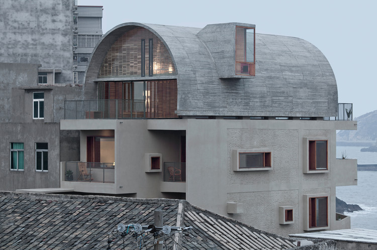
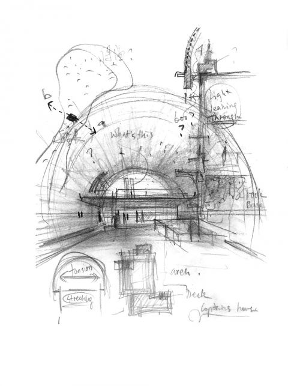

# 船长之家改造 / Renovation of the Captain's House

## 01 基本信息与经济技术指标

| 项目 | 内容 |
| --- | --- |
| 项目名称 | 船长之家改造 |
| 英文名称 | Renovation of the Captain's House |
| 建筑师 / 事务所 | 直向建筑（Vector Architects）主持建筑师：董功 |
| 地点 | 福建省福州市连江县苔菉镇北茭村，中国 |
| 国家 / 城市 | 中国 / 福州连江 |
| 建成年份 / 设计年份 | 2017年1月建成；设计周期2016.01-2016.08 |
| 建筑类型 | 独立住宅改造（加建） |
| 用地面积 | 未检索到可靠公开资料 |
| 建筑面积 | 470㎡（来源：直向建筑官网、ArchDaily） |
| 建筑高度 | 未检索到可靠资料 |
| 层数 | 原二层加建三层，含阁楼夹层（平面显示三层+夹层，官方未明确层数） |
| 容积率 | 未检索到可靠资料 |
| 建筑密度 | 未检索到可靠资料 |
| 结构体系 | 混凝土承重墙 + 旧有砖混结构（新增12cm混凝土墙复合原有砖墙） |
| 主要材料 | 混凝土、樱桃木、竹钢、玻璃砖、肌理涂料 |
| 业主 / 委托方 | 私人业主，上海广播电视台东方卫星频道 |
| 摄影 / 图纸来源 | 摄影：夏至、陈颢、陈振强；图纸：直向建筑 |
| 信息可信度 | 高（官方+两个高质量建筑媒体+分析文章） |
| 主要依据来源 | 直向建筑官网 (s1)、ArchDaily中文版 (s2)、gooood (s3)、有方 (s4,s5)、豆瓣青锋文章 (s6) |

> 指标说明：除建筑面积、结构体系和材料外，其他经济技术指标（用地面积、高度、容积率等）未从公开资料获得。

## 02 资料质量与证据密度

- 资料状态：sufficient
- 是否有一级资料：是
- 一级资料是否用于身份确认：是
- 建筑专业媒体数量：4（ArchDaily、gooood、有方×2）
- 图片处理状态：completed
- 已覆盖分析项：concept、context、program、circulation、facade_material、structure_construction、user_experience、urban_relationship
- 资料最充分的方向：设计概念、结构策略、空间格局、材料、拱顶分析
- 资料明显不足的方向：经济技术指标（场地面积、高度）、施工详细节点、造价
- 需要人工复核：无重大矛盾，但部分技术指标需进一步核实

## 03 一句话判断

通过新增12cm混凝土墙加固原有砖混结构，并以拱顶加建形成具有精神意义的家庭空间，使改造后的住宅在抵御海边恶劣气候的同时，赋予居住者新的生活尊严。

## 04 场地信息表

| 场地维度 | 与设计回应相关的信息 | 证据 |
| --- | --- | --- |
| 场地区位 | 福建连江县黄岐半岛东北端，与马祖列岛隔海相望，渔村密集区 | s1,s2 |
| 自然环境 | 礁石海岸，常受海风、雨水侵蚀，潮湿易腐 | s1,s2 |
| 人文环境 | 传统渔村，业主基督教信仰 | s1,s6 |
| 地形条件 | 建筑建于礁石上，岩石脉络东西向垂直海岸 | s6 |
| 道路与交通 | 村内窄巷，主入口朝北，次入口朝东 | s3平面图 |
| 周边建筑特点 | 2-3层传统民居，体量杂乱，建筑间距小 | s2,s3照片 |
| 建筑服务人群 | 船长一家四口及节日来访亲友 | s1,s6 |
| 场地核心矛盾 | 密集村落中如何兼顾隐私、海景、结构安全和空间品质 | 综合 |

> 场地资料整体较充分，但精确地形图、周边建筑高度等细节未公开。

## 05 概念创意探索 Conceptual Exploration

### 5.1 诊断 Diagnosis

- 来源明确：原有建筑砖混结构薄弱、漏水严重，无法满足当前生活需求，业主希望加建三层。海边潮湿腐蚀性气候是核心挑战。
- 基于资料的归纳判断：业主对大海“既依赖又恐惧”的矛盾心理（青锋引用船长原话），成为设计需要在空间上回应的深层主题。

### 5.2 定位 Positioning

- 来源明确：直向建筑表示希望改造“给一家人提供更多有质量的生活空间，赋予他们生活的尊严，同时也能成为他们家庭情感的载体”。
- 基于资料的归纳判断：项目不追求宏大叙事，而是聚焦于普通家庭的具体生活，在有限的造价和结构条件下创造超越日常的空间品质。

### 5.3 策略 Strategy

- 策略：结构加固作为设计起点，新增混凝土墙同时解决安全、加建和空间重组；窗系统家具将窗转化为媒介；拱顶加建整合结构、排水、景观和精神性。
- 回应的问题：危险的原有结构、恶劣气候、有限面积和加建需求。
- 对空间/形式/建造的影响：南墙完整封闭，东西通透；拱顶成为视觉和精神核心。
- 证据来源：s1,s2,s3,s6

### 5.4 意象与表达 Imagery, Naming & Expression

董功的草图明确将拱顶作为加建核心（s6记载）。项目名称“船长之家”本身就暗示了船、海洋与家的关系。拱顶被诠释为“灯塔”、“船”和“家庭教堂”，在村落中既融入又跳出。

图文相关性：黄昏时建筑暖光与拱顶轮廓，体现“灯塔”意向。

## 06 建筑语言生成 Architectural Language Generation

### 6.1 功能梳理 Function

一层：入口门厅、厨房、餐厅、起居室；二层：主卧室、女儿卧室、书房；三层：多功能活动室（兼家庭礼拜）、阁楼。卫生间集中布置于北侧（由南面移动）。空间从上到下形成从公共到私密、从日常到精神的梯度。

### 6.2 布局逻辑 Layout

建筑沿东西向延伸，垂直海岸线，两端分别面对渔港和东海。南立面通过填补和延伸成为完整实墙，减少开窗以抵御风雨；东、西、北立面大面积开窗，引入海景和光线。平面中卫生间从最佳海景位移至邻居一侧，释放视线给主要房间。

图文相关性：从村落方向看建筑，南墙完整，拱顶突出。

### 6.3 形式构成 Composition

原有L形平面通过南墙补齐和西墙延伸形成规整长方体。上层拱顶以混凝土现浇，两侧由混凝土墙承重，以曲线收束体量。窗套外凸、厚度设计为家具，强化立面阴影与使用功能。阁楼位于拱顶内，由舷梯连接。

图文相关性：可见外凸窗套和拱顶形态。

### 6.4 场所与氛围 Place & Atmosphere

室内以樱桃木、竹钢暖色为主，与混凝土冷灰形成对比。三层拱顶空间高耸，两端视野截然不同：一边是喧嚣渔港，一边是宁静大海。日落时玻璃砖透出柔光，建筑在村落中如同“归航的灯塔”。

## 07 建造品质控制 Construction Quality Control

> 本章仅写有可靠来源的内容。部分细节未公开。

### 7.1 建造语言 Construction Language

- 骨架：原有砖混结构 + 新增12cm钢筋混凝土墙，共同承重；拱顶为混凝土现浇（s1,s2）。
- 围合：南面实墙多，东西面落地窗为主（s1,s3照片）。
- 地台：建于礁石上，具体基础形式未公开（缺失）。

### 7.2 材料与工艺 Materials & Craft

主要材料：混凝土、樱桃木、竹钢、玻璃砖、肌理涂料（s1,s2）。樱桃木用于门窗和家具，竹钢用于栏杆和窗框，耐久性好。混凝土窗套外凸表面肌理涂料，防水且美观。

### 7.3 构造逻辑 Tectonic Logic

“窗系统家具”构造：窗套深度约300-400mm，内嵌坐凳或桌板，与室内地面齐平（s3,s6描述）。拱顶钢筋配置和模板施工资料缺失。

### 7.4 物理性能与施工控制 Performance & Construction Control

拱顶利于排水，减少漏水风险（s1）。施工期05/2016-01/2017，驻场建筑师监督（s1）。具体节点防水、保温等细节未公开。

## 08 核心方法提炼

### 方法 1：结构加固与空间重构一体化

- 面对的问题：原有砖混结构不安全、漏水；需加建但面积有限。
- 具体做法：在室内侧新增12cm混凝土墙，保留原有砖墙；新结构允许局部拆改砖墙，重新安排功能。
- 建筑效果：结构安全与空间重组同步完成，卫生间移位，主要房间获得海景和通风。
- 证据来源：s1,s2,s3
- 相关图片/图纸：
  
  图文相关性：外观可见混凝土新增墙体与窗套。
- 可迁移方法：改造中结构加固可作为空间重塑的契机，而非单纯的工程。

### 方法 2：窗系统家具（window-furniture）

- 面对的问题：海边多雨，窗易漏水；希望增强窗与人的互动。
- 具体做法：窗套突出墙面，为开启扇遮雨；窗洞厚度设计成坐凳、桌面，与室内家具连成一体。
- 建筑效果：窗成为“媒介”空间，增加了使用可能和观景仪式感。
- 证据来源：s1,s2,s3
- 相关图片/图纸：
  
  图文相关性：外凸窗套可见。
- 可迁移方法：窗的深度可转化为功能空间，适用海岸或风景好的住宅。

### 方法 3：拱顶加建作为精神空间

- 面对的问题：加建三层的结构效率、排水、景观及精神表达。
- 具体做法：采用混凝土拱顶，由两侧承重墙汇聚而成；内部设置夹层，两端开窗连接不同海景。
- 建筑效果：拱顶快速排水、方向性景观；成为家庭礼拜空间——‘海上灯塔’。
- 证据来源：s1,s2,s3,s6
- 相关图片/图纸：
  
  图文相关性：拱顶轮廓与整体形态。
- 可迁移方法：单一结构形态可同时解决多个问题，综合效益高。

### 方法 4：平面功能置换优化视线

- 面对的问题：原卫生间占据最佳海景面。
- 具体做法：将一、二层靠海卫生间移到北侧靠邻居处，释放南、东向给客厅、餐厅、主卧。
- 建筑效果：主要生活空间获得开阔海景，卫生间获得更好采光通风。
- 证据来源：s1,s2,s3
- 可迁移方法：小户型改造中，功能位置调整即可大幅提升体验。

## 09 图纸与图片索引

| 图片类型 | 推荐用途 | 正文嵌入状态 / 本地图片 / 来源页面 | 来源 | 下载状态 | 图文相关性 | 版权 / 备注 |
| --- | --- | --- | --- | --- | --- | --- |
| 01_hero | 封面/外观识别 | 已嵌入：`images/research-01.jpg` / [来源](https://www.vectorarchitects.com/uploads/img/2019/01/15482531122064_min.jpg) | 直向建筑官网 | downloaded | 可见改造后整体外观、拱顶、窗套 | 参考链接，版权未清除 |
| 02_site | 场地关系分析 | 已嵌入：`images/research-05.jpg` / [来源](https://images.adsttc.com/media/images/591b/43b6/e58e/ce3e/3e00/0589/newsletter/1_(9).jpg?1494959021=) | ArchDaily | downloaded | 黄昏外景，建筑与村落关系，拱顶高度 | 摄影夏至，版权归摄影师 |
| 09_analysis | 改造前后对比 | 未嵌入正文，留索引：`images/research-06.jpg` / [来源](https://images.adsttc.com/media/images/591b/4457/e58e/ce3e/3e00/058d/thumb_jpg/1_(8).jpg?1494959182=) | ArchDaily | downloaded | 改造前立面，体现原状 | 版权归ArchDaily/摄影师 |

## 10 对我的设计启发

- 可迁移方法 1：将结构加固与空间设计整合，避免二次改造。
- 可迁移方法 2：利用窗的深度创造多功能‘窗家具’，增加使用趣味和功能性。
- 可迁移方法 3：拱顶可作为解决结构、气候、精神和标识性问题的综合手法。
- 可迁移方法 4：在既有建筑中通过简单功能置换提升核心空间品质。
- 不适合直接照搬的部分：拱顶的宗教隐喻需结合业主背景；窗家具的深度和材料需根据当地气候细化。
- 可转化成的分析图：结构加固与空间重组关系图；窗家具类型与使用场景图；拱顶综合性能图解。

## 11 信息缺口与冲突

- 用地面积、建筑高度、容积率、建筑密度等经济技术指标全缺。
- 层数：资料显示原二层加建三层，平面图中三层含阁楼，但官方未明确总层数，此处记为“三层+夹层”。
- 结构体系明确无冲突。
- 材料和施工细节较充分，但无详细节点公开。

## 12 来源列表

### Level A：官方与一手来源
- [船长之家改造 - 直向建筑官网](https://www.vectorarchitects.com/cn/projects/30) (s1)

### Level B：高质量建筑媒体
- [船长之家改造 / 直向建筑 - ArchDaily 中文版](https://www.archdaily.com/zh/871456/chuan-chang-zhi-jia-gai-zao-zhi-xiang-jian-zhu) (s2)
- [船长之家改造 / 直向建筑 - gooood](https://www.gooood.cn/renovation-of-captains-house-vector-architects.htm) (s3)
- [视频首发 | 改造后的“船长之家”什么样？ – 有方](https://www.archiposition.com/items/20180525110306) (s4)
- [风语 船长之家 / 直向建筑 – 有方](https://www.archiposition.com/items/20211022033616) (s5)

### Level C：中文补充源
- [【船长之家】By 直向建筑 - 豆瓣（青锋：船长之家的隐喻与内涵）](https://www.douban.com/group/topic/234867746?_dtcc=1) (s6)

## 图像证据补充

以下图片由研究链路自动补入，以保持结构化图片记录与正文同步。

