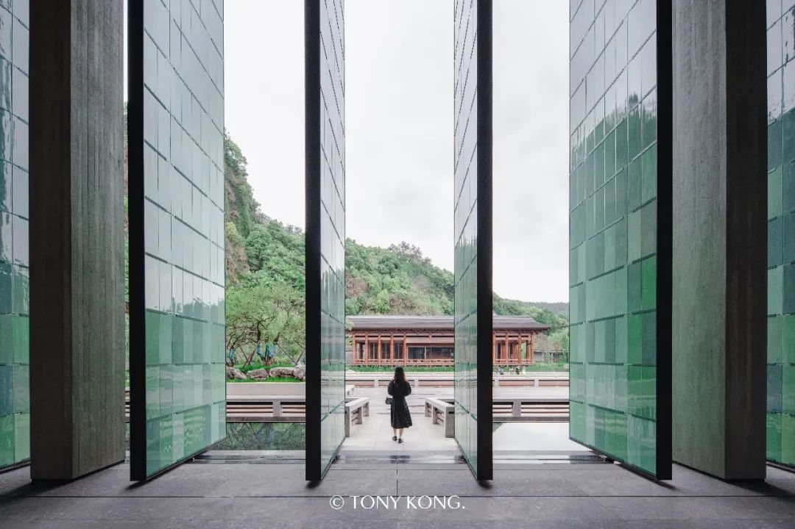
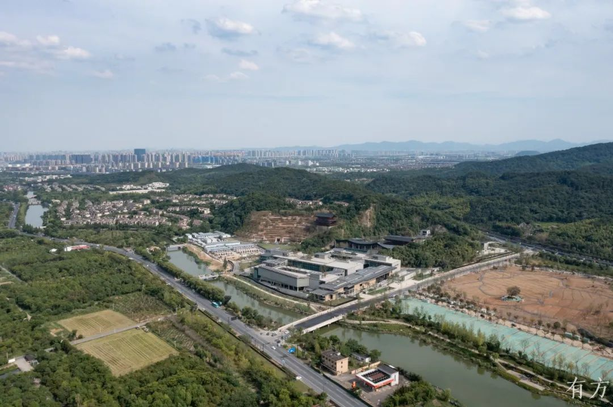
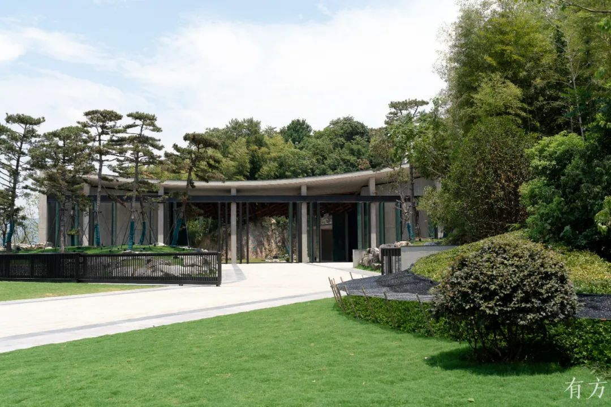
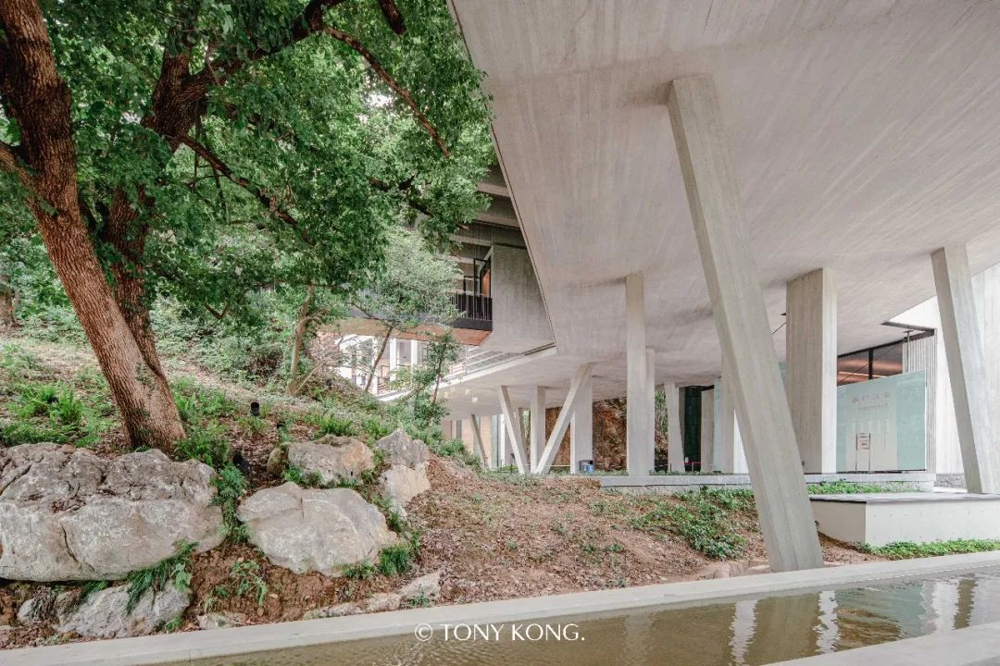
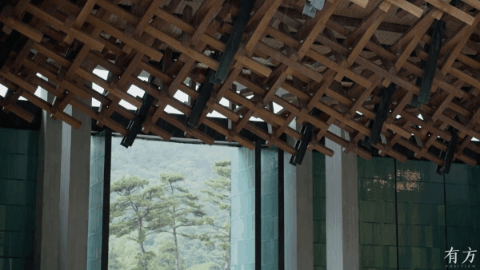
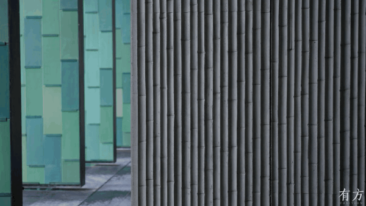

# 杭州国家版本馆（文润阁） / Hangzhou National Archives of Publications and Culture

> 不完整原因：本包已保留新华社、有方、Architectural Record、Domus 等可靠来源，身份与核心设计逻辑较清楚；但未检索到建筑师事务所或馆方项目页作为一级资料，建筑高度、容积率、建筑密度、完整结构体系、施工图与节点详图仍需人工复核。

## 01 基本信息与经济技术指标

| 项目 | 内容 |
| --- | --- |
| 项目名称 | 杭州国家版本馆（文润阁） |
| 英文名称 | Hangzhou National Archives of Publications and Culture / Wenrun Pavilion |
| 建筑师 / 事务所 | 王澍、陆文宇 / 业余建筑工作室 |
| 地点 | 浙江杭州良渚一带 |
| 国家 / 城市 | 中国 / 杭州 |
| 建成年份 / 设计年份 | 2022年7月23日正式落成 |
| 建筑类型 | 文化建筑；版本收藏、保护、展示、研究与交流综合体 |
| 用地面积 | 建筑时报报道为占地150亩，需复核原始工程资料 |
| 建筑面积 | 10.31万平方米 |
| 建筑高度 | 未检索到可靠资料；公开访谈提及良渚遗址周边15米限高约束 |
| 层数 | 未检索到可靠资料 |
| 容积率 | 未检索到可靠资料 |
| 建筑密度 | 未检索到可靠资料 |
| 结构体系 | 局部证据显示有钢骨架、混凝土挡土墙、木-钢雨棚与混凝土主体结构；完整体系未检索到可靠资料 |
| 主要材料 | 龙泉青瓷屏扇 / 瓷板、混凝土、木与钢等 |
| 业主 / 委托方 | 中国国家版本馆杭州分馆相关建设主体；具体业主合同信息未检索到可靠资料 |
| 摄影 / 图纸来源 | 有方 / 孔锦权、Architectural Record / Iwan Baan、Domus / Ji Yun 等公开页面 |
| 信息可信度 | medium |
| 主要依据来源 | 新华社、有方专访、有方摄影漫游、Architectural Record、Domus |

> 指标说明：总建筑面积和落成时间由新华社等来源支持；高度、层数、容积率、建筑密度和完整结构体系未找到可直接确认的一级资料，不作推测。

图文相关性：用于说明该项目不是孤立的纪念性单体，而是以山体、水面、书库和游廊共同组织的文化建筑群。

## 02 资料质量与证据密度

- 资料状态：partial
- 是否有一级资料：否
- 一级资料是否用于身份确认：否
- 建筑专业媒体数量：4
- 图片处理状态：completed
- 已覆盖分析项：concept / context / program / circulation / facade_material / structure_construction / user_experience / urban_relationship
- 资料最充分的方向：现代宋韵概念、南园北馆布局、废弃矿坑与良渚限高约束、青瓷屏扇与装配构造。
- 资料明显不足的方向：完整施工图、结构专业说明、经济技术指标、机电与环境性能数据。
- 需要人工复核：馆方或设计方的一手项目资料、最终竣工图、完整材料清单、结构与消防疏散体系。

## 03 一句话判断

杭州国家版本馆最值得学习的是：它没有把“宋韵”处理成仿古符号，而是把废弃矿坑、良渚遗址限高、藏书楼功能和龙泉青瓷工艺合成为一套从场地到表皮都能成立的当代山水建筑语言。

## 04 场地信息表

| 场地维度 | 与设计回应相关的信息 | 证据 |
| --- | --- | --- |
| 场地区位 | 坐落在良渚一带，邻近良渚遗址语境 | 新华社、有方专访 |
| 自然环境 | 基地原为废弃矿坑，山体残破但具有强烈“主峰”感 | 有方专访 |
| 人文环境 | 项目承载国家版本收藏保护任务，并被定位为江南特色版本库 | 新华社 |
| 地形条件 | 矿坑比外部道路平均高出约5米，且受15米限高约束 | 有方专访 |
| 道路与交通 | 公开资料未充分确认整体交通系统；访谈重点在南大门入口处理 | 有方专访 |
| 周边建筑特点 | 重点不是城市街区连续性，而是良渚遗址、山体和水面的保护性关系 | 新华社、有方专访 |
| 建筑服务人群 | 收藏、保护、研究、展示、交流与公共参观人群 | 新华社 |
| 场地核心矛盾 | 在低限高、废弃矿坑、国家级收藏功能和宋代园林命题之间建立可建成的空间秩序 | 有方专访、Architectural Record |

图文相关性：用于说明“南园北馆”和山水互补不是后期叙事，而是由场地地形和建筑布置共同生成。

## 05 概念创意探索 Conceptual Exploration

### 5.1 诊断 Diagnosis

- 来源明确：项目是国家新时代“藏书楼”，又处在良渚遗址周边；设计面对宋代园林命题、遗址视觉保护、废弃矿坑地形和大体量功能面积的叠加约束。有方专访中，建筑师特别指出15米限高、矿坑高差和山体保留使常规国家级展馆模式难以直接套用。
- 基于资料的归纳判断：这个项目的起点不是“做一座像宋代的楼”，而是在低矮、密集和场地破损的条件下，把藏书楼、园林、山体修复和公共游览重新组织为一个可进入的山水结构。

### 5.2 定位 Positioning

- 来源明确：新华社将其描述为中华版本保藏“一总三分”体系的重要组成部分，也是中央总馆异地灾备库、江南特色版本库和华东地区版本资源集聚中心。有方专访明确“现代宋韵”是核心定位。
- 基于资料的归纳判断：它承担两种不同尺度的角色：一方面是国家文化基础设施，强调收藏与保护；另一方面是面向公众的江南文化场所，强调游园、观看和材料体验。

### 5.3 策略 Strategy

- 策略：以“南园北馆”组织疏密关系，以不居中的南大门和双廊组织游园经验，以青瓷屏扇和装配构造把地方工艺转化为当代表皮系统。
- 回应的问题：既要满足大型保藏与展陈面积，又要降低对良渚遗址视觉环境的冲击；既要呈现宋韵，又不能退回仿古形式。
- 对空间 / 形式 / 建造的影响：建筑被压低并层层展开，南部园林和北部密集馆区形成“疏 / 密”互补；表皮不再是贴饰，而成为可开启、可维护、可被单片替换的构造系统。
- 证据来源：有方专访、Architectural Record、新华社。

### 5.4 意象与表达 Imagery, Naming & Expression

“文润阁”的公共叙事与“现代宋韵”相连。来源明确：王澍在有方专访中谈到项目从宋画与宋代园林中寻找“韵”，但强调现代宋韵不是仿古，而是把山水画中的遮掩、深远、平远和游观转译为空间组织。基于资料的归纳判断：项目的形象不是单一正立面，而是一组不断被山、水、廊、屏扇遮挡和展开的视线关系。

## 06 建筑语言生成 Architectural Language Generation

### 6.1 功能梳理 Function

来源明确：新华社说明杭州国家版本馆承担版本收藏、保护任务，并是“一总三分”体系中的重要组成部分；本地报道与建筑媒体均提及其包含保藏、展示、研究、交流等功能。基于资料的归纳判断：功能并非简单堆叠，而是被分成偏封闭的保藏库房、可公共进入的展览与园林、以及连接两者的游廊与过渡空间。

### 6.2 布局逻辑 Layout

来源明确：有方专访中，王澍描述整体为坐北朝南，利用小山头围成标准中国藏书楼“南园北馆”的结构：南边园林较疏朗，北边藏书功能密度较高。南大门并不在中轴线上，而是通过山体遮挡形成“掩映之美”。基于资料的归纳判断：这套布局把功能安全性和游园开放性拆开处理：地面和书库保持相对封闭，而公众通过园、桥、廊和漂浮系统获得可游路径。

图文相关性：用于说明项目通过“掩映”处理入口，而不是采用国家级文化建筑常见的正中轴纪念门厅。

### 6.3 形式构成 Composition

来源明确：有方专访提到北馆连续四栋密集建筑、限高下的“平远法”、以及由柱子支撑、漂浮在空中的曲折系统。Architectural Record 进一步指出，建筑群包括13个 pavilion，部分档案空间埋入相邻山体，山与水的粗粝地形构成项目山水结构。基于资料的归纳判断：项目的形式并不是“一个屋顶统领全场”，而是用低矮体量、曲折廊道、可开合屏扇和山体边界共同制造深度。

图文相关性：用于验证“封闭保藏功能”和“公共游园体验”之间通过漂浮系统产生过渡。

### 6.4 场所与氛围 Place & Atmosphere

来源明确：有方摄影漫游将项目体验概括为南园北馆、大疏大密、山水相互补位和游园时的迷失感；Domus 也把项目理解为山与水两种力量的互补。基于资料的归纳判断：项目的场所氛围来自连续遮挡和局部显露，而非宽阔全景。观者在入口、桥、双廊、北馆和水面之间移动时，感知到的是山水画式的分段阅读。

## 07 建造品质控制 Construction Quality Control

### 7.1 建造语言 Construction Language

- 骨架：来源明确：Architectural Record 记录青瓷屏扇背后有近35英尺高的统一钢骨架，屏扇可借助电机旋转开启；有方专访也提到漂浮系统由柱子支撑。完整主体结构体系未检索到可靠资料。
- 围合：来源明确：青瓷屏扇、幕墙和廊道围合是主要可见建造语言；Architectural Record 说明青瓷片通过氧化铜表面扣件固定，可替换。
- 地台：来源明确：有方专访提到双廊主体是混凝土挡土墙，用来在保留山体原真性的同时保障游人安全。

### 7.2 材料与工艺 Materials & Craft

来源明确：有方专访中，陆文宇谈到团队在龙泉考察不同窑口，并为接纳手工“不统一”设计颜色选择和搭配控制系统；王澍提到为约7万片青瓷设计铜扣件，使每片都可装配、未来可完整取下。Architectural Record 则记录项目使用12种釉色类型，约100,000平方英尺陶瓷砖，尺寸约1英尺乘2.5英尺乘5/16英寸。

图文相关性：用于说明材料策略不是表面贴附，而是把龙泉青瓷、屏扇、铜扣件和钢骨架组织成可维护的建筑系统。

### 7.3 构造逻辑 Tectonic Logic

来源明确：Architectural Record 说明瓷板由氧化铜扣件连接到钢骨架，既加快施工安装，也便于损坏后替换；有方专访中建筑师强调每片青瓷未来都能完整取下、单独留给历史。基于资料的归纳判断：这里的构造逻辑把“材料可传世”转化为“构件可拆卸”，使地方工艺不只是装饰，而有保存和维护层面的制度感。

图文相关性：用于说明项目中传统工艺并不单独存在，而是与混凝土、钢、木等现代建造系统形成对照。

### 7.4 物理性能与施工控制 Performance & Construction Control

来源明确：Architectural Record 记录项目经历全尺寸 mock-up 后推进12种釉色，且设计团队对夯土做法进行了现场示范；有方专访说明双廊以混凝土挡土墙和顶盖回应山体安全。未检索到可靠资料：完整防火、防水、机电、保温、排烟、安防与文物库房环境控制系统。

## 08 核心方法提炼

### 方法 1：把“遗址限高 + 大体量功能”转译为“平远”的低矮建筑群

- 面对的问题：国家级版本馆需要约10.31万平方米建筑面积，但良渚遗址周边存在严格高度控制，常规高大厅式公共建筑模式不适合。
- 具体做法：采用北馆密集、南园疏朗的总体格局，用连续低矮体量、层层展开的屋面和游廊来获得空间深度。
- 建筑效果：建筑不靠高度制造权威，而靠横向展开、遮挡、行进和山水关系获得公共文化建筑的庄重感。
- 证据来源：新华社、有方专访、Architectural Record。
- 相关图片 / 图纸：
  
  图文相关性：用于验证项目在地形和建筑群之间展开，而不是竖向纪念碑化。
- 可迁移方法：在限高或景观敏感场地中，可以先把“高度表达”转为“路径深度”和“横向层次”，再处理建筑形象。

### 方法 2：用“南园北馆”把封闭保藏与公共游园拆开

- 面对的问题：版本馆既要承担保藏保护，又要向公众提供展示、游览和文化体验。
- 具体做法：南侧组织园林与可游空间，北侧集中藏书和展陈功能，并以桥、廊和漂浮系统建立连接。
- 建筑效果：公众获得曲折、递进、可停留的游园经验；高安全需求的保藏功能则被放在更密集、更受控的北部馆区。
- 证据来源：有方专访、有方摄影漫游。
- 相关图片 / 图纸：
  
  图文相关性：用于验证公共路径不是附属交通，而是调和开放与封闭功能的核心空间装置。
- 可迁移方法：在功能安全等级差异大的文化建筑中，可用景观和路径作为缓冲层，而不是简单设置硬边界。

### 方法 3：以非正轴入口制造“掩映之美”

- 面对的问题：国家级文化建筑通常倾向正中轴和正面仪式，但该场地有山体、矿坑和宋画意境的命题。
- 具体做法：南大门不放在中轴线上，让山体与门洞互相遮挡，使进入过程先被遮蔽、再逐步展开。
- 建筑效果：入口从“到达大厅”变成“进入山水”的开端，建筑的公共性通过游观而不是正立面完成。
- 证据来源：有方专访、新华社。
- 相关图片 / 图纸：
  
  图文相关性：用于验证入口策略依赖遮挡、偏移和山体背景，而非居中对称。
- 可迁移方法：处理文化叙事型入口时，可以把“正面识别”转化为“转折、遮挡、再显露”的序列。

### 方法 4：把地方工艺升级为可拆卸、可维护的当代表皮系统

- 面对的问题：龙泉青瓷若只是装饰贴面，会停留在文化符号；若要进入大体量建筑，需要解决颜色控制、安装、维护和替换。
- 具体做法：以多种釉色青瓷片、铜扣件和钢骨架组成屏扇系统，并通过样板、颜色控制和装配方式管理手工材料的不均质。
- 建筑效果：青瓷既保留手工变化，又被组织成可开启、可替换、可传世的建筑构件。
- 证据来源：有方专访、Architectural Record。
- 相关图片 / 图纸：
  
  图文相关性：用于说明地方材料不是贴皮，而是被发展为建筑尺度的可操作系统。
- 可迁移方法：地方材料进入大型公共建筑时，应同时设计材料叙事、加工误差、安装系统和长期维护方式。

### 方法 5：用双廊把山体保护、安全和游观结合起来

- 面对的问题：废弃矿坑山体具有场地记忆和山水意象，但也带来安全风险和保护边界。
- 具体做法：以混凝土挡土墙和带顶游廊隔开山体，在保留山体原真性的同时让公众获得近距离游观。
- 建筑效果：双廊同时是安全设施、游园路径和空间叙事装置，使“保护”不等于隔离。
- 证据来源：有方专访、Domus。
- 相关图片 / 图纸：
  
  图文相关性：用于说明山体、混凝土和游廊之间不是景观装饰关系，而是安全与体验的复合构造。
- 可迁移方法：面对危险或脆弱自然遗存时，可以把防护构筑物设计成体验路径，而不是单纯工程围挡。

## 09 图纸与图片索引

| 图片类型 | 推荐用途 | 正文嵌入状态 / 本地图片 / 来源页面 | 来源 | 下载状态 | 图文相关性 | 版权 / 备注 |
| --- | --- | --- | --- | --- | --- | --- |
| 01_hero | 封面 / 外观识别 | 已在正文嵌入：`images/01_hero_exterior.jpg` / [来源](https://www.archiposition.com/items/92fdafd42c) | 有方 / 孔锦权 | downloaded | 说明山体、水面与建筑群关系 | Reference link only; rights not cleared. |
| 02_site | 场地关系分析 | 已在正文嵌入：`images/02_site_aerial.jpg` / [来源](https://www.archiposition.com/items/20220725050615) | 有方 | downloaded | 说明废弃矿坑和南园北馆总体关系 | Reference link only; rights not cleared. |
| 05_elevation | 入口与界面分析 | 已在正文嵌入：`images/03_south_gate.jpg` / [来源](https://www.archiposition.com/items/20220725050615) | 有方 | downloaded | 说明南大门非正轴和掩映关系 | Reference link only; rights not cleared. |
| 09_analysis | 漂浮系统 / 路径分析 | 已在正文嵌入：`images/04_floating_system.jpg` / [来源](https://www.archiposition.com/items/92fdafd42c) | 有方 / 孔锦权 | downloaded | 说明北馆中可游路径与封闭功能的调和 | Reference link only; rights not cleared. |
| 06_detail | 青瓷屏扇 / 构造分析 | 已在正文嵌入：`images/05_small-material-large-span.gif` / [来源](https://www.archiposition.com/items/20220725050615) | 有方 | downloaded | 说明小尺度青瓷构件如何进入大尺度建筑表皮 | Reference link only; rights not cleared. |
| 06_detail | 材料肌理 / 混凝土分析 | 已在正文嵌入：`images/06_bamboo-concrete.gif` / [来源](https://www.archiposition.com/items/20220725050615) | 有方 | downloaded | 说明混凝土、山体和青瓷之间的材料对照 | Reference link only; rights not cleared. |

## 10 对我的设计启发

- 可迁移方法 1：在强文化命题中，先找到空间与建造问题，再让文化叙事从问题的解决方式里长出来。
- 可迁移方法 2：面对限高、大体量和遗址保护，可以用“低矮展开 + 曲折路径 + 层层遮挡”替代高耸地标。
- 可迁移方法 3：地方材料进入当代公共建筑时，必须同时解决供应、色差、安装、维修和替换，不宜只做表面符号。
- 可迁移方法 4：入口可以不是正面仪式，而是用遮挡、偏移和短距离探索制造心理过渡。
- 不适合直接照搬的部分：青瓷屏扇、宋画叙事和山水布局高度依赖杭州、良渚、龙泉青瓷和王澍/陆文宇长期方法，离开这些条件容易变成表面风格。
- 可转化成的分析图：南园北馆疏密图、入口掩映视线图、青瓷屏扇构造层级图、双廊安全/游观复合图、限高下平远展开图。

## 11 信息缺口与冲突

- 未检索到建筑师事务所或馆方完整项目页，一级资料不足。
- 建筑高度、层数、容积率、建筑密度、完整结构体系和机电/环境控制系统未检索到可靠资料。
- 公开报道对项目英文名有 National Archives / National Archives of Publications and Culture / Wenrun Pavilion 等不同译法，本包保留中文正式名和常见英文描述。
- Architectural Record 使用约1.1 million square feet 表述项目规模，新华社使用10.31万平方米；两者量级接近，但本包以新华社中文面积为基本事实。

## 12 来源列表

### Level A：官方与一手来源

- 未检索到可稳定访问的一手项目页。

### Level B：高质量建筑媒体

- [王澍+陆文宇：杭州国家版本馆，现代宋韵｜有方专访](https://www.archiposition.com/items/20220725050615)
- [在杭州国家版本馆里，来一场“空间漫游” - 有方](https://www.archiposition.com/items/92fdafd42c)
- [Amateur Architecture Studio Clads a Chinese Archive with Thousands of Celadon Tiles - Architectural Record](https://www.architecturalrecord.com/articles/16842-amateur-architecture-studio-clads-a-chinese-archive-with-thousands-of-celadon-tiles)
- [Hanzhou National Archives, an alternation of hills and bodies of water - Domus](https://www.domusweb.it/en/architecture/2022/10/24/amateur-architecture-hanzhou-national-archives-an-alternation-of-hills-and-bodies-of-water.html)

### Level C：中文补充源

- [杭州国家版本馆：宋韵悠长，文“润”江南 - 新华社 / 新华网](https://www.news.cn/local/2023-06/10/c_1129683711.htm)
- [七大工艺创新助力现代“宋韵”方案落地 - 建筑时报](https://dzb.jzsbs.com/epaper/jzsb/pc/content/202212/05/content_18886.html)

### Level D：参考源，只能辅助

- [杭州国家版本馆又叫文润阁？ - 杭州本地宝](https://hz.bendibao.com/news/2022726/125485.shtm)
