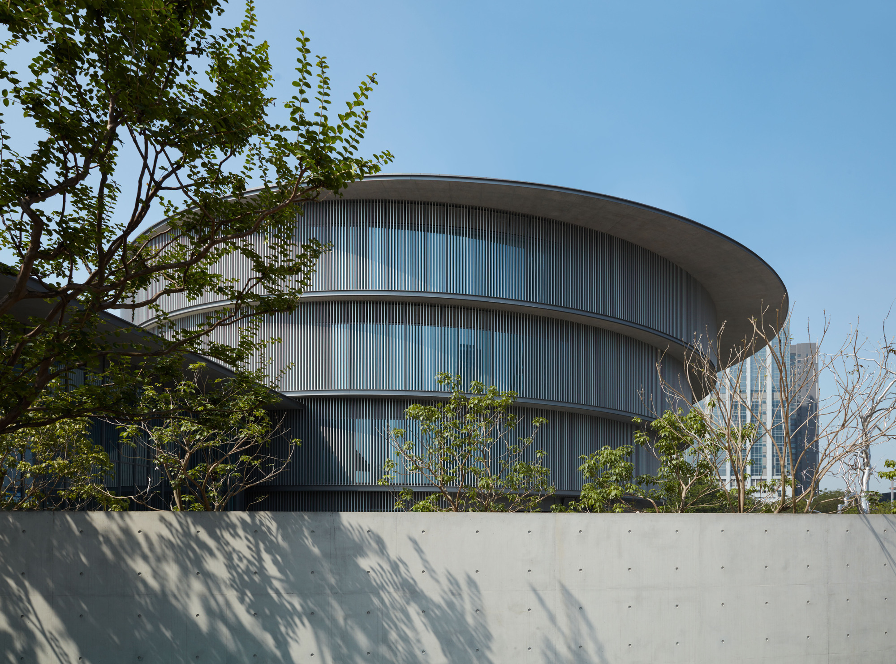
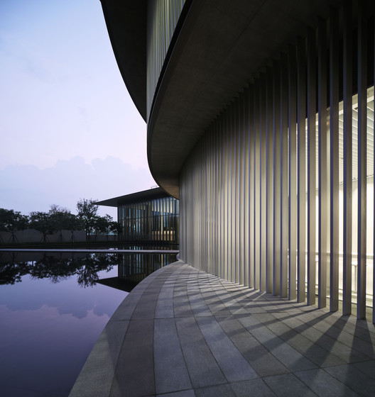
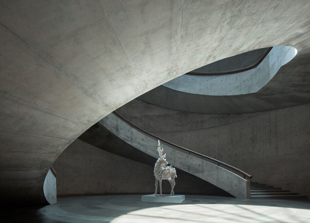
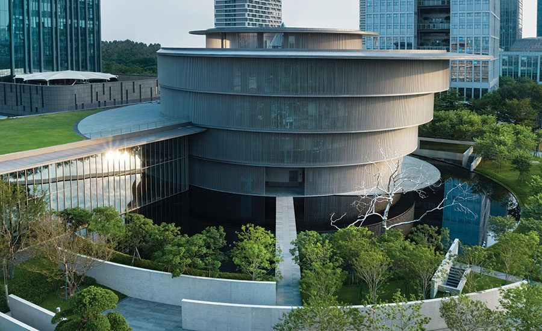

# 和美术馆 / He Art Museum

## 01 基本信息与经济技术指标

| 项目 | 内容 |
| --- | --- |
| 项目名称 | 和美术馆 |
| 英文名称 | He Art Museum / HEM |
| 建筑师 / 事务所 | Tadao Ando Architect & Associates / 安藤忠雄建筑研究所 |
| 地点 | 中国广东佛山顺德 |
| 建成 / 开放时间 | 2020 年建成；2020 年 10 月 1 日对公众开放 |
| 建筑类型 | 文化建筑 / 美术馆 |
| 建筑面积 | Architectural Record 记录为 176,000 sq ft，约 16,350 m2；Wallpaper 记录为约 16,000 m2 |
| 业主 / 委托方 | He Art Museum；创办人何剑锋 |
| 主要材料 | 清水混凝土、玻璃、铝合金竖向百叶、水景与景观 |
| 结构体系 | 可靠公开资料确认其为混凝土框架建筑，中央双螺旋楼梯兼具结构核心作用；完整结构图与节点未检索到 |
| 信息可信度 | high |
| 主要依据来源 | HEM 官方/馆方信息，ArchDaily，gooood，Architectural Record，Wallpaper |

> 指标说明：场地面积、容积率、建筑密度、完整结构计算、幕墙节点、防水构造和施工组织等高精度资料未在公开来源中检索到，本文不作推测。

## 02 资料质量与证据密度

- 资料状态：sufficient
- 是否有一级资料：有。HEM 馆方信息与项目图像说明可作为项目身份、开放时间、馆藏/公共活动定位的一级或准一级资料。
- 建筑专业媒体数量：5 个主要专业来源，包括 ArchDaily、ArchDaily China、gooood、Architectural Record、Wallpaper。
- 已覆盖分析项：concept / context / program / circulation / facade_material / structure_construction / user_experience / urban_relationship
- 资料最充分方向：项目身份、开放时间、创办与馆藏定位、圆形平面、中央天井、双螺旋楼梯、岭南/南越文化意象、展厅组织、遮阳与水景。
- 资料不足方向：详细施工图、结构计算、混凝土模板工艺、幕墙节点、防水层、机电系统、造价。
- 需要人工复核：公开发布或商业使用图片前需另行清权；建筑面积在不同媒体中有英制/公制与约数差异。

## 03 一句话判断

和美术馆最值得学习的不是“把建筑做成圆形”，而是安藤忠雄如何把“和”的语义、岭南水庭与南越圆形观念，转译成由圆形叠层、中央天井、双螺旋楼梯、水面和遮阳界面共同组织的美术馆空间系统。

图文相关性：这张图用于说明圆形体量、水面与入口景观共同建立“和”的场地识别，而不只是作为外观照片。

## 04 场地信息表

| 场地维度 | 与设计回应相关的信息 | 证据 |
| --- | --- | --- |
| 场地区位 | 佛山顺德，珠三角 / 大湾区语境中的新文化机构 | ArchDaily、Architectural Record、Wallpaper |
| 城市关系 | 场地一侧接近商业办公区，另一侧靠近公共公园，建筑需要在商业秩序与文化休憩之间建立缓冲 | Architectural Record |
| 地域文化 | 设计引用岭南水榭、南越文化中圆形象征与“和”的语义 | ArchDaily、Architectural Record、Wallpaper |
| 自然与气候 | 亚热带气候下，深檐、竖向百叶和水面被用于遮阳与微气候调节 | Architectural Record、Wallpaper |
| 服务人群 | 本地居民、大湾区访客、艺术观众与公共活动参与者 | ArchDaily、HEM 馆方信息 |
| 场地核心矛盾 | 如何让私人收藏背景下的美术馆成为面向社区和区域文化的公共场所 | ArchDaily、Architectural Record |

## 05 概念创意探索 Conceptual Exploration

### 5.1 诊断 Diagnosis

来源明确：项目由何剑锋创办，旨在将艺术和文化带给顺德、珠三角和国际观众；馆藏覆盖国际当代艺术、中国现代艺术、中国当代艺术及岭南相关艺术。Architectural Record 进一步指出，场地位于商业区与公共公园之间，需要在喧闹办公环境和文化避难所之间建立过渡。

基于资料的归纳判断：项目的基本问题不是单一展览容器，而是如何把家族收藏、地方文化、商业区边界和公共艺术体验整合为一个有入口仪式、有空间核心、有地域象征的文化场所。

### 5.2 定位 Positioning

来源明确：ArchDaily 引用馆方说明，HEM 希望植根本地、连接大湾区，并通过主题展览、常设展览和 HEM2 公共项目与社区互动。Wallpaper 记录其同时关注国际艺术和岭南文化。

基于资料的归纳判断：这是一座带有私人收藏背景的公共美术馆，它要在“国际当代艺术机构”和“顺德/岭南地方文化场所”之间建立双重身份。

### 5.3 策略 Strategy

项目核心策略是把“和”从名称转译为空间秩序：圆形叠层建立主要展览体量，中央天井引入光线并组织垂直体验，双螺旋楼梯把参观路径变成雕塑性事件，水面和景观墙把城市噪声过滤为渐进的入馆序列。

图文相关性：这张图用于验证中央空洞与双螺旋楼梯是建筑的空间核心，支撑“从概念到路径”的判断。

## 06 建筑语言生成 Architectural Language Generation

### 6.1 功能梳理 Function

HEM 的功能由圆形展厅、现代艺术特别展厅、公共入口、书店、咖啡、公共项目和馆藏展示组成。Wallpaper 记录其首层包含方形展厅、书店和咖啡，二层以上为圆形展览空间；Architectural Record 记录东北侧附加的方形高展厅用于现代艺术展览。

### 6.2 布局逻辑 Layout

Architectural Record 记录主楼由一组浅圆柱叠合而成，楼层直径自下而上扩大：约 42 m、45 m、48 m、51 m；中央天井贯通楼层，展厅楼板之间有偏心错动。这个布局让参观体验不只是沿平面转圈，而是在光井、楼梯、曲面展厅和偏心视线之间逐层展开。

图文相关性：这张图用于说明圆形展厅不是孤立形式，而是通过中央天井与环形路径组织展览。

### 6.3 形体构成 Composition

来源明确：项目以圆形为主导，同时用东北侧方形高展厅平衡圆形体量。圆形来自“和”的语义、南越文化对圆的象征，以及岭南水榭的地域联想；方形展厅则回应现代艺术展陈对大尺度、直线边界和高净空的需要。

基于资料的归纳判断：这个案例的形式生成并不是“圆形外壳 + 展厅”，而是“圆 / 方”“水 / 混凝土”“空洞 / 环绕”“地方符号 / 现代白盒”的张力组织。

### 6.4 场所与氛围 Place & Atmosphere

入口路径通过水面、景墙和斜向视线把商业区的直接进入转换为渐进抵达。室内则以自然光从中央 sky well 流入展厅，配合清水混凝土和曲面界面，形成安藤式的克制、静默和身体性路径。

## 07 建造品质控制 Construction Quality Control

### 7.1 建造语言 Construction Language

来源明确：Architectural Record 记录建筑为混凝土框架，中央现浇混凝土双螺旋楼梯从周边墙体悬挑，并承担结构核心角色；其复杂几何和清水混凝土施工被安藤称为施工难点。

基于资料的归纳判断：双螺旋楼梯不是装饰性交通构件，而是把结构、动线、天井和美术馆精神核心压缩在同一构件中。

### 7.2 材料与工艺 Materials & Craft

公开资料确认清水混凝土、玻璃、竖向铝合金百叶、水面和景观共同构成建筑语言。完整模板体系、混凝土配比、施工缝控制和节点详图未检索到可靠资料，因此不展开推测。

### 7.3 构造逻辑 Tectonic Logic

来源明确：上层圆柱体的外挑与深檐为下层提供遮阳，外周固定竖向百叶降低太阳辐射，地面反射水池帮助改善亚热带空气环境。V 形混凝土柱布置在展厅外圈附近，让展厅保持较高的展陈灵活性。

图文相关性：这张图用于验证外围界面并非单纯玻璃幕墙，而是由深檐、曲面边界和竖向百叶共同控制光和热。

### 7.4 物理性能与施工控制 Performance & Construction Control

可靠资料支持遮阳、竖向百叶、水面降温、展厅灵活性和双螺旋楼梯施工难度的判断；但防水、空调、消防、展陈吊挂系统、机电夹层和施工组织等资料不足。

## 08 核心方法提炼

### 方法 1：把项目名称转译为空间结构，而不是表皮符号

- 面对的问题：和美术馆的“和”如果只停留在命名或标志层面，会变成抽象口号。
- 具体做法：以圆形叠层、中央天井、环形展厅、水面与景墙共同组织“和”的空间秩序。
- 建筑效果：观众从入口到展厅持续经历圆、光、水、混凝土和路径的叠加，而不是只在立面上识别概念。
- 证据来源：ArchDaily、Architectural Record、Wallpaper。
- 可迁移方法：文化项目的关键词应转化为平面、剖面、动线和材料控制规则。

### 方法 2：用中央空洞建立美术馆的方向感

- 面对的问题：圆形展厅容易造成方向感弱、路径重复。
- 具体做法：以 skylit atrium 作为空间锚点，并用双螺旋楼梯组织垂直动线。
- 建筑效果：展厅环绕中心展开，观众在上下移动时不断重新感知建筑核心。
- 证据来源：Architectural Record、ArchDaily。
- 相关图片：见“中央天井与双螺旋楼梯”。
- 可迁移方法：复杂或曲线平面需要一个清晰的剖面核心，帮助建立身体记忆。

### 方法 3：用圆与方平衡象征性和展陈效率

- 面对的问题：纯圆形空间具有强烈象征性，但对现代艺术展陈并不总是高效。
- 具体做法：主楼采用圆形叠层，东北侧附加方形高展厅，用于现代艺术和大尺度作品。
- 建筑效果：建筑既保留地方文化与“和”的形式表达，也提供更中性的高展厅条件。
- 证据来源：Architectural Record、Wallpaper。
- 可迁移方法：当概念形式与功能效率冲突时，可以用互补体量承接不同展陈需求。

### 方法 4：把入口序列作为城市缓冲器

- 面对的问题：场地夹在商业办公区与公共公园之间，直接进入会削弱美术馆的文化转换感。
- 具体做法：通过水面、景观、放射路径和独立混凝土墙组织抵达。
- 建筑效果：访客从城市喧闹逐步进入更安静的文化场域。
- 证据来源：Architectural Record、ArchDaily。
- 可迁移方法：文化建筑的公共性不只在室内展厅，也在从城市到入口的心理过渡。

### 方法 5：让气候控制参与形式表达

- 面对的问题：岭南 / 珠三角气候需要遮阳和热环境控制。
- 具体做法：上层外挑形成深檐，外围竖向百叶控制日照，水面帮助调节微气候。
- 建筑效果：遮阳构件与圆形体量一起构成立面秩序，性能不被隐藏为纯技术附属。
- 证据来源：Architectural Record、Wallpaper。
- 可迁移方法：气候策略应尽量进入建筑语言，而不是事后附加。

## 09 图纸与图片索引

| 图片类型 | 推荐用途 | 正文嵌入状态 / 本地图片 / 来源页面 | 来源 | 下载状态 | 图文相关性 | 版权 / 备注 |
| --- | --- | --- | --- | --- | --- | --- |
| 01_hero | 外观与场地识别 | 已嵌入：`images/01_hero_exterior.jpg` / [来源](https://www.archdaily.com/947876/tadao-ando-completes-the-he-art-museum-in-china) | ArchDaily / HEM | downloaded | 用于说明圆形体量、水景与入口景观 | 研究引用；公开发布需另行清权 |
| 04_section | 中央天井与楼梯 | 已嵌入：`images/04_section_stair_atrium.jpg` / [来源](https://www.archdaily.com/947876/tadao-ando-completes-the-he-art-museum-in-china) | ArchDaily / HEM | downloaded | 用于说明双螺旋楼梯和中央空洞 | 研究引用；公开发布需另行清权 |
| 03_plan | 平面与展厅组织 | 已嵌入：`images/03_plan_gallery.jpg` / [来源](https://www.archdaily.com/947876/tadao-ando-completes-the-he-art-museum-in-china) | ArchDaily / HEM | downloaded | 用于说明圆形展厅与中心交通 | 研究引用；公开发布需另行清权 |
| 05_elevation | 立面遮阳与界面 | 已嵌入：`images/05_facade_louvers.jpg` / [来源](https://www.architecturalrecord.com/articles/14900-he-art-museum-by-tadao-ando) | Architectural Record / HEM | downloaded | 用于说明竖向百叶和曲面外墙 | 研究引用；公开发布需另行清权 |

## 10 对我的设计启发

- 可迁移方法 1：把文化关键词转译为可验证的空间组织规则。
- 可迁移方法 2：用剖面核心解决圆形或环形平面的方向感问题。
- 可迁移方法 3：用互补体量处理概念形式与专业展陈之间的矛盾。
- 可迁移方法 4：把入口路径作为城市噪声与文化体验之间的缓冲层。
- 可迁移方法 5：让遮阳、水面和界面控制成为形式秩序的一部分。
- 不适合直接照抄的部分：圆形体量、清水混凝土和双螺旋楼梯只有在项目文化语义、展陈路径和施工能力共同支持时才成立。
- 可转化成的分析图：圆/方体量关系图、入口缓冲序列图、中央天井剖面图、环形展厅路径图、遮阳与水面微气候图。

## 11 信息缺口与冲突

- 建筑面积：Architectural Record 记录 176,000 sq ft，Wallpaper 记录 16,000 sq m，二者为接近数值但存在约数差异。
- 结构与施工：公开资料确认混凝土框架、V 形柱、中央双螺旋楼梯和施工难点，但未提供完整结构图、节点图和施工组织。
- 图片权利：图片下载仅用于本地研究整理，不代表商业或公开传播授权。
- 官方建筑页：HEM 官方站更偏向馆方与展览信息，未检索到完整的建筑项目页；建筑事实主要由专业媒体和馆方公开信息交叉确认。

## 12 来源列表

### Level A：官方与一手来源

- [He Art Museum 官方网站](https://www.hem.org)

### Level B：高质量建筑媒体

- [Tadao Ando Completes the He Art Museum in China / ArchDaily](https://www.archdaily.com/947876/tadao-ando-completes-the-he-art-museum-in-china)
- [安藤忠雄“和美术馆”将于国庆开放 / ArchDaily 中国](https://www.archdaily.cn/cn/947894/an-teng-zhong-xiong-he-mei-zhu-guan-jiang-yu-guo-qing-kai-fang-ling-nan-wen-hua-yu-kong-jian-rong-he)
- [He Art Museum by Tadao Ando / Architectural Record](https://www.architecturalrecord.com/articles/14900-he-art-museum-by-tadao-ando)
- [Tadao Ando’s He Art Museum draws on local Chinese vernacular / Wallpaper](https://www.wallpaper.com/architecture/hem-museum-tadao-ando-china)
- [和美术馆，安藤忠雄建筑研究所 / gooood](https://www.gooood.cn/he-art-museum-china-by-taodao-ando-architects.htm)

### Level C：中文补充源

- 普通网页搜索检索到若干微信公众号和中文转述线索，但本文未使用其作为核心事实依据。

### Level D：参考源

- 未使用 Level D 作为核心依据。
