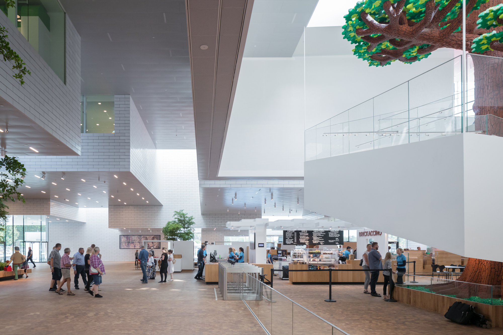
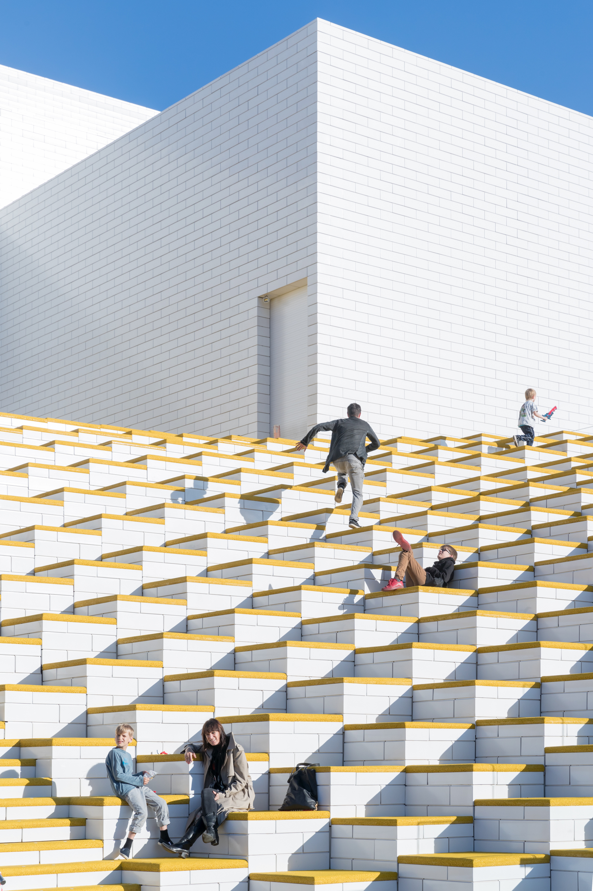
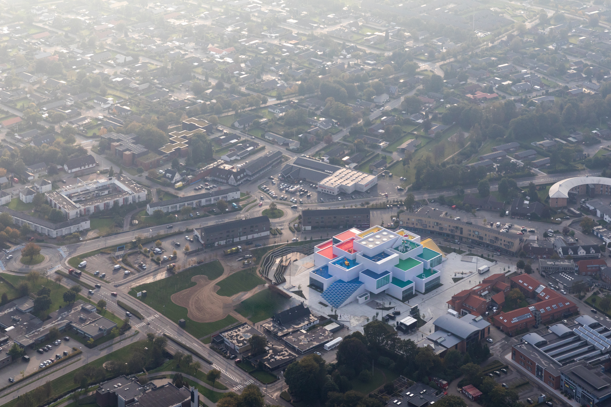
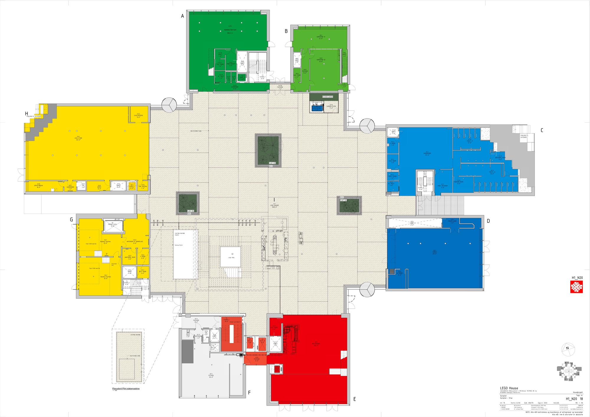
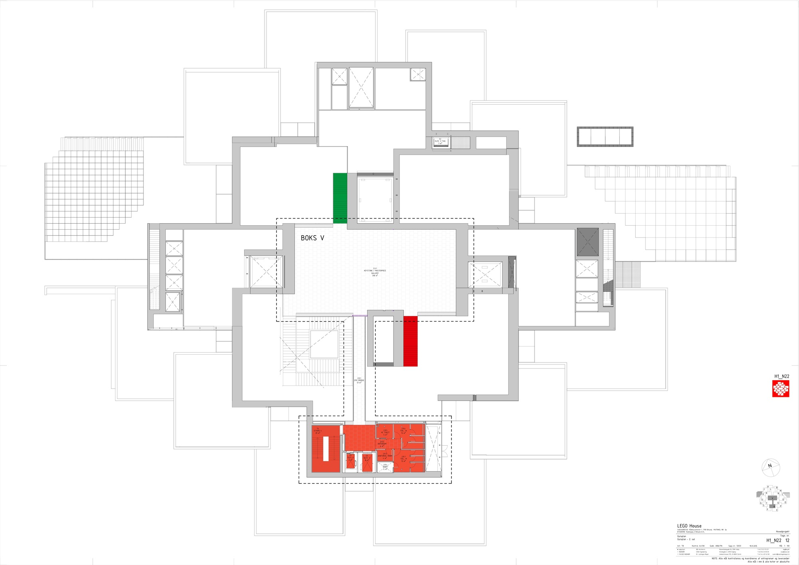
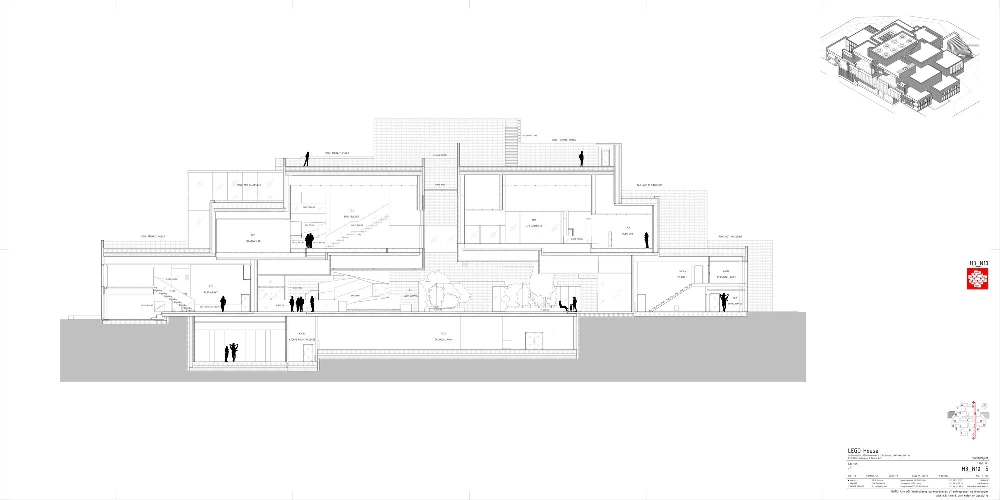
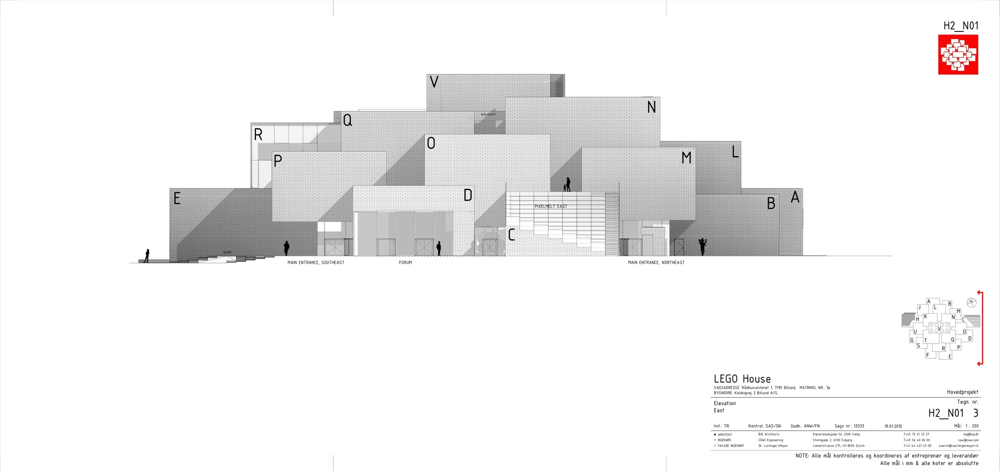

# 乐高之家 / LEGO House

## 01 基本信息与经济技术指标

| 项目 | 内容 |
| --- | --- |
| 项目名称 | LEGO House / LEGO Brand House |
| 建筑师 / 事务所 | BIG - Bjarke Ingels Group |
| 地点 | Billund, Denmark |
| 建成年份 | 2017 |
| 建筑类型 | 文化体验中心 / 品牌之家 / 儿童与家庭学习体验空间 |
| 建筑面积 | 约 11,960 m2，BIG 官网；ArchDaily 记载约 12,000 m2 |
| 业主 / 委托方 | KIRKBI / LEGO 相关主体 |
| 主要材料 | 公共资料明确呈现白色块体外壳、彩色屋顶平台、室内彩色体验区；具体构造层次和节点资料未检索到可靠公开资料 |
| 信息可信度 | high |
| 主要依据来源 | BIG 官方项目页、ArchDaily 项目页、LEGO House 官方介绍 |

## 02 资料质量与证据密度

- 资料状态：sufficient
- 是否有一手资料：是
- 一手资料是否用于身份确认：是
- 建筑专业媒体数量：1
- 已覆盖分析项：concept / context / program / circulation / facade_material / structure_construction / user_experience / urban_relationship
- 资料最充分的方向：项目概念、体量组织、公共屋顶、平面与剖面图纸、体验分区、品牌叙事。
- 资料明显不足的方向：幕墙节点、结构体系细部、施工过程、能耗与运营技术指标。
- 需要人工复核：BIG 与 ArchDaily 面积口径略有差异；具体结构系统和构造节点需查施工级资料。

## 03 一句话判断

LEGO House 最值得学习的地方，不是把建筑做成一个巨大的玩具，而是把“乐高积木的比例、堆叠、可攀爬与开放组合”转译成城市尺度的公共地形：下层是可穿行的城市广场，上层是可游玩的屋顶平台，内部则以不同颜色和体验区组织学习路径。

图文相关性：这张外观图用于验证白色“积木块”体量与彩色屋顶平台共同形成建筑识别，而不是只依赖立面图案。

## 04 场地信息表

| 场地维度 | 与设计回应相关的信息 | 证据 |
| --- | --- | --- |
| 场地区位 | 位于丹麦 Billund，LEGO 品牌发源城市，BIG 官网和 ArchDaily 均确认地点。 | s1, s2 |
| 城市角色 | LEGO House 被定位为面向公众的品牌体验与学习空间，也承担城市公共目的地角色。 | s1, s3 |
| 使用人群 | 家庭、儿童、LEGO 爱好者、游客与本地公众。 | s3 |
| 核心场地矛盾 | 品牌体验建筑既要承载门票型展陈，也要向城市开放，避免成为封闭展馆。 | s1, s2 |
| 设计回应 | 通过首层公共广场、屋顶露台和可进入的外部地形，把建筑部分公共化。 | s1, s2 |

图文相关性：这张图用于验证建筑屋顶并非纯装饰表皮，而是转化为可停留、可游玩的公共平台。

## 05 概念创意探索 Conceptual Exploration

### 5.1 诊断 Diagnosis

来源明确：BIG 官方项目页将项目描述为和 LEGO 玩具本身一样 playful and inviting，并说明建筑应用 LEGO brick 的比例来体现品牌文化与价值。这个诊断把问题从“如何设计一座品牌展馆”转化为“如何让建筑本身像 LEGO 系统一样可组合、可进入、可玩”。[s1]

基于资料的归纳判断：项目面对的是品牌建筑常见的符号化风险。BIG 没有只把积木形象贴在立面上，而是把积木逻辑变成体量组织、公共地形和展陈系统，这让品牌叙事进入空间结构。

### 5.2 定位 Positioning

来源明确：LEGO House 官方将其称为 Home of the Brick，并强调这里是体验 LEGO play、创造力和学习的场所；BIG 和 ArchDaily 则共同确认其作为 Billund 的文化体验建筑。项目因此不是传统博物馆，也不是单纯商业旗舰店，而是品牌、城市公共空间和家庭学习体验的混合体。[s1][s2][s3]

### 5.3 策略 Strategy

项目的核心策略可以概括为：以积木比例生成建筑单元，以叠放体量制造城市台地，以彩色体验区组织不同学习主题，以公共屋顶和首层广场把品牌建筑打开给城市。

## 06 建筑语言生成 Architectural Language Generation

### 6.1 功能梳理 Function

LEGO House 的功能不是单一展厅，而是由体验区、公共广场、餐饮、商店、屋顶游玩空间和城市开放界面共同组成。LEGO House 官方介绍强调参观者在不同体验中进行创造、学习与游戏；这说明功能组织的重点是“主动参与”，而非线性观看。[s3]

图文相关性：这张室内图用于验证展陈空间以可参与、可操作、可停留的体验区组织，而不是传统静态展柜。

### 6.2 布局逻辑 Layout

ArchDaily 图纸显示，首层平面以中央公共空间和周边功能组成，可理解为把城市通行、进入、停留和展陈入口组织在同一层级。这个布局使品牌体验建筑不再完全内向，而是在地面层形成可进入的城市节点。[s2]

图文相关性：这张首层平面用于支撑“地面层承担城市进入、公共聚集与展陈转换”的判断。

二层平面进一步显示上部体验区围绕不同块体展开，功能不是均质平铺，而是对应到积木式体量的分区组织。平面与屋顶平台共同说明，建筑把室内体验和外部可游玩表面叠合在一起。[s2]

图文相关性：这张二层平面用于支撑“体验区随积木式体量分区展开”的判断。

### 6.3 形式构成 Composition

形式上，建筑由多个白色块体叠合形成，顶部嵌入彩色平台。这个构成让 LEGO brick 的比例不只停留在外观，而是成为体量堆叠、露台生成和室内分区的共同规则。BIG 官方项目页明确提到 LEGO brick ratio 在建筑中的应用，ArchDaily 的图纸和照片进一步显示这一比例逻辑如何落到平面、立面和剖面上。[s1][s2]

图文相关性：这张剖面用于验证体量堆叠、室内高度关系和屋顶平台不是彼此独立的设计动作，而是在剖面上连成一个公共地形。

### 6.4 立面与城市识别 Facade & Urban Image

立面不是用复杂装饰表达品牌，而是用白色块体的比例、开窗和叠合关系形成抽象的积木秩序。彩色屋顶平台则把 LEGO 的颜色系统放到可使用的水平面上，避免立面变成单纯广告牌。[s1][s2]

图文相关性：这张立面图用于支撑“品牌识别来自体量比例和开口秩序，而非表面贴图”的判断。

## 07 建造品质控制 Construction Quality Control

公开资料对 LEGO House 的空间、平面、体量和体验介绍较充分，但施工级构造资料较少。可以确认的建造层面主要包括：白色块体外观、彩色屋顶平台、室内彩色体验区、以及体量堆叠形成的屋顶公共空间。具体结构体系、幕墙节点、防水构造、屋顶铺装层次、施工过程和质量控制措施，未检索到可靠公开资料，本文不作推测。

基于图纸和照片的归纳判断：项目的建造难点很可能集中在叠合块体与可上人屋顶之间的构造协调，但公开资料不足以支持节点级分析。因此，本案例的建造启发应停留在“构造服务体验和公共地形”的原则层面，而不是模仿具体节点。

## 08 核心方法提炼

### 方法 1：把品牌母题转译为空间规则，而不是表面图案

- 面对的问题：品牌建筑容易变成符号展示，空间本身反而缺少方法。
- 具体做法：BIG 将 LEGO brick 的比例和叠放逻辑用于建筑体量、立面秩序和室内外分区。
- 建筑效果：建筑像积木系统一样由单元组合而成，品牌识别来自空间组织。
- 证据来源：s1, s2。
- 相关图片 / 图纸：
  
  图文相关性：用于验证品牌母题被转译为体量规则。
- 可迁移方法：当项目有强品牌或文化符号时，应优先寻找可转化为空间、比例、动线或构造的底层规则。

### 方法 2：用屋顶平台把封闭展馆转化为城市公共地形

- 面对的问题：体验馆通常依赖门票和内部动线，容易与城市公共生活断开。
- 具体做法：多个块体叠合形成可进入的屋顶露台，外部空间成为游玩和停留的一部分。
- 建筑效果：建筑不仅被观看，也被攀爬、停留和使用；品牌体验延伸到城市界面。
- 证据来源：s1, s2。
- 相关图片 / 图纸：
  
  图文相关性：用于验证屋顶是可使用的公共平台，而非只用于造型。
- 可迁移方法：文化与商业体验建筑可以把屋顶、台阶、平台和露台设计成开放界面，以增加城市公共性。

### 方法 3：用平面分区承接“游戏式学习”的体验逻辑

- 面对的问题：儿童与家庭体验空间需要支持主动探索，而不是单向参观。
- 具体做法：不同体验区围绕平面和体量展开，并通过颜色、主题和路径组织参观者的活动。
- 建筑效果：空间从“展品容器”变成“学习游戏场”，鼓励停留、操作和重复探索。
- 证据来源：s2, s3。
- 相关图片 / 图纸：
  
  图文相关性：用于验证体验区与体量分区相互对应。
- 可迁移方法：教育和文化体验项目应把学习目标转化为不同空间模式，而不仅是展陈内容。

### 方法 4：用剖面组织内外体验的连续关系

- 面对的问题：外部造型、内部展厅和屋顶活动容易互不相干。
- 具体做法：剖面中通过体量叠合、楼层高度和屋顶平台把室内体验与外部游玩连接起来。
- 建筑效果：建筑形成从城市地面到屋顶平台的连续体验，而不是一个封闭盒子。
- 证据来源：s2。
- 相关图片 / 图纸：
  
  图文相关性：用于验证室内体验和屋顶公共地形在剖面上的连续关系。
- 可迁移方法：做公共建筑时，应优先用剖面检查“进入、停留、观看、上升、屋顶使用”是否形成连续链条。

## 09 图纸与图片索引

| 图片类型 | 推荐用途 | 正文嵌入状态 / 本地图片 / 来源页面 | 来源 | 下载状态 | 图文相关性 | 版权 / 备注 |
| --- | --- | --- | --- | --- | --- | --- |
| 01_hero | 外观识别 / 体量策略 | 已在正文嵌入：`images/01_hero_exterior.jpg` / [来源](https://www.archdaily.com/880900/lego-house-big) | ArchDaily | downloaded | 验证白色积木体量和彩色屋顶构成整体识别 | 图片来自 ArchDaily 页面；研究引用，商业使用需另行清权 |
| 02_site | 屋顶公共性 / 城市地形 | 已在正文嵌入：`images/02_roof_terraces.jpg` / [来源](https://www.archdaily.com/880900/lego-house-big) | ArchDaily | downloaded | 验证屋顶平台可进入、可停留、可游玩 | 图片来自 ArchDaily 页面；研究引用，商业使用需另行清权 |
| 08_interior | 室内体验 | 已在正文嵌入：`images/08_interior_experience_zone.jpg` / [来源](https://www.archdaily.com/880900/lego-house-big) | ArchDaily | downloaded | 验证室内空间以互动体验区组织 | 图片来自 ArchDaily 页面；研究引用，商业使用需另行清权 |
| 03_plan | 首层平面 / 公共进入 | 已在正文嵌入：`images/03_ground_floor_plan.jpg` / [来源](https://www.archdaily.com/880900/lego-house-big/59d39f22b22e38efb1000109-lego-house-big-ground-floor-plan) | ArchDaily / BIG drawing | downloaded | 验证首层公共进入与聚集空间组织 | 图纸来自 ArchDaily 页面；研究引用，商业使用需另行清权 |
| 03_plan | 二层平面 / 体验分区 | 已在正文嵌入：`images/03_second_floor_plan.jpg` / [来源](https://www.archdaily.com/880900/lego-house-big/59d39faab22e38efb100010b-lego-house-big-second-floor-plan) | ArchDaily / BIG drawing | downloaded | 验证体验区与积木式体量分区关系 | 图纸来自 ArchDaily 页面；研究引用，商业使用需另行清权 |
| 04_section | 剖面 / 内外连续体验 | 已在正文嵌入：`images/04_section_jj.jpg` / [来源](https://www.archdaily.com/880900/lego-house-big/59d3a20fb22e38e53e000260-lego-house-big-section-jj) | ArchDaily / BIG drawing | downloaded | 验证室内空间、体量堆叠与屋顶平台关系 | 图纸来自 ArchDaily 页面；研究引用，商业使用需另行清权 |
| 05_elevation | 立面比例 / 开口秩序 | 已在正文嵌入：`images/05_east_facade_elevation.jpg` / [来源](https://www.archdaily.com/880900/lego-house-big/59d39fb9b22e38e53e00025c-lego-house-big-east-facade-elevation) | ArchDaily / BIG drawing | downloaded | 验证立面识别来自比例和开口秩序 | 图纸来自 ArchDaily 页面；研究引用，商业使用需另行清权 |

## 10 对我的设计启发

- 可迁移方法 1：从符号中提炼空间规则。不要复制“乐高积木外形”，而要学习它如何把比例、堆叠、颜色和可参与性转成建筑方法。
- 可迁移方法 2：让体验建筑承担一部分城市公共空间。屋顶、台阶、露台和首层广场可以成为公共性接口。
- 可迁移方法 3：用平面和剖面共同组织体验。平面负责分区和路径，剖面负责高度、视线、上升和屋顶使用。
- 不适合直接照抄的部分：彩色屋顶和积木块体高度依赖 LEGO 品牌语境，其他项目若直接复制会变成浅层造型。
- 可转化成的分析图：积木比例生成图、体量堆叠图、首层公共性图、体验区分区图、剖面公共路径图、屋顶平台使用图。

## 11 信息缺口与冲突

- BIG 官网记载面积约 11,960 m2，ArchDaily 记载约 12,000 m2，差异很小，可能来自四舍五入或统计口径。
- 公开资料中未确认结构体系、幕墙节点、屋顶防水层次、施工过程和质量控制措施；相关内容不作推测。
- ArchDaily 页面提供大量照片与图纸，但摄影署名、具体每张图的版权许可仍需按原页面确认；本包仅用于研究整理。

## 12 来源列表

### Level A：官方与一手来源

- s1 [LEGO Brand House - BIG](https://big.dk/projects/lego-brand-house-2740)
- s3 [LEGO House 官方网站](https://www.legohouse.com/)

### Level B：高质量建筑媒体

- s2 [LEGO House / BIG - ArchDaily](https://www.archdaily.com/880900/lego-house-big)

### Level C：中文补充源

- 未使用。项目已有官方来源与建筑媒体来源，中文补充不是核心依据。

### Level D：参考源，只能辅助

- 未使用。
