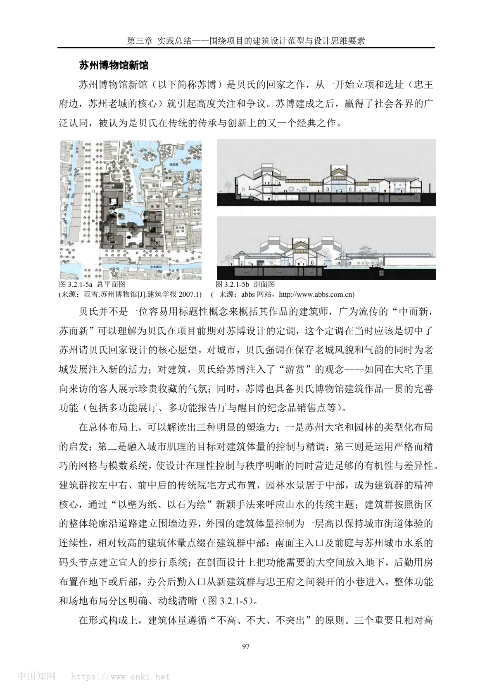
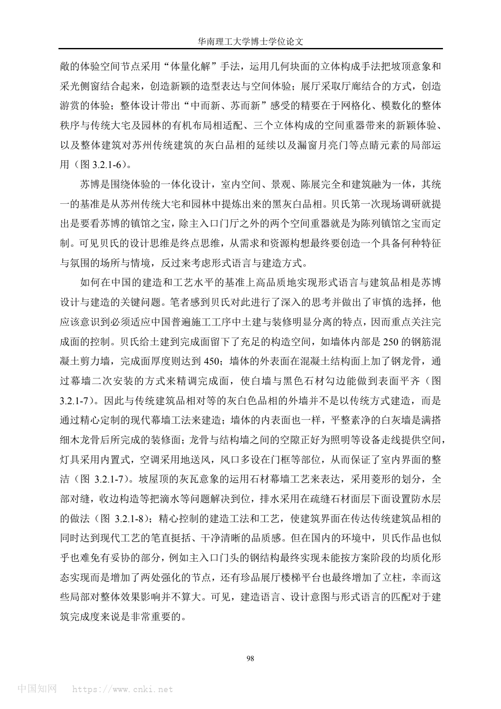
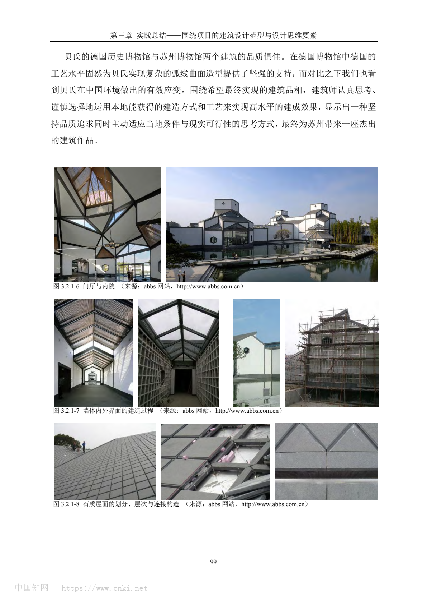

# 苏州博物馆新馆 / Suzhou Museum

## 01 基本信息与经济技术指标

| 项目 | 内容 |
| --- | --- |
| 项目名称 | 苏州博物馆新馆 |
| 英文名称 | Suzhou Museum |
| 建筑师 / 事务所 | I. M. Pei Architect；Pei Partnership Architects |
| 地点 | 江苏省苏州市姑苏区东北街与齐门路交汇处，邻近忠王府、拙政园与狮子林 |
| 国家 / 城市 | 中国 / 苏州 |
| 建成年份 | 2006 年 10 月竣工开馆；2006 年 10 月 6 日对外开放 |
| 建筑类型 | 文化建筑 / 博物馆 |
| 用地面积 | 约 10,700 平方米（官方）；约 10,750 平方米为另一官方页面口径 |
| 建筑面积 | 新馆约 19,000 平方米（官方）；PEI Architects 记为 15,390 平方米；Architectural Record 记为 183,000 sq.ft. |
| 建筑高度 | 主体建筑檐口控制在 6 米内；中央大厅和西部展厅局部二层，高度 16 米 |
| 层数 | 以地下一层、地面一层为主，局部二层 |
| 容积率 | 未检索到可靠资料 |
| 建筑密度 | 未检索到可靠资料 |
| 结构体系 | 公开资料确认使用开放式钢结构、玻璃天棚、局部混凝土墙体；完整结构体系未检索到可靠资料 |
| 主要材料 | 白墙、深灰色“中国黑”花岗石屋面与压顶、玻璃天窗、开放式钢结构、金山石铺地等 |
| 业主 / 委托方 | 苏州市文化广电新闻出版局 / Suzhou Municipal Administration of Culture, Radio and Television |
| 摄影 / 图纸来源 | ArchDaily China 摄影 Chenxing Mi；Architectural Record 摄影 Kerun Ip；用户提供 PDF 页图 |
| 信息可信度 | high |
| 主要依据来源 | 苏州博物馆官方页面、PEI Architects、ArchDaily China、Architectural Record、Google Arts & Culture、用户提供 PDF |

指标说明：项目面积存在统计口径差异。苏博官方以本馆新馆建筑面积 19,000 余平方米、总建筑面积 26,500 平方米为主要口径；PEI Architects 页面使用 15,390 平方米；Architectural Record 使用 183,000 sq.ft.。本分析采用官方口径作为中文案例表主口径，并在信息缺口中记录差异。

## 02 资料质量与证据密度

- 资料状态：sufficient。
- 是否有一级资料：是。苏州博物馆官方、PEI Architects 与 Google Arts & Culture 中的苏州博物馆专题均可用于身份、场地、面积、设计意图与材料说明。
- 建筑专业媒体数量：3。ArchDaily China、Architectural Record、Architizer。
- 图片处理状态：completed。已将用户提供 PDF 的第 6、7、8 页渲染为本地图片并嵌入正文。
- 已覆盖分析项：concept、context、program、circulation、facade_material、structure_construction、user_experience、urban_relationship。
- 资料最充分的方向：场地关系、传统与现代的转译、院落与园林、屋面 / 材料 / 光线策略、入口和中央大厅体验。
- 资料明显不足的方向：完整结构体系、容积率、建筑密度、施工过程、节点详图与成本控制。
- 需要人工复核：面积口径差异，以及 PDF 原文文本层乱码导致无法逐字引用，仅使用其可见页图与图注信息作为本地参考。

## 03 一句话判断

苏州博物馆新馆最值得学习的不是“仿古”，而是在高度敏感的历史街区中，把粉墙黛瓦、院落园林、坡屋面和自然光重新组织为一套现代公共文化建筑语言：它用克制的尺度融入古城，又用材料、几何和光线建立新的时代性。

## 04 场地信息表

| 场地维度 | 与设计回应相关的信息 | 证据 |
| --- | --- | --- |
| 场地区位 | 位于苏州东北街与齐门路相汇处，处在古城核心文化地段 | s1, s2 |
| 自然环境 | 水、庭院、竹林、树木成为建筑体验的一部分；主庭院以水景连接空间和园林意象 | s1, s4 |
| 人文环境 | 邻近忠王府、拙政园、狮子林，周边传统园林和历史建筑密度极高 | s1, s2, s5 |
| 地形条件 | 未检索到复杂地形资料，公开叙述主要强调历史街区与相邻园林关系 | s1 |
| 道路与交通 | 官方资料提到贝聿铭建议将临馆东北街改为步行街，以保护历史街区完整性 | s1 |
| 周边建筑特点 | 粉墙黛瓦、低矮尺度、庭院和园林构成周边主导语汇 | s1, s2, s5 |
| 建筑服务人群 | 公众参观者、文化教育使用者、展览与研究人员；功能包括展厅、档案、咖啡、商店、行政与辅展空间 | s2, s3 |
| 场地核心矛盾 | 既要在世界遗产级园林和文保建筑旁建新博物馆，又不能压过古城尺度；既要现代化展示，又要延续苏州文脉 | s1, s4 |

## 05 概念创意探索 Conceptual Exploration

### 5.1 诊断 Diagnosis

- 来源明确：苏州博物馆官方将新馆概括为“中而新、苏而新”和“不高不大不突出”的设计思想；官方还说明主体檐口高度控制在 6 米内，中央大厅和西部展厅局部二层高度 16 米，未超过周边古建筑最高点。这个约束说明项目的首要问题不是造型表现，而是在古城历史风貌中控制尺度、轮廓和公共性。
- 来源明确：Google Arts & Culture 的苏州博物馆专题指出，新馆紧邻拙政园和狮子林，要同时满足现代化博物馆与周边传统建筑融合，对贝聿铭构成挑战。
- 基于资料的归纳判断：项目真正的设计命题是“如何让新建筑成为古城文化长廊的一部分”。因此，建筑没有以单体纪念性为目标，而是以院落、低矮屋面、白墙、灰黑屋顶、水院和步行街共同组织一个低调但清晰的公共文化场所。

### 5.2 定位 Positioning

- 来源明确：PEI Architects 说明博物馆位于苏州古城历史街区，毗邻忠王府与拙政园，设计从苏州传统建筑的白墙、深灰屋顶和园林建筑语汇中取意。
- 来源明确：苏州博物馆官方将其定位为苏州古城标志性公共文化建筑，也是传统与现代、传承与创新的艺术作品。
- 基于资料的归纳判断：新馆的定位不是以“国际式现代建筑”替代地方性，而是以现代材料和几何秩序重新解释地方性。它把博物馆、古建筑和园林看成一个整体文化场景，而不是孤立的展览容器。

### 5.3 策略 Strategy

- 策略：以低矮、分块、院落化的总体布局回应古城环境。
- 回应的问题：场地周边有忠王府、拙政园、狮子林和传统街巷，新馆如果追求高大体量，会破坏历史街区尺度。
- 对空间 / 形式 / 建造的影响：建筑群坐北朝南，分为中部入口、前庭、中央大厅和主庭院，西部主展区，东部辅展区与行政办公区，形成与忠王府格局呼应的东、中、西三路布局；低檐口和局部二层让建筑成为连续街区肌理的一部分。
- 证据来源：s1, s2, s6。

图文相关性：这张页图来自用户提供 PDF，包含苏州博物馆新馆平面与剖面图示，用于支撑“分区布局、院落组织和局部高度控制”的分析。

### 5.4 意象与表达 Imagery, Naming & Expression

来源明确：官方资料反复强调粉墙黛瓦、“中国黑”花岗石、几何坡顶、玻璃天窗、光线和创意山水园。Google Arts & Culture 进一步说明花岗石片被加工为菱形，在晴天呈深灰、雨天转黑；大厅屋顶框架由正方形和三角形构成，自然光通过百叶窗和斜角窗进入室内。

基于资料的归纳判断：贝聿铭在这里不是复制苏州园林的细节，而是抽取“黑、白、灰”“墙、瓦、院、水、桥、亭”“移步换景”和“光影层次”这些可被现代构造转译的关系。传统成为一种组织逻辑，而不是贴在建筑表面的装饰符号。

图文相关性：这张页图来自用户提供 PDF，用于支撑“传统民居 / 园林语汇被几何化、抽象化、现代化”的判断。

## 06 建筑语言生成 Architectural Language Generation

### 6.1 功能梳理 Function

来源明确：PEI Architects 说明博物馆包含适合展品尺度的展厅、档案室、咖啡和礼品店。Architectural Record 说明入口八角大厅组织参观转向，展览空间沿通道展开，二层设绘画展厅，东侧设置当代艺术展厅。官方资料则将新馆分为中央入口 / 大厅 / 主庭院、西部主展区、东部辅展区与行政办公区。

基于资料的归纳判断：功能组织并非简单线性展览盒子，而是以中央大厅和庭院作为“分配器”。参观者从入口进入后，被中央大厅、天窗廊道和庭院景观引导，在展览、休憩、观景之间形成连续转换。

### 6.2 布局逻辑 Layout

来源明确：官方资料说明建筑群分为中、西、东三部分，并与忠王府格局相互映衬。主庭院位于中央大厅北部，东、南、西三面由新馆建筑围合，北面与拙政园相邻。

基于资料的归纳判断：布局策略可以理解为“双重中介”：一方面，中轴和三路布局使新馆与忠王府的历史秩序对话；另一方面，庭院和水景在新馆与拙政园之间建立视觉与意象上的连续。建筑不是直接打开到拙政园，而是通过水、墙、片石假山和庭院构图完成“笔断意连”的连接。

### 6.3 形式构成 Composition

来源明确：官方资料说明新馆采用粉墙黛瓦色调，但以深灰花岗石替代传统小青瓦；玻璃和开放式钢结构让室内获得大片天光；屋顶借鉴传统老虎天窗并改良为几何天窗。Architectural Record 也指出博物馆用 China Black granite 覆盖屋顶、勾勒窗和压顶，形成清晰且现代的效果。

基于资料的归纳判断：形式构成的关键不是一个大屋顶，而是一组可控的小尺度坡顶和折面天窗。传统屋面被拆解为三角形、菱形和矩形构成的几何系统，既回应周边屋顶轮廓，又把现代采光、钢结构和玻璃屋面整合进展览体验。

### 6.4 场所与氛围 Place & Atmosphere

来源明确：Google Arts & Culture 和官方资料均强调自然光、光影、植物、水景与材料共同塑造游览体验。大厅屋顶让参观者看到天空，光线经过遮光条调节进入活动区和展区；主庭院由池塘、片石假山、桥、亭、竹林组成。

基于资料的归纳判断：苏州博物馆新馆的氛围不是强烈戏剧性的纪念空间，而是以低亮度、浅色墙面、深色屋面、水面反射、庭院停顿和天光变化形成“慢体验”。它把博物馆参观转化为类似园林游线的观看、转折和停留。

## 07 建造品质控制 Construction Quality Control

### 7.1 建造语言 Construction Language

- 骨架：来源明确，官方资料确认使用开放式钢结构替代传统木构材料；Architectural Record 记录结构工程顾问为 Leslie E. Robertson & Associates。完整结构体系、柱网与基础做法未检索到可靠公开资料。
- 围合：来源明确，白墙、深灰花岗石屋面 / 压顶、玻璃天窗和大尺度开窗共同构成围护语言。
- 地台：来源明确，官方资料说明东北街步行街采用金山石铺地，体现地方材料和手工打磨质感；室内外具体地面系统未检索到完整节点资料。

### 7.2 材料与工艺 Materials & Craft

来源明确：官方资料说明传统小青瓦易碎易漏、维护和平整度难满足新馆要求，因此采用深灰色“中国黑”花岗石替代灰瓦；石片加工成菱形并铺设于屋面。Google Arts & Culture 说明这种石材密度高、质地硬、不会开裂，晴天与雨天呈现不同灰黑色调。Architectural Record 也记录 Pei 团队研究传统建筑形态和可用石材色调后，选择 China Black granite。

基于资料的归纳判断：材料策略的专业价值在于“以性能和工艺替换传统形象”。花岗石既承担黛瓦的视觉记忆，又解决传统瓦在维护、漏水和平整度上的问题，使地域性不再依赖原样材料，而可以通过现代材料性能被重新实现。

图文相关性：这张页图来自用户提供 PDF，包含墙面、开口与石材屋面 / 玻璃构造的参考图片，用于支撑材料转译和建造品质控制分析。

### 7.3 构造逻辑 Tectonic Logic

来源明确：屋顶使用几何坡顶、玻璃天窗、钢结构与花岗石片共同组织；大厅屋顶框架由正方形和三角形构成，材料则从传统木梁架转为现代钢结构和玻璃。

基于资料的归纳判断：构造逻辑呈现为“传统轮廓 + 现代骨架 + 可控光线”。坡顶保留江南屋面意象，钢结构提供开放空间和天窗体系，玻璃与遮光条把自然光转化为室内展览可接受的漫射光。这里的构造不是隐藏的工程后台，而是成为建筑语言本身。

### 7.4 物理性能与施工控制 Performance & Construction Control

来源明确：官方资料说明玻璃屋顶和遮光条使自然光进入活动区域和展区，并克服单纯人工采光的弊端；花岗石屋面则因维护、坚固性、工艺和平整度要求而替代传统瓦。关于通风、保温、雨水组织、施工样板和完整施工流程，未检索到可靠资料。

基于资料的归纳判断：可确认的性能控制主要集中在屋面防水 / 耐久、自然采光、展厅光线调节和材料维护上。不可把这些资料扩展推断为完整绿色建筑系统或详细施工管理体系。

## 08 核心方法提炼

### 方法 1：以“不高不大不突出”建立历史街区中的新建筑尺度

- 面对的问题：新馆位于拙政园、狮子林、忠王府等高敏感历史环境中，现代公共建筑容易因体量和高度破坏古城风貌。
- 具体做法：主体以地下一层、地面一层为主，檐口控制在 6 米内，局部二层高度 16 米；总体分为东、中、西三路，并与忠王府格局相互映衬。
- 建筑效果：建筑获得公共文化建筑的容量，同时在街区尺度上保持低调，避免成为压迫周边园林和古建的孤立纪念物。
- 证据来源：s1, s6。
- 相关图片 / 图纸：见上文 PDF 第 6 页。
- 可迁移方法：在历史街区做新公共建筑时，先设定高度、檐口、分块和院落边界，再讨论造型表达。

### 方法 2：把传统符号转译为现代材料和几何秩序

- 面对的问题：直接复古会削弱现代建筑的真实性，完全现代又可能与苏州古城脱节。
- 具体做法：延续粉墙黛瓦的黑白灰关系，但用“中国黑”花岗石替代传统瓦，用几何坡顶、菱形石片、钢结构和玻璃天窗重构传统屋面。
- 建筑效果：建筑既能被读作苏州语境中的作品，又具有清晰的现代构造和材料品质。
- 证据来源：s1, s3, s4。
- 相关图片 / 图纸：见上文 PDF 第 8 页。
- 可迁移方法：传统不是复制构件，而是提取比例、色彩、轮廓和性能要求，再用当代材料重组。

### 方法 3：以院落和水景作为建筑与园林之间的中介

- 面对的问题：新馆与拙政园相邻，但不能简单打开边界或模拟古典园林。
- 具体做法：主庭院由建筑三面围合，北向与拙政园相邻；通过池塘、片石假山、桥、亭、竹林等元素形成创意山水园，并以水景和墙面建立意象连接。
- 建筑效果：博物馆空间具有园林式停顿与观看节奏，历史园林的精神被转换为现代参观体验。
- 证据来源：s1, s4, s5。
- 相关图片 / 图纸：见上文 PDF 第 7 页。
- 可迁移方法：面对强历史景观时，不一定追求直接视线连通，可以用庭院、水、墙和路径构造“间接连续”。

### 方法 4：让自然光参与展览路径和空间记忆

- 面对的问题：博物馆需要控制光线，同时公共空间又需要明亮、开放和方向感。
- 具体做法：屋顶引入玻璃天窗、百叶 / 遮光条和高挑斜角窗；大厅与廊道通过几何屋面和天光形成视觉引导。
- 建筑效果：光线从工程采光转化为游览体验，参观者通过光影变化感知路径、庭院和空间层级。
- 证据来源：s1, s4。
- 相关图片 / 图纸：见上文 PDF 第 8 页。
- 可迁移方法：文化建筑的采光策略应同时处理展品保护、路径识别和空间氛围，而不是只追求明亮。

### 方法 5：把公共开放性放在“门庭”与“步行街”层面解决

- 面对的问题：传统深宅大院常有高墙闭合感，博物馆作为公共建筑需要更开放的入口姿态。
- 具体做法：入口采用玻璃重檐、两面坡式金属梁架；贝聿铭建议将临馆东北街改为步行街，并以金山石铺地延续地方质感。
- 建筑效果：公共性不只发生在馆内，也延伸到街道、入口、前庭和中央大厅，形成从城市到展览的渐进过渡。
- 证据来源：s1。
- 相关图片 / 图纸：见上文 PDF 第 6 页。
- 可迁移方法：公共文化建筑应把周边街道、入口门庭和室内大厅作为连续系统设计。

## 09 图纸与图片索引

| 图片类型 | 推荐用途 | 正文嵌入状态 / 本地图片 / 来源页面 | 来源 | 下载状态 | 图文相关性 | 版权 / 备注 |
| --- | --- | --- | --- | --- | --- | --- |
| 03_plan | 平面 / 剖面 / 布局分析 | 已嵌入：`images/03_plan_and_section_pdf_p6.png` | 用户提供 PDF《贝聿铭作品.pdf》第 6 页 | downloaded | 用于说明三路布局、院落组织、局部高度和剖面关系 | 课堂研究整理；权利未清除 |
| 07_concept | 空间语言 / 传统转译分析 | 已嵌入：`images/07_spatial_language_pdf_p7.png` | 用户提供 PDF《贝聿铭作品.pdf》第 7 页 | downloaded | 用于说明传统民居、园林语汇的抽象化与现代化 | 课堂研究整理；权利未清除 |
| 06_detail | 材料 / 构造 / 开口分析 | 已嵌入：`images/06_material_detail_pdf_p8.png` | 用户提供 PDF《贝聿铭作品.pdf》第 8 页 | downloaded | 用于说明墙面、屋面、玻璃和石材的构造表达 | 课堂研究整理；权利未清除 |

## 10 对我的设计启发

- 可迁移方法 1：先用“场地约束”定义体量边界，再让造型在边界内生长。苏博新馆的高度控制、分区和院落化比单个立面更关键。
- 可迁移方法 2：传统转译要找“可操作的现代替代物”。例如以花岗石替代瓦，不只是换材料，而是同时回应颜色、耐久、平整度、维护和现代轮廓。
- 可迁移方法 3：公共建筑可以借鉴园林的“移步换景”，但需要转化为入口、廊道、庭院、展厅和休憩点之间的路径组织。
- 可迁移方法 4：光线可以成为空间结构的一部分。采光、遮光、屋顶几何和展览动线应一体考虑。
- 不适合直接照搬的部分：黑白灰、坡屋顶、片石假山等符号若脱离苏州古城语境，容易成为表面风格；真正可学的是“语境诊断 + 现代构造转译”的方法。
- 可转化成的分析图：场地敏感性图、三路布局图、入口到庭院流线图、屋面几何与天光分析图、黑白灰材料转译图、庭院与拙政园“间接连续”图。

## 11 信息缺口与冲突

- 面积口径差异：苏州博物馆官方页面记载新馆占地约 10,700 平方米、新馆建筑面积 19,000 余平方米、总建筑面积 26,500 平方米；PEI Architects 记载 15,390 平方米；ArchDaily China 记载 15,000 平方米；Architectural Record 记载 183,000 sq.ft.。这些可能来自是否计入忠王府修缮、展陈 / 后勤 / 总建筑面积等统计口径差异，需在正式图册中人工复核。
- 结构体系缺口：公开资料能确认开放式钢结构、玻璃天窗、局部混凝土墙体和结构工程顾问，但未检索到完整结构体系、柱网、基础和节点详图。
- 施工过程缺口：材料选择、东北街金山石手工打磨、屋面花岗石替代瓦有较充分说明；施工组织、样板控制、成本和工期细节未检索到可靠资料。
- PDF 使用限制：用户提供 PDF 的文本层存在乱码，本文将其作为本地图像证据和页图参考，未逐字引用 PDF 段落。

## 12 来源列表

### Level A：官方与一手来源

- s1 [苏博建筑 - 苏州博物馆](https://dx.szmuseum.com/views/NewsDetails.aspx?guid=349a54de-f3f5-41bc-b86d-7c3488d3c0d6)
- s2 [Suzhou Museum - PEI Architects](https://pei-architects.com/projects/suzhou-museum/)
- s4 [苏州博物馆：贝聿铭建筑大作 - Google Arts & Culture](https://artsandculture.google.com/story/hgXxr9NyQc6tKA?hl=zh-CN)
- s6 用户提供 PDF：《贝聿铭作品.pdf》，C:/Users/dell/Desktop/贝聿铭作品.pdf

### Level B：高质量建筑媒体

- s3 [AD经典：苏州博物馆 / 贝聿铭 + 贝氏建筑事务所 - ArchDaily China](https://www.archdaily.cn/cn/943933/adjing-dian-su-zhou-bo-wu-guan-bei-yu-ming-plus-bei-shi-jian-zhu-shi-wu-suo)
- s5 [Suzhou Museum by I. M. Pei - Architectural Record](https://www.architecturalrecord.com/articles/8019-suzhou-museum-by-i-m-pei)
- s7 [Suzhou Museum - Architizer](https://architizer.com/projects/suzhou-museum/)

### Level C：中文补充源

- 未纳入独立 Level C 来源。由于已有官方、建筑师事务所与专业建筑媒体，未将低证据密度中文评论作为事实依据。

### Level D：参考源，只能辅助

- 未使用 Level D 作为核心事实来源。
