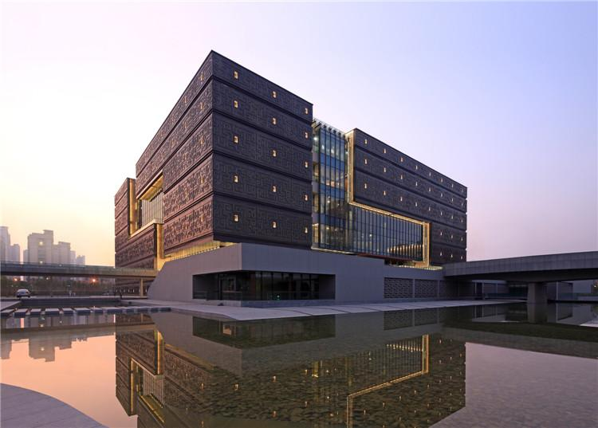

# 安徽省博物院新馆 / Anhui Museum New Building

> 不完整原因：未检索到华南理工大学建筑设计研究院当前官网项目页、gooood / ArchDaily / 有方完整项目页。资料以建筑学院授权转载、景观中国条目、建筑学报论文数据库摘要和搜索结果可见信息为主；项目事实与设计解读仍建议人工复核。

## 01 基本信息与经济技术指标

| 项目 | 内容 |
| --- | --- |
| 项目名称 | 安徽省博物院新馆 / 安徽省博物馆新馆 |
| 英文名称 | Anhui Museum New Building |
| 建筑师 / 事务所 | 华南理工大学建筑设计研究院；主创线索：何镜堂、刘宇波、张振辉、梁玮健、盘育丹、刘挺、陆超、蔡卓等 |
| 地点 | 安徽省合肥市政务文化新区，省文化博物园区 |
| 国家 / 城市 | 中国 / 合肥 |
| 设计时间 / 竣工时间 | 2006-2009 / 2011（来自搜索结果与文库可见摘要，需复核） |
| 建筑类型 | 文化建筑 / 博物馆 |
| 用地面积 | 55,500 m2（来自搜索结果可见摘要，需复核） |
| 总建筑面积 | 41,380 m2（来自搜索结果可见摘要，需复核） |
| 建筑高度 | 未检索到可靠资料 |
| 层数 | 未检索到可靠资料 |
| 容积率 | 未检索到可靠资料 |
| 建筑密度 | 未检索到可靠资料 |
| 结构体系 | 未检索到可靠资料 |
| 主要材料 | 外表面青铜纹理、内表面木质衬里（景观中国条目） |
| 建设单位 | 安徽省公益性项目建设管理中心（来自搜索结果可见摘要，需复核） |
| 摄影 / 图纸来源 | 张广源；建筑学院 / 景观中国页面 |
| 信息可信度 | medium |
| 主要依据来源 | s1, s2, s3, s4 |

## 02 资料质量与证据密度

- 资料状态：partial
- 是否有一手资料：是，建筑学报文章题名与作者线索可确认，但正文公开获取不完整
- 一手资料是否用于身份确认：部分用于确认设计者与设计概念线索
- 建筑专业媒体数量：2
- 图片处理状态：partial
- 已覆盖分析项：concept / context / program / circulation / facade_material / urban_relationship / user_experience
- 资料最充分的方向：设计概念、地域文化定位、中庭与公共大厅、片墙组织、材料表皮意向。
- 资料明显不足的方向：完整平剖面、结构体系、构造节点、施工过程、经济技术指标的官方出处。
- 需要人工复核：设计团队完整名单、面积数据、建设单位、竣工时间、图纸原始出处。

## 03 一句话判断

安徽省博物院新馆最值得学习的是：它没有把“徽派”简化成白墙黑瓦的图像，而是把“四水归堂”的院落原型转译成开放中庭、片墙和垂直游线的公共空间系统。

## 04 场地信息表

| 场地维度 | 与设计回应相关的信息 | 证据 |
| --- | --- | --- |
| 场地区位 | 位于合肥市政务文化新区内的省文化博物园区 | s1, s2, s3 |
| 城市关系 | 省文博园位于新区中轴线西侧、次景观轴一端，新馆居中 | s1, s3 |
| 周边建筑 | 与古生物化石博物馆、美术馆呈品字形布局 | s3 |
| 入口关系 | 主入口朝东；景观中国提到以入口引桥串联竹林、水面、广场 | s2, s3 |
| 文化背景 | 安徽地域文化兼具北方雄浑敦厚与南方温文秀雅 | s3 |
| 核心矛盾 | 省级博物馆需要在新区中形成标志性，同时避免把地域文化窄化为单一徽州符号 | s3，AI synthesis |

## 05 概念创意探索 Conceptual Exploration

### 5.1 诊断 Diagnosis

- 来源明确：建筑学院转载文本说明，设计团队在调研中意识到安徽文化不能只由徽州村落、白墙黑瓦来代表，而应面对淮北、江淮、大别山、沿江、皖南等多元地域文化。
- 基于资料的归纳判断：项目的设计问题不是“做一个有传统符号的博物馆”，而是在合肥新区的公共文化轴线上，为省级文化建筑建立更包容的地域表达。

图文相关性：用于说明新馆作为文化园区中心建筑的整体形象、方整体量与厚重表皮。

### 5.2 定位 Positioning

- 来源明确：建筑学院文本提出新馆应呈现“端庄厚重、方正平直而又雅致通透、内涵丰富”的标志性形象。
- 基于资料的归纳判断：建筑的公共性来自中庭和流线系统，而地域性来自院落原型、片墙、巷道、青铜纹理与木质衬里的综合转译。

### 5.3 策略 Strategy

- 策略：以“四水归堂、五方相连”为核心意象。
- 回应的问题：如何把安徽多元文化和博物馆公共流线组织到一个可体验的空间核心中。
- 对空间 / 形式 / 建造的影响：形成向天开敞的公共大厅，用连续转折的片墙限定空间，并通过自动扶梯和“窄巷”式路径把各层展览空间联动起来。
- 证据来源：s2, s3, s4。

## 06 建筑语言生成 Architectural Language Generation

### 6.1 功能梳理 Function

公开资料没有提供完整功能分区图。可确认的是：项目作为省级博物馆，新馆的公共大厅承担入口集散、垂直交通、空间识别与展览路径组织的枢纽作用。建筑学院文本描述自动扶梯布置在片墙夹持、天光引导的“窄巷”中，环绕盘旋到达各层空间。

### 6.2 布局逻辑 Layout

来源明确：新馆位于文博园中部，主入口朝东；场地设计以入口引桥为主线，连接竹林、水面、广场，强化中轴线空间序列。基于资料的归纳判断：外部入口序列先建立轴线与仪式感，内部则由中庭和片墙把参观路径转化为空间体验。

图纸源链接（下载失败）：[建筑学院旧图源](http://qn.cutt.com/170927191855242.750.353.0.2654)（状态：failed；原因：旧 qn.cutt.com 直链返回 404）

### 6.3 形式构成 Composition

景观中国条目概括其形体：方正建筑由连续转折的实体体量与穿插其间的透明空间立体构成；公共空间从内部中庭向建筑外部延伸连通。这个描述与建筑学院文本中的“立体徽州村落”“通高片墙”“巷道”互相印证。

图纸源链接（下载失败）：[建筑学院旧剖面图源](http://qn.cutt.com/170927191856009.750.356.0.2654)（状态：failed；原因：旧 qn.cutt.com 直链返回 404）

### 6.4 场所与氛围 Place & Atmosphere

来源明确：核心大厅向天开敞，片墙通过转折、勾连、错动、交叠限定不同尺度空间；自动扶梯被放入片墙夹持和天光引导的“窄巷”。基于资料的归纳判断：项目把传统院落的内向性转化为博物馆的公共共享空间，把村落巷道的游走经验转化为展览前后的身体路径。

室内旧图源（下载失败）：[公共大厅图源](http://qn.cutt.com/170927191804590.750.471.0.2654)（状态：failed；原因：旧 qn.cutt.com 直链返回 404）

## 07 建造品质控制 Construction Quality Control

### 7.1 建造语言 Construction Language

- 骨架：未检索到可靠结构体系资料。
- 围合：景观中国明确提到外表面为青铜纹理、内表面为木质衬里。
- 地台：未检索到可靠节点或基础资料。

### 7.2 材料与工艺 Materials & Craft

来源明确：体量外表面采用青铜纹理、内表面采用木质衬里，景观中国将其解释为以现代视角转译地方与历史的厚重、文雅质感。这里可以学习的是材料意向与空间位置的分工：外部偏纪念性和历史重量，内部偏温润、公共和可停留。

### 7.3 构造逻辑 Tectonic Logic

未检索到可靠节点图、幕墙系统、连接方式或施工做法资料。当前只能记录“实体体量 + 透明空间 + 片墙”的空间构成逻辑，不能进一步推断具体构造。

### 7.4 物理性能与施工控制 Performance & Construction Control

未检索到可靠的遮阳、通风、保温、防雨、施工难点、样墙或质量控制资料。

## 08 核心方法提炼

### 方法 1：从地域文化“扩容”开始，而不是直接套用地方符号

- 面对的问题：安徽文化容易被单一化理解为徽派村落与白墙黑瓦。
- 具体做法：将安徽置于承东启西、连南接北的过渡区位中理解，提炼出雄浑敦厚与温文秀雅并存的气质。
- 建筑效果：建筑形象避免单一仿古，转向方正、厚重、通透并存。
- 证据来源：s3。
- 相关图片：
- 可迁移方法：做地域建筑时先扩大文化样本，再选择空间原型和材料语汇。

### 方法 2：把“四水归堂”转译为公共中庭，而不是复刻天井

- 面对的问题：省级博物馆需要开放、集散、导向和标志性空间。
- 具体做法：在核心部位形成向天开敞的公共大厅，并以片墙限定空间。
- 建筑效果：传统院落原型被转化为现代公共大厅，兼具方向感、聚合性和纪念性。
- 证据来源：s3, s4。
- 相关图片 / 图纸：旧图源下载失败，见第 09 节。
- 可迁移方法：传统空间原型应转译为空间组织机制，而不是只转译成视觉符号。

### 方法 3：用片墙和“窄巷”组织垂直游线

- 面对的问题：博物馆多层参观容易形成单纯交通核，体验与展陈脱节。
- 具体做法：把自动扶梯置于片墙夹持、天光引导的“窄巷”中，环绕盘旋到达各层。
- 建筑效果：交通被空间化，参观者在上升和转折中获得类似村落巷道的身体经验。
- 证据来源：s3。
- 可迁移方法：将垂直交通放入空间叙事，而不是只作为效率设施。

### 方法 4：外部青铜纹理与内部木质衬里分层表达

- 面对的问题：博物馆需要同时表达历史厚度和可进入的公共温度。
- 具体做法：外表面采用青铜纹理，内表面采用木质衬里。
- 建筑效果：外部建立文化纪念性，内部形成更温润的参观氛围。
- 证据来源：s2。
- 可迁移方法：材料表达可以按外部城市角色与内部身体体验分层配置。

## 09 图纸与图片索引

| 图片类型 | 推荐用途 | 正文嵌入状态 / 本地图片 / 来源页面 | 来源 | 下载状态 | 图文相关性 | 版权 / 备注 |
| --- | --- | --- | --- | --- | --- | --- |
| 01_hero | 外观识别 | 已嵌入：`images/01_hero_exterior.jpg` / [来源](https://www.archcollege.com/37338.html) | 建筑学院 | downloaded | 说明整体外观、方整体量和表皮识别 | 图片来源页面注明张广源；研究整理使用，权利未清 |
| 03_plan | 平面 / 布局参考 | [旧图源](http://qn.cutt.com/170927191855242.750.353.0.2654) | 建筑学院旧图源 | failed | 用于验证平面或流线组织 | 旧直链 404 |
| 04_section | 剖面 / 空间关系 | [旧图源](http://qn.cutt.com/170927191856009.750.356.0.2423) | 建筑学院旧图源 | failed | 用于验证剖面空间关系 | 旧直链 404 |
| 08_interior | 公共大厅 / 片墙 | [旧图源](http://qn.cutt.com/170927191804590.750.471.0.2654) | 建筑学院旧图源 | failed | 用于说明中庭、片墙、天光和垂直交通 | 旧直链 404 |

## 10 对我的设计启发

- 可迁移方法 1：先做地域文化的多源诊断，再建立建筑气质，而不是直接套符号。
- 可迁移方法 2：把传统空间原型转化为功能组织和身体路径。
- 可迁移方法 3：把交通、采光、尺度变化合并成连续体验。
- 可迁移方法 4：用材料内外分层处理公共建筑的城市性与可亲近性。
- 不适合直接照搬的部分：青铜纹理、片墙和“徽州村落”意象必须依赖具体地域与展陈叙事，不能作为通用造型。
- 可转化成的分析图：地域文化样本图、外部轴线与入口序列图、中庭-片墙-垂直交通剖面图、内外材料分层图。

## 11 信息缺口与冲突

- 官方项目页：未检索到华工院当前官网项目页面。
- 资料等级：未找到 gooood / ArchDaily / 有方完整项目页；建筑学院和景观中国为可用二级来源。
- 指标复核：用地面积、总建筑面积、建设单位、设计团队完整名单来自搜索结果可见摘要或数据库条目线索，建议查阅《建筑学报》2011 年第 12 期原文。
- 技术缺口：结构体系、幕墙节点、材料构造、施工过程、物理性能未检索到可靠公开资料。
- 图片缺口：建筑学院旧图源大量返回 404，仅下载到封面图。

## 12 来源列表

### Level A：官方与一手来源

- [四水归堂五方相连——安徽省博物馆新馆创作构思-何镜堂刘宇波张振辉梁玮健-中文期刊【掌桥科研】](https://www.zhangqiaokeyan.com/academic-journal-cn_architectural-journal_thesis/0201210418354.html)

### Level B：高质量建筑媒体

- [国庆专题 | 博物馆——安徽省博物院新馆 / 何镜堂 - 建筑学院官方网站](https://www.archcollege.com/37338.html)
- [安徽省博物馆新馆建筑设计/何镜堂_景观中国](http://www.landscape.cn/architecture/9248.html)

### Level C：中文补充源

- [国庆余额不足 | 博物馆——安徽省博物馆新馆 / 何镜堂](https://www.sohu.com/a/196733785_656721)

### Level D：参考源，只能辅助

- [安徽省博物馆_何镜堂_刘宇波_张振辉_梁玮健... - 百度文库](https://wenku.baidu.com/view/20135eb902d276a200292e5d.html)
- [安徽省博物馆新馆 - 百度文库](https://wenku.baidu.com/view/99145d74647d27284b7351fe.html)
