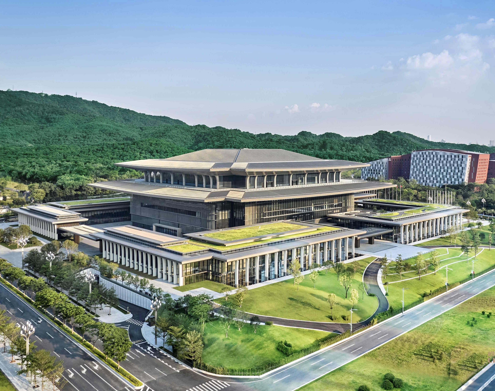
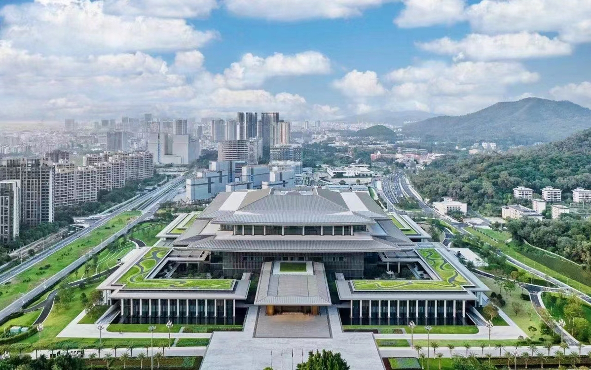

# 白云国际会议中心国际会堂 / Baiyun International Convention Center International Hall

> 不完整原因：公开资料中仍未找到完整的设计院项目页或 Level B 建筑媒体深度报道；本包已补充南都 N 视频/搜狐转载的公众号式文章、广州市政府转载信息和会展平台资料。施工图级构造、完整团队名单和竣工资料仍需进一步核验。

## 案例图像

*图像用途：用于验证“国际会堂整体外观”这一分析要点。 来源：[原始页面/图像](https://p9.itc.cn/q_70/images03/20230821/6c2c58a5433743e2b0eaf1de3d17f8e7.jpeg)。*

*图像用途：用于验证“叠层屋面与主入口”这一分析要点。 来源：[原始页面/图像](https://img3.chinadaily.com.cn/images/202308/19/64e04d95a3109d7518e26caa.jpeg)。*

## 01 基本信息

- 建筑师 / 事务所：何镜堂院士及华南理工大学建筑设计研究院团队（澎湃新闻转载稿提及）
- 地点：中国广东省广州市白云区白云大道南 1039-1045 号
- 年份：公开资料显示二期/国际会堂于 2023 年前后投入使用，具体竣工年份需官方项目页确认
- 类型：会议会展 / 大型公共建筑 / 会堂
- 面积：国际会堂总建筑面积约 13.7 万平方米；与一期联合打造总规模超 40 万平方米的会议综合体
- 状态：已投入运营
- 关键词：会议综合体、云山叠景、岭南新中式、围院式布局、立体化园林、无柱宴会厅、光伏饰面板、白云山水意象
- 案例类型：文化会展建筑 / 大型会议中心
- 信息可信度：中高 / 仍缺少设计院原始项目页
- 主要依据来源：岭南酒店官网、广州市政府转载信息、南都 N 视频、搜狐转载稿、澎湃新闻转载设计介绍

## 02 一句话判断

这个案例最值得学习的是：它把大型会议会展建筑的高容量、可变使用和仪式性空间结合起来，用“白云山水”和岭南礼序作为空间叙事线索，而不是只做一个中性的会议盒子。

## 03 项目背景

白云国际会议中心位于广州白云区白云大道南，邻近白云山与白云新城一带，是广州大型会议、展览和城市活动的重要承载设施。岭南酒店官网将白云国际会议中心与白云国际会堂并列描述为共同构成逾 45 万平方米的世界级会议综合体，说明国际会堂在功能上是对原会议中心的扩展和升级。来源：s1。

澎湃新闻转载稿将该项目称为“广州白云国际会议中心国际会堂”，并说明其由何镜堂院士及华南理工大学建筑设计研究院团队设计。该文强调项目以“白云山水，云山叠翠，时代国风”为主题，回应白云山地域意象、岭南文化和大型会展活动的礼仪性需求。来源：s2。

补充检索到的南都 N 视频/搜狐转载稿进一步说明：国际会堂是白云国际会议中心二期项目，由何镜堂院士团队牵头设计，越秀集团裕城公司作为建设单位，岭南集团一体化运营；项目集高端会议、展览、宴会功能于一体，总建筑面积约 13.7 万平方米。来源：s6、s7。

## 04 设计理念

### 来源明确的设计理念

澎湃新闻转载稿明确提出项目主题为“白云山水，云山叠翠，时代国风”，并把“天圆地方”、青花瓷顶、流水花园、琉璃墙、水晶灯和云山意象联系在一起。南都/搜狐转载稿则补充了“云山叠景”理念，强调建筑布局融合中国礼仪型制与岭南园林特色，塑造依傍云山、面向未来的园林主会场。来源：s2、s6、s7。

### AI 综合判断

从已公开资料看，项目的设计逻辑不是单一造型概念，而是把“岭南文化意象”“大型会展弹性”“礼仪性到达与聚会空间”叠合起来：外部通过圆形屋顶、玻璃方盒和山水意象形成识别度，内部通过中厅、多功能厅、移动廊院和可变设备系统服务不同会议场景。此判断为基于 s1、s2 的综合分析。

## 05 核心建筑策略

### 策略 1：以“白云山水”组织大型会堂的地域形象

- 设计问题：大型会议中心容易成为尺度巨大但地域性薄弱的通用空间，需要在城市级公共活动中建立可识别的广州/白云意象。
- 具体做法：项目以“白云山水，云山叠翠，时代国风”为主题，使用圆形屋顶、玻璃方盒、青花瓷顶、水体、水晶吊坠、琉璃墙等元素，把山、水、云、岭南工艺感转译为空间和表皮线索。
- 建筑效果：形成比普通会议中心更强的礼仪感和地域叙事，也让室内中厅成为可被记忆的公共核心。
- 证据来源：s2。
- 相关图片 / 图纸链接： 见本页“案例图像”章节中的本地图片。。
- 可借鉴点：大型公共建筑可以把地域意象落实到屋顶、界面、采光、水体和室内装置等多层级，而不是停留在口号式“文化表达”。

### 策略 2：以中厅和廊院建立会议建筑的空间序列

- 设计问题：大型会展建筑人流量大、活动类型多，若只有大厅和房间堆叠，容易缺少明确的到达、停留和转换空间。
- 具体做法：公开介绍中将建筑按中厅、会展厅、多功能厅及配套分为主要部分，并通过中厅、流水花园、移动廊院等空间组织公共活动与转换。
- 建筑效果：中厅承担集散、仪式、视觉核心和室内景观作用；廊院则缓冲不同功能区，降低超大尺度建筑的压迫感。
- 证据来源：s2。
- 相关图片 / 图纸链接： 见本页“案例图像”章节中的本地图片。。
- 可借鉴点：会议中心的“交通空间”不应只是走廊，可以被设计成连续的公共场景和活动前厅。

### 策略 3：用可变设备系统支持超级多功能厅

- 设计问题：会堂需要适应会议、展览、宴会、演出等不同活动，固定空间很难高效覆盖多种场景。
- 具体做法：澎湃新闻转载稿提到项目使用超大跨度钢桁架承重体系，以及可调可变的天花、隔声间隔、灯光、音响和 450 个升降台，可快速调整场地。
- 建筑效果：超级多功能厅从单一大厅转化为可重组的活动平台，提高大型公共建筑的运营弹性。
- 证据来源：s2。
- 相关图片 / 图纸链接： 见本页“案例图像”章节中的本地图片。。
- 可借鉴点：大空间的核心不只是“做大”，还要把结构、声学、灯光、隔断、升降平台和运营模式作为一个系统设计。

### 策略 4：以大跨度结构服务无柱化公共活动

- 设计问题：大型会议和会展空间需要减少视线遮挡，并提供高适应性的平面。
- 具体做法：资料提及超级多功能厅采用超大跨度钢桁架承重体系，局部使用白色倒圆锥形点支撑的视觉表达。
- 建筑效果：结构系统既解决大空间覆盖，也成为室内视觉秩序的一部分。
- 证据来源：s2。
- 相关图片 / 图纸链接： 见本页“案例图像”章节中的本地图片。。
- 可借鉴点：在大型公共建筑中，结构可以从“隐藏的技术支撑”转化为可感知的空间组织和视觉表达。

### 策略 5：围院式布局、深远挑檐与光伏屋面共同服务绿色会议场馆

- 设计问题：广州大型会议建筑需要处理遮阳、热环境、能源消耗和室内空气品质，同时保持礼仪性形象。
- 具体做法：补充资料提到项目采用围院式布局，深远挑檐形成自遮阳体形，多层次平台和挑檐促进风压变化，改善局部热环境；屋面采用与造型结合的光伏饰面板，并与建筑电力系统联通。
- 建筑效果：绿色技术不作为外加设备，而与岭南庭院、屋顶造型和会议建筑的形象系统结合。
- 证据来源：s6、s7。
- 相关图片 / 图纸链接： 见本页“案例图像”章节中的本地图片。。
- 可借鉴点：大型公共建筑的绿色策略应尽量嵌入形体、庭院、挑檐、平台和屋面系统，而不是后置附加。

## 06 空间与流线

项目公开资料显示，国际会堂由中厅、会展厅、多功能厅及配套空间组成，说明其流线重点在于大型集散、中厅转换、多厅并行运营和活动弹性。中厅更像“城市客厅”或活动前厅，承担到达、等待、分流和礼仪展示；多功能厅则承担高强度活动使用。相关图片： 见本页“案例图像”章节中的本地图片。。

补充资料显示，项目一层岭南厅可作为 1200 人主会场，最大无柱宴会厅约 2800 平方米，可分隔为两个 1400 平方米会议室；会堂内还有超过 30 间中小型会议室，可分隔成超过 60 间会议室。这说明空间组织重点不只是单个大厅，而是多会议场景并行、可分隔、可转换的会议集群。来源：s6、s7。由于未找到完整平面图和剖面图，本包暂不对消防疏散、后勤动线和贵宾流线作确定判断。

## 07 形体、立面与建构

公开介绍中提到“圆形屋顶漂浮于玻璃方盒上”，可以理解为项目通过圆与方、厚重屋顶与透明体量的对比，塑造大型会堂的公共形象。立面与室内材料表达则围绕琉璃、水晶、青花瓷顶和流水意象展开。相关图片： 见本页“案例图像”章节中的本地图片。。

结构方面，资料明确提到超级多功能厅使用超大跨度钢桁架承重体系，但未找到结构跨度、节点、构件尺寸或施工图级资料，因此只能作为公开资料层面的结构策略判断。相关图片： 见本页“案例图像”章节中的本地图片。。

补充来源还提到国际会堂结合岭南传统挑檐、遮阳、庭院进行现代演绎，立面包含金属夹丝玻璃格栅，内部以国画、广绣、木雕等艺术品回应“江澜海阔 花盛云祥”的艺术主题。来源：s6、s7。

## 08 图纸与图片索引

| 图片类型 | 推荐用途 | 图片或页面链接 | 来源 | 版权 / 备注 |
| --- | --- | --- | --- | --- |
| 01_hero | 外观 / 项目识别 | https://imagepphcloud.thepaper.cn/pph/image/245/761/593.jpg | 澎湃新闻转载稿 | 仅作研究链接，版权未清 |
| 08_interior | 中厅 / 礼仪空间分析 | https://imagepphcloud.thepaper.cn/pph/image/245/761/594.jpg | 澎湃新闻转载稿 | 仅作研究链接，版权未清 |
| 08_interior | 室内材料与地域意象 | https://imagepphcloud.thepaper.cn/pph/image/245/761/595.jpg | 澎湃新闻转载稿 | 仅作研究链接，版权未清 |
| 09_analysis | 廊院 / 空间转换分析 | https://imagepphcloud.thepaper.cn/pph/image/245/761/598.jpg | 澎湃新闻转载稿 | 仅作研究链接，版权未清 |
| 06_detail | 大跨度空间 / 结构分析 | https://imagepphcloud.thepaper.cn/pph/image/245/761/599.jpg | 澎湃新闻转载稿 | 仅作研究链接，版权未清 |
| 01_hero | 会议中心与国际会堂整体识别 | https://www.lnhotels.com/resources/uploads/gzbaiyun/images/20221202/166996700669.jpg | 岭南酒店官网 | 仅作研究链接，版权未清 |
| 01_hero | 主立面鸟瞰 / 整体形象 | https://p6.itc.cn/q_70/images03/20230209/a3aa50c9cbf94506a3e9d05645db66dd.png | 搜狐转载稿 | 图注称九里建筑摄影，研究链接 |
| 02_site | 白云山与立体化园林关系 | https://p6.itc.cn/q_70/images03/20230209/27c2248e0d9244b6a8b788470e748671.png | 搜狐转载稿 | 图注称九里建筑摄影，研究链接 |
| 05_elevation | 金属夹丝玻璃格栅 / 立面分析 | https://p7.itc.cn/q_70/images03/20230209/2775a5b1055e4d538191862b437997cb.png | 搜狐转载稿 | 图注称九里建筑摄影，研究链接 |
| 08_interior | 一层主会场前厅 / 会议流线 | https://p1.itc.cn/q_70/images03/20230209/f5f3011b3abc4b91bf7da2c504ab4534.png | 搜狐转载稿 | 图注称九里建筑摄影，研究链接 |

## 09 对我的设计启发

- 可以学什么：大型会展建筑如何把地域文化、仪式空间和高弹性运营结合；如何让中厅、廊院、多功能厅形成连续的公共体验。
- 不适合直接照搬什么：不要简单复制“青花瓷、琉璃、水晶、山水”等符号，关键是理解它们如何服务空间序列、采光、界面和活动体验。
- 适合用于哪类设计任务：会议中心、文化中心、城市会客厅、校园礼堂、多功能公共活动中心。
- 可转化成哪些分析图：功能分区图、中厅-廊院-大厅空间序列图、可变大厅设备系统图、圆顶与玻璃方盒形体关系图、地域意象转译图。

## 10 信息缺口与冲突

- 未找到完整设计院项目页，建筑师、团队成员和设计说明仍主要来自媒体转载稿。
- 未找到完整平面图、剖面图、总平面图和结构节点图，因此空间流线和结构分析只能保持概括。
- 面积口径已补充：国际会堂约 13.7 万平方米；会议中心一期与国际会堂联合规模超 40 万平方米；岭南酒店官网另称综合体逾 45 万平方米，可能因统计口径不同。
- 竣工年份、施工单位、结构顾问、幕墙顾问等信息仍需进一步查官方招标、竣工或设计院资料。
- 缺少 Level B 建筑媒体深度报道，但已有官方转载、运营方来源和微信/公众号式补源，信息可信度提升为中高；专业构造与完整图纸仍有限。

## 11 来源列表

### Level A：官方与一手来源

- [广州白云国际会议中心 - 岭南酒店官网](https://www.lnhotels.com/brand_df/hotels/index/hotel_id/6.html)
- [白云国际会议中心国际会堂首秀可满足国际会议专业需求 - 广州市人民政府门户网站](https://www.gz.gov.cn/zt/gzlfzgzld/gzld/content/post_8780619.html)

### Level B：高质量建筑媒体

- 暂未找到可核验的 Level B 深度报道。

### Level C：中文补充源

- [广州白云国际会议中心国际会堂惊艳亮相，设计师竟是他！ - 澎湃新闻转载](https://www.thepaper.cn/newsDetail_forward_21845617)
- [白云国际会议中心二期构建“数字世界” - 广州日报/大洋网](https://news.dayoo.com/guangzhou/202302/17/139995_54426280.htm)
- [何镜堂院士团队设计！广州这一国内顶尖会议场馆惊艳首秀！ - 南都 N 视频](https://m.mp.oeeee.com/a/BAAFRD000020230208762782.html)
- [何镜堂院士团队牵头设计！这一国内顶尖会议场馆惊艳首秀！ - 搜狐转载](https://www.sohu.com/a/638771704_121123712)

### Level D：参考源，只能辅助

- [广州白云国际会议中心 - 维基百科](https://zh.wikipedia.org/wiki/%E5%B9%BF%E5%B7%9E%E7%99%BD%E4%BA%91%E5%9B%BD%E9%99%85%E4%BC%9A%E8%AE%AE%E4%B8%AD%E5%BF%83)
- [白云新城 - 维基百科](https://zh.wikipedia.org/wiki/%E7%99%BD%E4%BA%91%E6%96%B0%E5%9F%8E)
