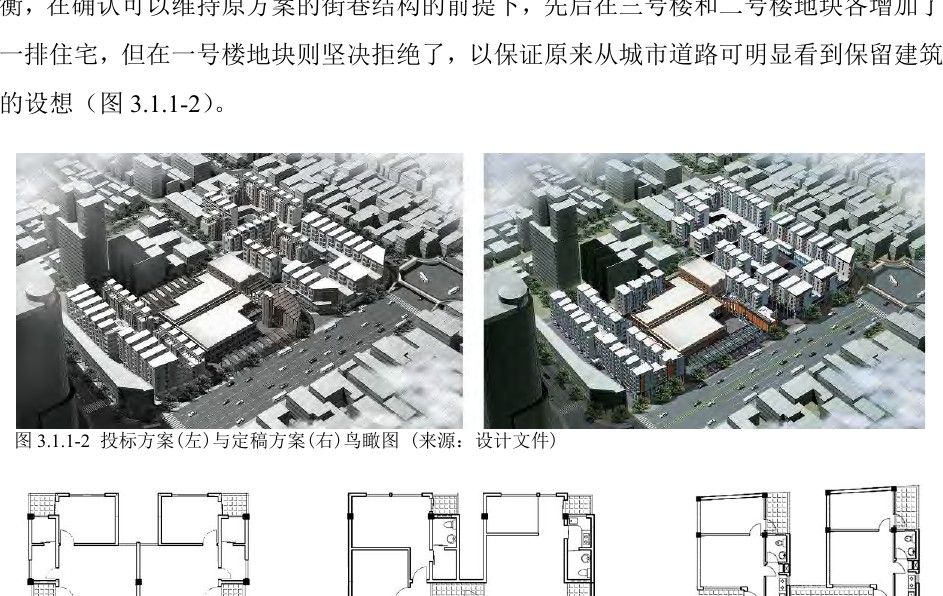
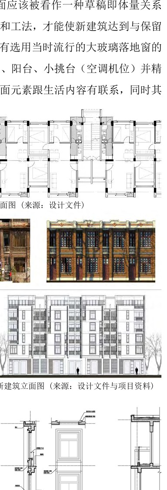
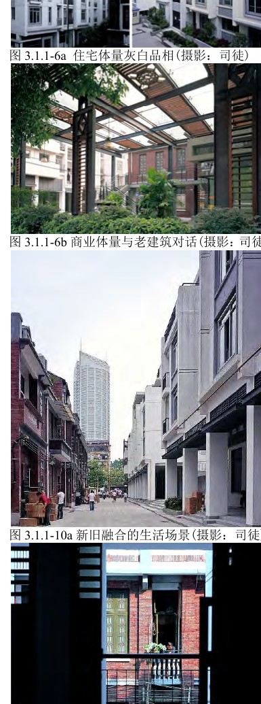
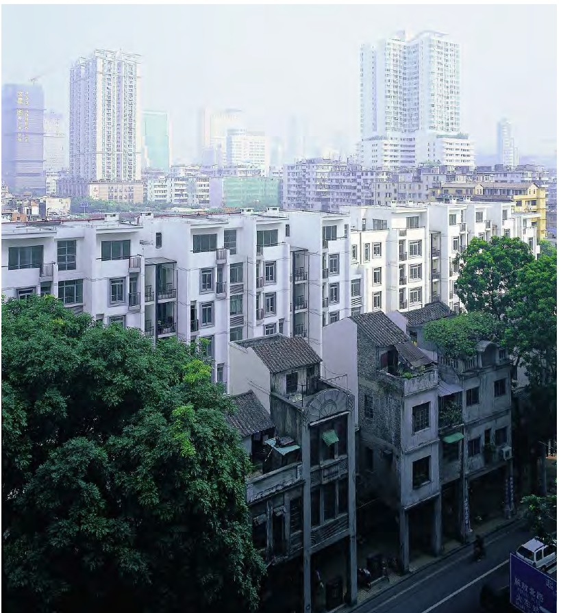

# 广州市越秀区解放中路旧城改造 / Jiefang Middle Road Old City Renewal

> 不完整原因：本案例包采用 PDF Source Mode，仅使用用户提供的学位论文 PDF，未联网补充官方页面、事务所页面、竣工年份、面积、结构体系或完整施工资料。因此，项目身份和设计过程可由论文一手回顾确认，但经济技术指标与施工细节仍需人工复核。

## 01 基本信息与经济技术指标

| 项目 | 内容 |
| --- | --- |
| 项目名称 | 广州市越秀区解放中路旧城改造 |
| 英文名称 | Jiefang Middle Road Old City Renewal |
| 建筑师 / 事务所 | 张振辉及设计团队；PDF 未列明事务所全称 |
| 地点 | 中国广东省广州市越秀区解放中路 |
| 国家 / 城市 | 中国 / 广州 |
| 建成年份 / 设计年份 | 2004 年启动；PDF 未列明竣工年份 |
| 建筑类型 | 旧城改造 / 回迁住宅 / 沿街商业 / 保留建筑修复 |
| 用地面积 | PDF 未提供可靠数据 |
| 建筑面积 | PDF 未提供可靠数据 |
| 建筑高度 | PDF 未提供可靠数据 |
| 层数 | 多层集合住宅；具体层数 PDF 未提供 |
| 容积率 | PDF 未提供可靠数据 |
| 建筑密度 | PDF 未提供可靠数据 |
| 结构体系 | PDF 未提供可靠数据 |
| 主要材料 | 住宅灰白品相；沿街商业体量使用钢、玻璃、木百叶；局部使用水刷石、剁斧石、金属栏杆/窗框等做法 |
| 业主 / 委托方 | 广州市政府主导；执行建设单位为区旧城改造办公室 |
| 摄影 / 图纸来源 | 用户提供 PDF 中的设计文件、项目资料、自绘图与司徒摄影 |
| 信息可信度 | medium |
| 主要依据来源 | PDF《从概念到建成：建筑设计思维的连贯性研究_张振辉》，pp.3-8 |

指标说明：PDF 对项目的策略、户型、体量、立面与设计修改过程提供了较充分证据，但未给出面积、容积率、建筑密度、结构体系、竣工年份等硬指标；本案例不据常识推测。

## 02 资料质量与证据密度

- 资料状态：partial
- 是否有一手资料：是。该 PDF 为张振辉博士论文中的实践回顾，作者明确说明相关已建项目为其主持设计或全程参加的项目之一。
- 一手资料是否用于身份确认：是。项目名称、启动时间、试点性质、政府目标与设计过程均来自 PDF pp.3-8。
- 建筑专业媒体数量：0。此次按 PDF Source Mode 未联网检索。
- 图片处理状态：completed。已从 PDF pp.3-8 渲染并保存 6 张页面图，用作图纸与图像证据。
- 已覆盖分析项：concept / context / program / circulation / facade_material / structure_construction / user_experience / urban_relationship
- 资料最充分的方向：旧城改造模式、街巷肌理、户型原型、公共到私密的梯度、规范约束下的体量调整、新旧立面对话。
- 资料明显不足的方向：竣工年份、面积指标、结构体系、施工过程、节点样板和后期运营评价。
- 需要人工复核：若用于发表或课程精确图纸分析，应补充官方项目档案、完整设计图纸、竣工资料与现场照片。

## 03 一句话判断

解放中路旧城改造的价值不在于单一风格，而在于把“政府主导、居民回迁、保留老建筑、延续街巷肌理”这些互相牵制的条件，转化为可反复调整的空间原型和建造语言。来源明确：PDF《从概念到建成》，pp.3-8。

## 04 场地信息表

| 场地维度 | 与设计回应相关的信息 | 证据 |
| --- | --- | --- |
| 场地区位 | 广州市越秀区解放中路，属于旧城改造试点 | PDF p.3 |
| 自然环境 | 岭南地区气候被明确纳入户型与楼梯间通风考虑 | PDF p.5 |
| 人文环境 | 基地内有价值老建筑需要保留，新建部分需要延续老城文脉和肌理 | PDF p.3 |
| 地形条件 | PDF 未提供可靠资料 | 资料缺口 |
| 道路与交通 | 设计坚持从城市道路可明显看到保留建筑，并以街巷结构作为总体布局线索 | PDF p.4 |
| 周边建筑特点 | 民国红砖建筑的立面品质成为新建筑细部与材质深化的参照 | PDF p.7 |
| 建筑服务人群 | 回迁居民、沿街商业使用者与旧城公共生活使用者 | PDF pp.3-5 |
| 场地核心矛盾 | 回迁住宅量、规范间距、旧城紧密街巷尺度、保留建筑可见性之间的平衡 | PDF pp.4-6 |

## 05 概念创意探索 Conceptual Exploration

### 5.1 诊断 Diagnosis

来源明确：项目由广州市为迎接 2010 年亚运会于 2004 年启动，政府希望通过它探索新的旧城改造模式：不由开发商介入、不搞强制拆迁、以回迁需要为主要建筑量依据、保留有价值老建筑并延续老城文脉与肌理。PDF p.3。

基于资料的归纳判断：项目真正的设计难题不是“做一片新住宅”，而是在政府公共目标、居民回迁接受度、旧城历史肌理、经济补偿逻辑和规范审批之间建立一个可协商的空间框架。这个框架必须能够在后续反复修改中仍保持方向不散。PDF pp.3-6。

### 5.2 定位 Positioning

来源明确：方案中选的重要原因是“设计定位与项目意图有较高契合度”，其核心包括延续基地原有街巷结构、中等密度多层集合住宅、岭南下商上宅剖面、保留建筑原样修复以及新旧建筑的对话衔接。PDF pp.3-4。

基于资料的归纳判断：项目定位可以概括为“非盈利优先的旧城更新试点”，它把社会价值、经济补偿、文化连续性和居民生活改善放在同一个判断框架里，而不是把旧城当作可被整体清空的开发地块。

### 5.3 策略 Strategy

策略一：以街巷肌理作为总体结构。设计首先保留并发展原有街巷结构，后续即使增加住宅量，也坚持不破坏这个总体框架。PDF pp.3-4。

策略二：以标准户型单元作为可变原型。面对走廊式住宅接受度不足和回迁面积可调需求，设计发展出一梯两户的标准户型单元，用服务模块、可调卧室条带、入户阳台与楼梯组合来兼顾效率、均好性、通风和邻里交往。PDF p.5。

策略三：以“品相对等”而非仿古作为新旧关系。新建筑不复制老建筑，而通过灰白住宅体量、钢玻璃木百叶商业体量、细部窗框和构造材料，与民国红砖建筑建立品质层面的对话。PDF pp.6-8。

图文相关性：用于说明在增加住宅量时，设计仍围绕街巷结构和保留建筑可见性进行取舍。来源明确：PDF《从概念到建成》，p.4。

### 5.4 意象与表达 Imagery, Naming & Expression

PDF 没有给出独立的概念口号或命名意象，但清楚呈现了两个表达方向：一是“新旧缝合”，即通过比例、尺度、布局和共同营造街巷来衔接保留建筑；二是“素雅品相”，即用灰白体量、细部勾勒和生活化开洞，让新建筑在旧城中显得克制而有细节。来源明确：PDF pp.4、7-8。

## 06 建筑语言生成 Architectural Language Generation

### 6.1 功能梳理 Function

项目的功能不是简单住宅开发，而是回迁住宅、沿街商业、保留建筑修复与旧城街巷公共生活的复合组织。PDF 指出建筑量主要考虑回迁需要，并适量增加建筑面积用于补偿政府投资；沿用岭南传统下商上宅剖面，有利于分层营造商业与居住环境。来源明确：PDF pp.3-4。

### 6.2 布局逻辑 Layout

总体布局以原有街巷结构为主线。设计在二号楼、三号楼地块增加住宅以回应建设单位对经济安全系数的担忧，但拒绝在一号楼地块增加住宅，以保证从城市道路能明显看到保留建筑。来源明确：PDF p.4。

基于资料的归纳判断：这是一种“局部增量服从总体识别”的布局控制方法。增量可以发生，但不能破坏街巷结构、保留建筑可见性和旧城空间记忆。

### 6.3 形体构成 Composition

住宅从内廊式、外廊式研究转向一梯两户模式后，设计没有放弃梳状布局，而是用标准户型单元排列成条型体量，灵活嵌入基地肌理或组合成新组团。楼梯间前后通风改善小气候，入户阳台把邻里交往从街道或共享平台引向每层住户门口，实现公共到私密的梯度。来源明确：PDF p.5。

### 6.4 场所与氛围 Place & Atmosphere

项目并未把“旧城氛围”理解成装饰风格，而是落在可使用的居住环境和街道界面上：明厨明厕、前后通风、入户阳台、楼梯间交往空间、下商上宅剖面和新旧建筑共同构成街巷。PDF p.5 和 p.8 的建成生活场景说明，设计目标最终指向居民生活品质与旧城活力的同步提升。

## 07 建造品质控制 Construction Quality Control

### 7.1 建造语言 Construction Language

PDF 未提供结构体系或施工流程资料，但提供了建筑语言层面的清晰证据：住宅体量采用灰白品相，沿街商业体量采用钢、玻璃和木百叶等新材质，与红砖老建筑对话。来源明确：PDF pp.6-7。

### 7.2 材料与工艺 Materials & Craft

设计没有选用当时流行的大玻璃落地窗，而是具体安排窗洞、阳台、小挑台和空调机位，并设计窗框、栏杆、檐口滴水勾边等细节。材料做法包括水刷石灰色窗框、剁斧石墙基与平台护栏、深灰色金属栏杆和窗框、依据趟拢门意象定制的入户铁门、深灰色檐口滴水勾边和灰白色墙面。来源明确：PDF p.7。

图文相关性：用于验证“品相对等”的立面和构造逻辑，即新建筑通过窗洞、阳台、材料和细部与保留建筑建立关系。来源明确：PDF《从概念到建成》，p.7。

### 7.3 构造逻辑 Tectonic Logic

基于资料的归纳判断：构造并非附属于立面装饰，而是从户型生活需求、外墙开洞、空调布置、栏杆和滴水细节中生长出来。PDF p.7 明确说明，设计一方面回到户型与家具/空调布置，另一方面细致考虑外墙窗洞、阳台、挑台、栏杆等做法的材料、建造实现和构造方式。

### 7.4 物理性能与施工控制 Performance & Construction Control

来源明确：楼梯间前后通风被用来改善住区小气候，并被指出对岭南地区尤为重要。PDF p.5。

资料缺口：PDF 未提供防雨、防火构造节点、保温隔热、现场施工控制或样板墙等施工资料；本节不做推测。规范层面，PDF 只说明防火和日照间距约束促使设计采取退台、防火墙、错动组合等综合策略。PDF p.6。

## 08 核心方法提炼

### 方法 1：把旧城更新目标翻译为街巷结构控制

- 面对的问题：政府希望探索新的旧城改造模式，同时保留老建筑、回应回迁需求并延续文脉。
- 具体做法：总体布局延续和发展基地原有街巷结构；后续增加住宅量时，仍以保留建筑可见性和街巷结构为底线。
- 建筑效果：更新不是清空重建，而是在原有城市肌理上产生可识别的新旧缝合。
- 证据来源：PDF pp.3-4；相关图页见“总体布局延续原有街巷结构”和“从投标方案到定稿方案的体量调整”。
- 可迁移方法：旧城改造先建立不可轻易破坏的空间结构底线，再允许局部增量和经济条件在底线内调整。

### 方法 2：用标准户型原型吸收复杂变化

- 面对的问题：建设单位担心走廊式住宅不被回迁居民接受，同时回迁面积、通风、均好性和邻里交往都需要兼顾。
- 具体做法：发展一梯两户标准户型单元，以厨厕和生活阳台组成服务模块，以卧室条带调节面积，以入户阳台和楼梯组合形成交往空间。
- 建筑效果：在户型可变、组团可变的情况下，仍保持清晰的空间逻辑和居住品质目标。
- 证据来源：PDF p.5；相关图页见“户型单元、楼梯间通风与公共-私密梯度”。
- 可迁移方法：面对不确定需求时，不是不断画例外方案，而是先建立能容纳变化的原型。

### 方法 3：在规范、密度和肌理之间做综合调停

- 面对的问题：防火和日照规范倾向于拉开建筑间距，而旧城街巷肌理需要新旧建筑保持紧密尺度，同时还要保证住宅量。
- 具体做法：通过六号楼沿边界错动组合、四号楼和五号楼面向保留建筑退台、三号楼局部防火墙等策略，满足规范且不破坏总体规划结构。
- 建筑效果：项目产生大量具体变化，但仍能保持思路连贯性和结构简单性。
- 证据来源：PDF p.6；相关图页见“规范约束下的体量调整与新旧融合场景”。
- 可迁移方法：规范约束不只是限制，也可以成为深化体量、户型和界面关系的设计工具。

图文相关性：用于验证退台、错动、防火墙等策略如何在规范约束中维护街巷肌理和规划结构。来源明确：PDF《从概念到建成》，p.6。

### 方法 4：用“品相对等”替代仿古或强对比

- 面对的问题：新建筑需要与保留的民国红砖建筑对话，但不能简单仿古，也不能用过度现代的玻璃界面切断旧城气质。
- 具体做法：住宅采用灰白品相，商业体量使用钢、玻璃、木百叶；立面通过窗洞、阳台、挑台、窗框、栏杆和滴水线等细部组织，与生活内容和旧城环境关联。
- 建筑效果：新建筑以克制、细腻、生活化的立面组织进入旧城，而不是用符号化复古解决问题。
- 证据来源：PDF pp.7-8；相关图页见“立面、户型平面与构造细部”和“新建筑融入传统城市肌理”。
- 可迁移方法：历史环境中的新建筑可以追求“品质对等”和“尺度默契”，而不是只在形式上选择仿古或对比。

图文相关性：用于说明最终建成生活场景中，新住宅、保留建筑和街巷环境的融合效果。来源明确：PDF《从概念到建成》，p.8。

## 09 图纸与图片索引

| 图片类型 | 推荐用途 | 正文嵌入状态 / 本地图片 / 来源页面 | 来源 | 下载状态 | 图文相关性 | 版权 / 备注 |
| --- | --- | --- | --- | --- | --- | --- |
| 02_site | 场地与街巷结构 | 已在正文嵌入：`images/02_site_street_structure_crop.jpg` / sources/concept-to-built-zhang-zhenhui.pdf#page=3 | 用户提供 PDF | downloaded | 验证总体布局延续原有街巷结构 | 研究引用；商业或公开发布需另行清权 |
| 09_analysis | 体量调整与保留建筑可见性 | 已在正文嵌入：`images/09_massing_revision_crop.jpg` / sources/concept-to-built-zhang-zhenhui.pdf#page=4 | 用户提供 PDF | downloaded | 验证投标方案到定稿方案中的体量取舍 | 研究引用；商业或公开发布需另行清权 |
| 03_plan | 户型与公共-私密梯度 | 已在正文嵌入：`images/03_unit_public_private_gradient_crop.jpg` / sources/concept-to-built-zhang-zhenhui.pdf#page=5 | 用户提供 PDF | downloaded | 验证标准户型、通风和邻里交往空间 | 研究引用；商业或公开发布需另行清权 |
| 09_analysis | 规范约束与体量策略 | 已在正文嵌入：`images/09_regulation_massing_crop.jpg` / sources/concept-to-built-zhang-zhenhui.pdf#page=6 | 用户提供 PDF | downloaded | 验证退台、错动和防火墙等综合策略 | 研究引用；商业或公开发布需另行清权 |
| 05_elevation | 立面与构造细部 | 已在正文嵌入：`images/05_facade_detail_crop.jpg` / sources/concept-to-built-zhang-zhenhui.pdf#page=7 | 用户提供 PDF | downloaded | 验证品相对等、窗洞与细部建造逻辑 | 研究引用；商业或公开发布需另行清权 |
| 01_hero | 生活场景与街巷融合 | 已在正文嵌入：`images/01_hero_old_new_city_context.jpg` / sources/concept-to-built-zhang-zhenhui.pdf#page=8 | 用户提供 PDF | downloaded | 验证新旧建筑共同组成新的生活场景 | 研究引用；商业或公开发布需另行清权 |

## 10 对我的设计启发

- 可迁移方法 1：旧城更新要先找“不可破坏的空间底线”，例如街巷、保留建筑视线、公共通道和生活尺度。
- 可迁移方法 2：在需求不断变化的项目里，原型比单次方案更重要。标准户型单元、服务模块和公共-私密梯度能让修改不失控。
- 可迁移方法 3：规范不是后期校核表，而是可以反向塑造体量、户型和新旧关系的设计条件。
- 可迁移方法 4：历史环境中的当代表达可以通过材料、比例、构造细节和生活内容建立“品相对等”，不必落入仿古或强对比。
- 不适合直接照搬的部分：该项目的政府主导、回迁政策和旧改办协调机制具有特定时代背景，不能直接套用到市场化城市更新。
- 可转化成的分析图：街巷结构延续图、体量增减取舍图、标准户型原型图、公共到私密梯度图、新旧立面品相对照图。

## 11 信息缺口与冲突

- 竣工年份：PDF 只说明项目为 2004 年启动且属于已建成项目，未列明竣工年份。
- 事务所/完整设计团队：PDF 以第一人称回顾设计过程，但未列明完整设计单位、合作方和团队名单。
- 经济技术指标：PDF 未提供用地面积、建筑面积、容积率、建筑密度、结构体系等硬指标。
- 施工过程：PDF 提供了构造与细部设计证据，但没有提供现场施工、样板、质量控制或竣工构造记录。
- 资料范围：本包未联网检索，所有判断均基于用户提供 PDF；如需公开发布，应补充官方/事务所/竣工资料。

## 12 来源列表

### Level A：官方与一手来源

- PDF《从概念到建成：建筑设计思维的连贯性研究_张振辉》，用户提供文件：`sources/concept-to-built-zhang-zhenhui.pdf`

### Level B：高质量建筑媒体

- 本次 PDF Source Mode 未联网检索。

### Level C：中文补充源

- 本次 PDF Source Mode 未联网检索。

### Level D：参考源，只能辅助

- 本次 PDF Source Mode 未使用 Level D 来源。
