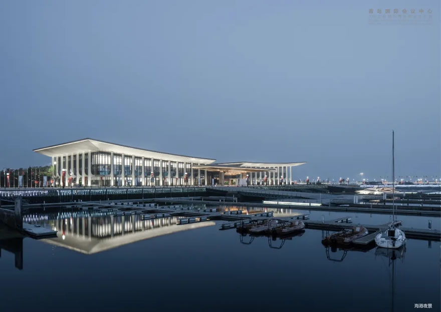
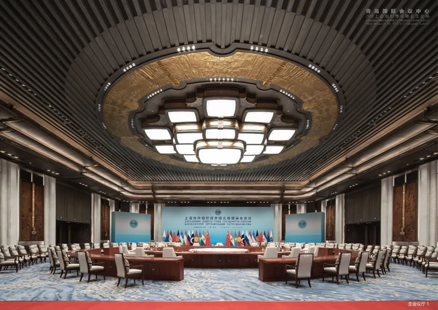
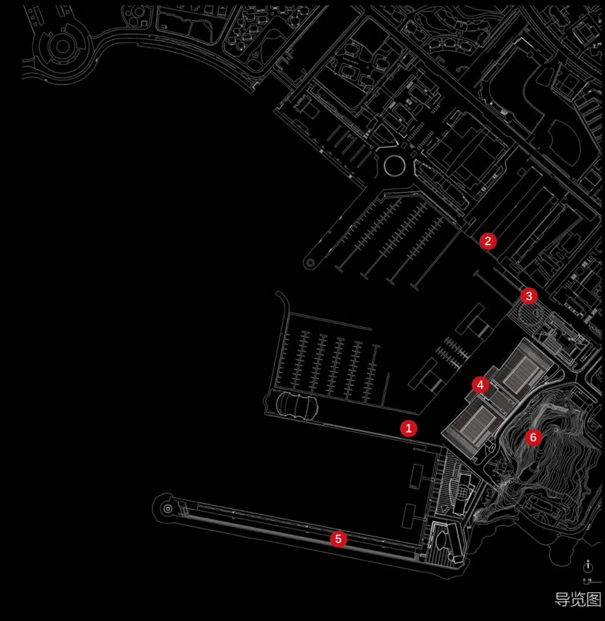
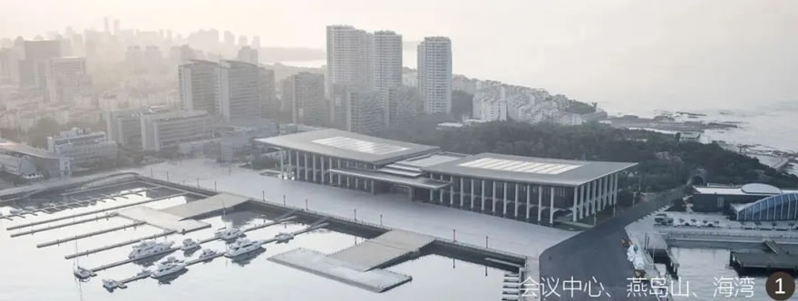
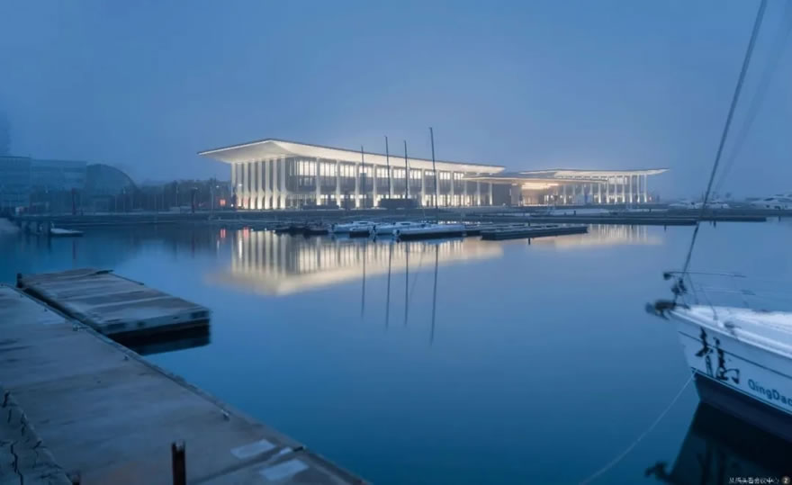

# 青岛国际会议中心 / Qingdao International Conference Center

> 资料说明：本案例已确认目标为华南理工大学建筑设计研究院、何镜堂院士团队设计的 2018 上海合作组织青岛峰会主会场。技术指标在不同来源中存在楼层与高度表述差异，已在“信息缺口与冲突”中记录。

## 01 基本信息与经济技术指标

| 项目 | 内容 |
| --- | --- |
| 项目名称 | 青岛国际会议中心（2018 上合组织青岛峰会主会场） |
| 英文名称 | Qingdao International Conference Center |
| 建筑师 / 事务所 | 华南理工大学建筑设计研究院；何镜堂院士团队 |
| 地点 | 青岛奥帆广场 / 奥帆中心核心区 |
| 国家 / 城市 | 中国 / 山东青岛 |
| 建成年份 / 使用时间 | 2018 年上合组织青岛峰会投入使用 |
| 建筑类型 | 国际会议中心 / 主场外交会议建筑 |
| 建筑面积 | 约 5.4 万平方米 |
| 建筑高度 | ARCHINA：23.99 米；中国建筑：22.6 米，屋面起翘最高点 28 米 |
| 层数 | ARCHINA：地上 4 层、地下 1 层；中国建筑：地上 2 层 |
| 结构体系 | 地上主体约 1.1 万吨钢结构；更细结构体系未检索到可靠资料 |
| 主要材料 | 外墙金属板，“青岛金”暖色金属表皮；具体构造节点未检索到可靠资料 |
| 承建 / 建设 | 中国建筑集团有限公司承建 |
| 信息可信度 | high |
| 主要依据来源 | 华南理工大学、中国日报、ARCHINA、中国建筑、新华网、金羊网 / 羊城晚报 |

## 02 资料质量与证据密度

- 资料状态：sufficient
- 是否有一级资料：是
- 一级资料是否用于身份确认：是
- 建筑专业媒体数量：1
- 图片处理状态：completed
- 已覆盖分析项：concept / context / program / circulation / facade_material / structure_construction / user_experience / urban_relationship
- 资料最充分的方向：设计单位、概念叙事、场地关系、外观语言、主会场功能、快速建造。
- 资料明显不足的方向：完整平面图、剖面图、幕墙节点、材料供应链、施工样板与质量验收细节。
- 需要人工复核：楼层数、建筑高度、完整设计团队名单、正式业主信息。

## 03 一句话判断

这个案例最值得学习的不是单一造型，而是如何把国家级会议功能、青岛山海港城格局、快速建造压力和后续城市公共使用，压缩成一个可识别、可运营、可被公众记住的主场外交建筑。

图文相关性：用于验证建筑与奥帆港湾、水面、帆船意象和水平展开体量之间的关系。图片来源：ARCHINA。

## 04 场地信息表

| 场地维度 | 与设计回应相关的信息 | 证据 |
| --- | --- | --- |
| 场地区位 | 奥帆广场核心区域，原奥运帆船赛事场地周边 | ARCHINA；中国建筑；新华网 |
| 自然环境 | 依山面海，山、城、海、港、堤在视野中叠合 | ARCHINA；新华网 |
| 人文环境 | 承接 2008 奥帆城市记忆，又承担 2018 上合峰会主场外交功能 | ARCHINA；华南理工大学 |
| 道路与交通 | 公开资料未检索到完整交通组织图 | 资料缺口 |
| 建筑服务人群 | 峰会代表团、会议会展人群、后续游客与市民 | ARCHINA；金羊网 |
| 场地核心矛盾 | 高等级外交会议的庄重秩序，需要与海滨开放性、后续公共使用并存 | 基于多源资料归纳 |

## 05 概念创意探索 Conceptual Exploration

### 5.1 诊断 Diagnosis

- 来源明确：项目时间非常紧。中国日报和金羊网均提到何镜堂团队于 2017 年 9 月左右接到任务，至 2018 年 6 月投入使用；新华网与中国建筑报道工程建设约 6 个月。
- 基于资料的归纳判断：设计面对的是四重约束：主场外交的礼仪尺度、青岛海滨场地的城市可见性、快速设计建造、峰会后的公共与会议复合使用。

### 5.2 定位 Positioning

- 来源明确：华南理工大学与中国日报报道均确认项目定位为“中国气派、世界水准、山东风格、青岛特色”，并强调“山水一体、海天一色”。
- 基于资料的归纳判断：这种定位把建筑从单纯会议设施提升为城市地标和外交形象界面，要求建筑既有清晰中心轴线和仪式性，又不能脱离奥帆中心的海港语境。

### 5.3 策略 Strategy

- 策略：以“腾飞逐梦、扬帆领航”为总概念，将海鸥展翅、帆影出海、柱廊秩序和中轴门廊组织为统一形象。
- 回应的问题：如何在海滨环境中生成具有青岛地域特征、又能承载国际峰会礼仪的公共建筑。
- 对空间 / 形式 / 建造的影响：建筑采用水平展开的三段式格局，屋面与柱廊共同形成横向舒展的海港界面；主入口和柱廊强化中心礼仪序列。
- 证据来源：ARCHINA；中国日报；华南理工大学；金羊网。

## 06 建筑语言生成 Architectural Language Generation

### 6.1 功能梳理 Function

项目是多层国际会议综合体。ARCHINA 将其描述为为中国主场外交峰会提供会场，并在峰会后承办会议和大型活动，兼具旅游景点、会展会议与“市民客厅”目标。功能组织的关键不是单一会堂，而是会议厅、接待、流线、景观界面和后续运营的复合。

图文相关性：用于说明项目首先要满足国际重大会议的主厅尺度、礼仪性与会议功能。图片来源：ARCHINA。

### 6.2 布局逻辑 Layout

ARCHINA 明确提到项目呼应场地格局、强化“山海轴线”，并采用水平三段布局。基于外观照片和场地描述可判断，建筑以横向展开面对港湾，通过屋面、柱廊和水面倒影形成较强的海滨公共界面。公开资料未检索到完整平面图，因此内部流线与功能分区不能进一步推断。

### 6.3 形式构成 Composition

项目的形式语言把“海鸥展翅”“帆影出海”转译为大屋面、起翘边缘、柱廊和中心门廊。这个操作的重点不是仿生图像本身，而是用可识别的水平屋盖控制整体天际线，再用柱列和金属表皮形成庄重、连续的公共立面。

图文相关性：用于支持外部到内部的礼仪性场景序列分析。图片来源：ARCHINA。

### 6.4 场所与氛围 Place & Atmosphere

建筑选择暖色调金属表皮，媒体报道中称为何镜堂团队反复推敲的“青岛金”。这种材料表达避免纯白海滨建筑的轻盈化倾向，转向庄重、温暖、具有仪式感的国家会议中心气质；同时水面倒影、港湾和帆船背景又削弱了封闭纪念性，使其能进入市民旅游体验。

图文相关性：用于支持柱廊、金属表皮和水平屋盖共同塑造城市界面的判断。图片来源：ARCHINA。

## 07 建造品质控制 Construction Quality Control

### 7.1 建造语言 Construction Language

- 骨架：新华网与中国建筑均报道项目地上主体为约 1.1 万吨钢结构。更细的柱网、节点、屋盖结构体系未检索到可靠资料。
- 围合：中国建筑报道工程包括幕墙、装饰、园林景观、市政道排、智能化、音视频会议等专业工程；具体幕墙节点未公开。
- 地台：建筑位于奥帆广场核心区域，与海港水面和景观平台形成连续公共界面；地台构造做法未检索到可靠资料。

### 7.2 材料与工艺 Materials & Craft

公开采访资料强调“青岛金”金属板的现场比选：既要庄重典雅，又要避免过度反光或俗艳。这里的材料控制是形象控制的一部分：颜色、反射度和海滨光照共同决定建筑在白天、夜景和水面倒影中的公共形象。

### 7.3 物理性能与施工控制 Performance & Construction Control

可靠资料可以确认的是快速建造组织：从任务启动到峰会使用周期短，承建报道称工程建设约 6 个月。具体防水、防腐、抗风、幕墙节点、施工样板和验收细则未检索到可靠资料，不能根据海滨环境做进一步推测。

## 08 核心方法提炼

### 方法 1：用场地大关系生成外交建筑的整体形象

- 面对的问题：国家级会议建筑容易脱离地方语境，变成抽象纪念性对象。
- 具体做法：把奥帆中心的海港、水面、帆船和山海轴线转化为横向展开的体量、起翘屋面和帆影柱廊。
- 建筑效果：形成一眼可识别的青岛海滨会议中心形象。
- 证据来源：ARCHINA；中国日报；新华网。
- 相关图片：
- 可迁移方法：大型公共建筑可以先锁定城市级视线、轴线和地景关系，再决定体量姿态。

### 方法 2：把宏大叙事压缩到可建造的构件语言

- 面对的问题：“中国气派、世界水准、山东风格、青岛特色”容易停留在口号层面。
- 具体做法：通过中轴门廊、柱廊、屋面边缘和金属表皮，把抽象定位转化为可施工、可控制的建筑语言。
- 建筑效果：建筑既有仪式性，也保持了现代会议中心的清晰体量。
- 证据来源：ARCHINA；华南理工大学；中国日报。
- 相关图片：
- 可迁移方法：面对多重价值要求时，优先把关键词落到少量高控制度构件上。

### 方法 3：为一次性峰会预设长期运营身份

- 面对的问题：重大活动建筑容易在活动后失去公共性和使用弹性。
- 具体做法：设计目标中同时包含国事活动、旅游景点、会展会议、市民客厅；建筑面向港湾展开，保持可被公众识别和到达的城市界面。
- 建筑效果：峰会后仍可作为城市名片和公共目的地继续运营。
- 证据来源：ARCHINA；金羊网。
- 相关图片：
- 可迁移方法：事件型公共建筑应在设计初期并置“活动期间秩序”和“活动后日常使用”。

### 方法 4：在快速建造中保留材料现场校准

- 面对的问题：工期紧张时，外立面材料容易被标准化采购和快速施工主导。
- 具体做法：采访资料提到团队对“青岛金”金属板进行现场多角度比选，控制颜色与反射效果。
- 建筑效果：材料色彩服务于庄重、温暖、海滨光照下不过度反光的整体形象。
- 证据来源：金羊网；新浪 / 澎湃转载线索。
- 相关图片：
- 可迁移方法：快速项目仍应保留少数关键材料的现场样板和光照校验。

## 09 图纸与图片索引

| 图片类型 | 推荐用途 | 正文嵌入状态 / 本地图片 / 来源页面 | 来源 | 下载状态 | 图文相关性 | 版权 / 备注 |
| --- | --- | --- | --- | --- | --- | --- |
| 01_hero | 封面 / 外观识别 | 已嵌入：`images/01_hero_exterior.jpg` / [来源](https://www.archina.com/index.php?a=show&g=works&id=6017&m=index) | ARCHINA | downloaded | 说明海港、水面、建筑横向体量关系 | Reference use only; rights not cleared. |
| 08_interior | 主会议厅 | 已嵌入：`images/08_interior_main_hall.jpg` / [来源](https://www.archina.com/index.php?a=show&g=works&id=6017&m=index) | ARCHINA | downloaded | 说明国际会议主厅尺度与仪式性 | Reference use only; rights not cleared. |
| 09_analysis | 场景序列 | 已嵌入：`images/09_sequence_reference.jpg` / [来源](https://www.archina.com/index.php?a=show&g=works&id=6017&m=index) | ARCHINA | downloaded | 支持外部到内部礼仪序列分析 | Reference use only; rights not cleared. |
| 05_elevation | 立面 / 表皮 | 已嵌入：`images/05_facade_reference.jpg` / [来源](https://www.archina.com/index.php?a=show&g=works&id=6017&m=index) | ARCHINA | downloaded | 支持柱廊、金属表皮、水平屋盖分析 | Reference use only; rights not cleared. |
| 08_interior | 室内氛围 | 已嵌入：`images/08_interior_sequence.jpg` / [来源](https://www.archina.com/index.php?a=show&g=works&id=6017&m=index) | ARCHINA | downloaded | 支持材料与氛围判断 | Reference use only; rights not cleared. |

## 10 对我的设计启发

- 可迁移方法 1：先抓城市级关系，再处理建筑形象。这里的“山海轴线”和奥帆港湾比单体造型更先决定建筑的姿态。
- 可迁移方法 2：将抽象文化要求落到少数可控构件：屋面、门廊、柱廊、表皮颜色。
- 可迁移方法 3：重大事件建筑要同步设计活动后身份，避免只为仪式瞬间服务。
- 不适合直接照抄的部分：海鸥、帆影、金色金属板属于高度场地化和事件化表达，换场地直接复制会失去依据。
- 可转化成的分析图：山海轴线图、水平三段体量图、外交礼仪流线图、事件使用 / 日常使用转换图、金属表皮光照校准图。

## 11 信息缺口与冲突

- 楼层冲突：ARCHINA 写地上 4 层、地下 1 层；中国建筑写地上两层。
- 高度冲突：ARCHINA 写建筑高度 23.99 米；中国建筑写建筑高度 22.6 米、屋面起翘最高点 28 米。
- 设计团队：华南理工大学和中国日报确认何镜堂院士团队；完整专业负责人名单未检索到可靠来源。
- 图纸缺口：未检索到公开可用的完整平面图、剖面图、节点图。
- 构造缺口：钢结构总量、幕墙和装饰专业范围可确认；节点、构件尺度、安装工艺、质量控制程序未公开。

## 12 来源列表

### Level A：官方与一手来源

- [华南理工大学：上合峰会主会场惊艳登场，“华工设计”再引媒体关注](https://www2.scut.edu.cn/scutcm/2018/0614/c23940a344024/page.htm)
- [中国建筑：上合组织青岛峰会在中国建筑承建的青岛国际会议中心召开](https://www.cscec.com/xwzx_new/gsyw_new/201806/2883553.html)

### Level B：高质量建筑媒体

- [ARCHINA：青岛国际会议中心（2018上合组织青岛峰会主会场） | 华南理工大学建筑设计研究院](https://www.archina.com/index.php?a=show&g=works&id=6017&m=index)

### Level C：中文补充源

- [中国日报网：上合峰会主会场建设创造“青岛速度”](https://cn.chinadaily.com.cn/2018-06/12/content_36375086.htm)
- [金羊网 / 羊城晚报：华工团队设计上合组织青岛峰会主会场，何镜堂院士为您揭开会场背后的故事](https://wap.ycwb.com/2018-06/12/content_30028538.htm)
- [新华网：探究上合组织青岛峰会背后的中国建筑](https://www.xinhuanet.com/world/2018-06/10/c_1122964981.htm)
- [中国日报中国频道：【中国梦·践行者】华工团队设计上合组织青岛峰会主会场](https://china.chinadaily.com.cn/2018-06/14/content_36387848.htm)

### Level D：参考源，只能辅助

- [新浪新闻转载：8旬院士打造上合青岛峰会主场馆设计到完工7个月](https://news.sina.cn/2018-06-14/detail-ihcwpcmq6511031.d.html?vt=4)
