# 雷励贵州大项目活动营地 / Raleigh Campsite in Guizhou

## 01 基本信息

- 建筑师 / 事务所：华南理工大学建筑设计研究院
- 主创：张振辉、陈玮璐
- 地点：贵州省黔西南布依族苗族自治州贞丰县者相镇平桥村
- 年份：设计 2013.11；一期 2016.08；二期 2018.05
- 类型：青少年公益营地 / 乡村活动营地 / 乡建公益项目
- 面积：新建部分 1007 平方米，改造部分 423 平方米，营区面积 3679 平方米
- 状态：已建成并投入使用
- 关键词：乡村营地、公益建造、旧校改造、轻量工业化体系、毛石、竹模板混凝土、多功能通用空间、乡村图书馆
- 案例类型：乡建 / 青少年活动营地 / 公益公共建筑
- 信息可信度：高
- 主要依据来源：谷德设计网项目报道，内容由华南理工大学建筑设计研究院提供

## 02 一句话判断

这个案例最值得学习的是：它不是把营地当成孤立建筑，而是把废弃乡村小学、山地台地、青少年公益活动和本地工匠建造整合成一个可持续运营的乡村公共活动系统。

## 03 项目背景

雷励贵州大项目活动营地位于贵州省黔西南布依族苗族自治州贞丰县者相镇平桥村，场地在县道与村路交接处的狭长台地上，原址是一所撤点乡村小学，保留有一座废弃三层教学楼。项目以青少年公益营地为目标，探索青少年活动营地与乡村建设的结合模式。来源：s1。

项目通过设计方案吸引企业捐助，并由公益伙伴与本地工匠共同建造。启用不到一年，营地已举办少年营、青年营和远征营，支持雷励队员进行乡村公益实践，同时服务社区援建和环保建设。来源：s1。

## 04 设计理念

### 来源明确的设计理念

谷德文章明确说明：这是一个驻点乡村的青少年公益营地，旨在探索青少年活动营地与乡村建设的结合模式。项目通过改造原教学楼、加建多功能通用空间、活动场地、服务体和乡村图书馆，形成服务青少年成长和乡村发展的营地。来源：s1。

### AI 综合判断

这个项目的核心不是单体造型，而是“旧校锚固 + 轻量加建 + 地方材料服务体 + 社区开放图书馆”的复合策略。它把公益活动的运营需求转译为空间组织：营地内部服务青少年训练和宿营，入口图书馆则长期向村庄儿童开放，使营地从短期活动基地转化为乡村公共资源。此判断基于 s1 的综合分析。

## 05 核心建筑策略

### 策略 1：以废弃乡村小学作为场地锚点

- 设计问题：场地狭长、用地紧张，同时已有废弃三层教学楼，若完全新建会浪费既有资源并削弱场地记忆。
- 具体做法：保留并改造原教学楼，以其作为场地锚固点，在南侧加建多功能通用空间、户外活动场地和服务设施。
- 建筑效果：新旧空间形成连续营区，既降低建设成本，也让营地与村庄原有教育记忆产生联系。
- 证据来源：s1。
- 相关图片 / 图纸链接：images/01_hero_aerial.jpg、images/02_camp_axis.jpg、images/03_site_section.jpg、images/08_master_plan.jpg。
- 可借鉴点：乡建项目可以先寻找“可被重新激活的既有公共资产”，而不是从零开始做形式。

### 策略 2：用轻量海帕膜屋面构建连续共享空间

- 设计问题：贵州气候温和多雨，营地需要遮雨、通风和可承载活动、培训、宿营、用餐的复合空间。
- 具体做法：核心多功能通用空间采用连续起伏的半透明海帕膜屋面；平面非正交划分，开间向山和村庄打开，二层平台形成微高差错动。
- 建筑效果：屋面提供连续遮雨界面，半透明与开放边界让使用者感知同伴活动和山村风景，形成开放、互动、共享的营地氛围。
- 证据来源：s1。
- 相关图片 / 图纸链接：images/04_multiuse_section.jpg、images/05_multiuse_hall.jpg、images/06_shared_platform.jpg、images/09_ground_plan.jpg。
- 可借鉴点：营地的“大空间”不一定要封闭，可以通过轻量屋面、半室外平台和开放界面组织弹性活动。

### 策略 3：以毛石、竹界面和竹模板混凝土建立地方建构关系

- 设计问题：公益营地需要控制成本并便于本地施工，同时不能与乡村环境脱节。
- 具体做法：场地以小碎石铺底利于排水；活动区采用当地毛石砌筑；多功能空间使用像素化竹界面；图书馆、厨房、盥洗区等服务体采用竹模板现浇混凝土和本地砌石工艺。
- 建筑效果：轻量工业化构件与乡土材料工艺形成对照，使营地既具有现代活动空间的效率，也保留本地材料和工匠参与的痕迹。
- 证据来源：s1。
- 相关图片 / 图纸链接：images/07_bamboo_interface.jpg、images/01_hero_aerial.jpg0、images/01_hero_aerial.jpg1、images/01_hero_aerial.jpg2。
- 可借鉴点：低成本乡建不等于“粗糙”，关键是把材料、排水、工艺和维护放在同一套建构逻辑里。

### 策略 4：将乡村图书馆作为营地与村庄的公共接口

- 设计问题：如果营地只服务外来志愿者或短期活动，容易与村庄日常生活割裂。
- 具体做法：在营地入口与村路交接处设置乡村图书馆，由接待区和面向村庄道路的阅览室组成；两个错落半层的三角形开放框体通过小楼梯连接村道和营地两个标高。
- 建筑效果：图书馆长期向社区开放，透明界面向村庄展示内部活动，成为当地孩子阅读、玩耍和询问功课的场所。
- 证据来源：s1。
- 相关图片 / 图纸链接：images/01_hero_aerial.jpg3、images/01_hero_aerial.jpg4、images/01_hero_aerial.jpg5、images/01_hero_aerial.jpg6。
- 可借鉴点：公益营地应设计一个面向社区的“长期开放界面”，让项目价值超出活动周期。

### 策略 5：用山坡剧场和砂砾场地支持分组与集体活动

- 设计问题：青少年营地需要不同尺度的活动空间，既有集中集合，也有小组交流和户外停留。
- 具体做法：南侧设置圆形砂砾集中活动场地；西侧山体设置毛石砌筑的半圆形台阶小剧场，收住延伸入场地的山坡。
- 建筑效果：集中场地和山间小剧场共同构成灵活活动系统，适应营会、交流、表演、休息和小组任务。
- 证据来源：s1。
- 相关图片 / 图纸链接：images/01_hero_aerial.jpg0、images/01_hero_aerial.jpg7、images/01_hero_aerial.jpg8。
- 可借鉴点：营地设计要同时考虑“所有人一起”的场地和“小组活动”的场地，两者的尺度和边界应不同。

## 06 空间与流线

营地以保留教学楼作为北侧锚点，向南加建多功能通用空间和活动场地，服务体围绕主要活动区布置。入口处的乡村图书馆同时面对营地入口和村庄道路，承担接待、社区开放和标高转换作用。相关图纸：images/02_camp_axis.jpg、images/08_master_plan.jpg、images/09_ground_plan.jpg。

空间体验上，营区不是单一轴线，而是由旧教学楼、多功能棚、圆形砂砾场、山坡剧场、服务体和图书馆组成的聚落式系统。其核心流线可以理解为：村路/县道到达 - 图书馆入口界面 - 营地活动核心 - 宿营/培训/用餐复合空间 - 山坡与户外活动场地。

## 07 形体、立面与建构

多功能通用空间采用连续起伏的半透明海帕膜屋面，与像素化竹界面共同形成轻量、通风、半开放的营地核心。它和保留教学楼之间不是风格复制关系，而是通过“轻量加建”与“既有建筑”形成新旧并置。相关图片：images/04_multiuse_section.jpg、images/05_multiuse_hall.jpg、images/06_shared_platform.jpg。

服务体和乡村图书馆则使用竹模板现浇混凝土与本地砌石工艺，体量与保留建筑、通用空间和营区边界形成动态关系。图书馆的透明界面和儿童尺度家具，把建筑从营地服务设施转化为村庄儿童的日常公共空间。相关图片：images/01_hero_aerial.jpg3、images/01_hero_aerial.jpg4、images/01_hero_aerial.jpg5。

## 08 补充图片证据

以下图片已下载为案例包本地资产，并按“场地—公共空间—材料构造—图书馆—活动场地”的证据链组织。详情页会依据全站图片配额和相似度规则选择展示，不会把同一张图片重复渲染。

### 场地与总体关系

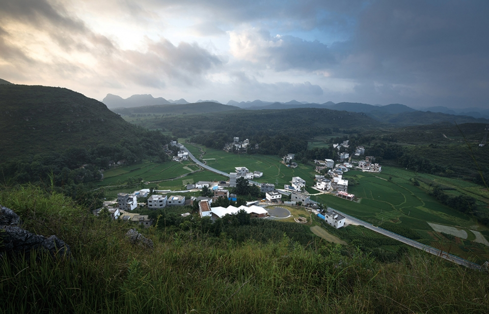

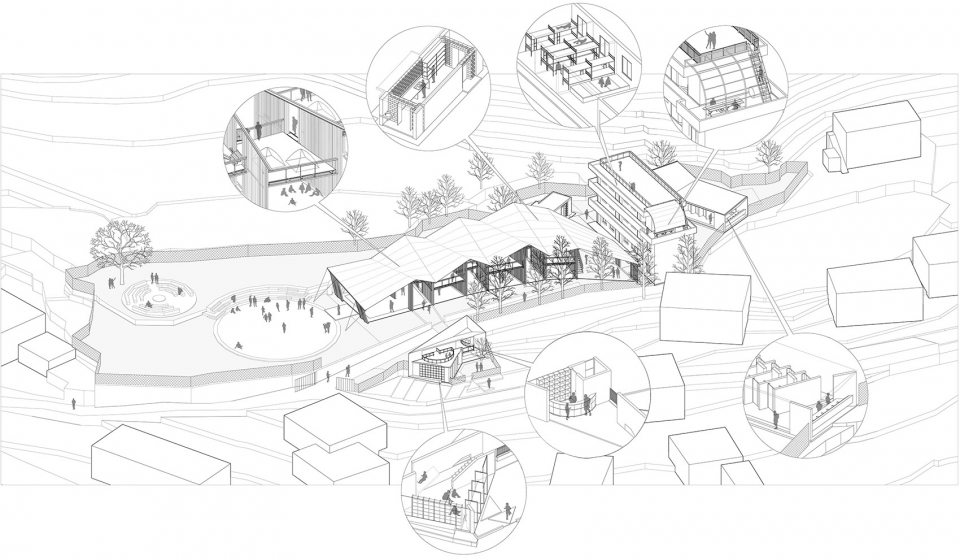

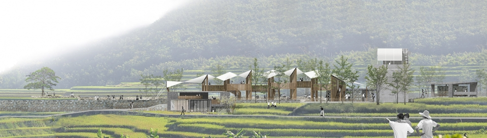

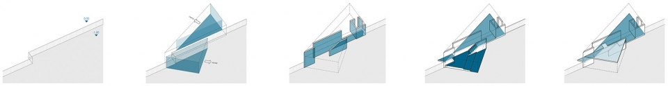

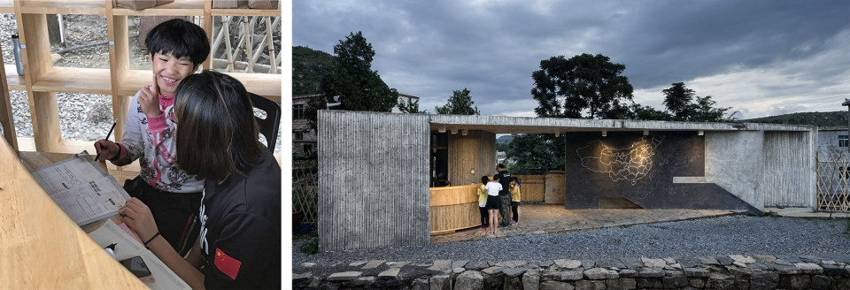

### 多功能空间与轻型屋面

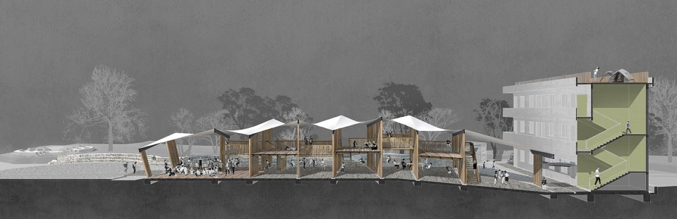

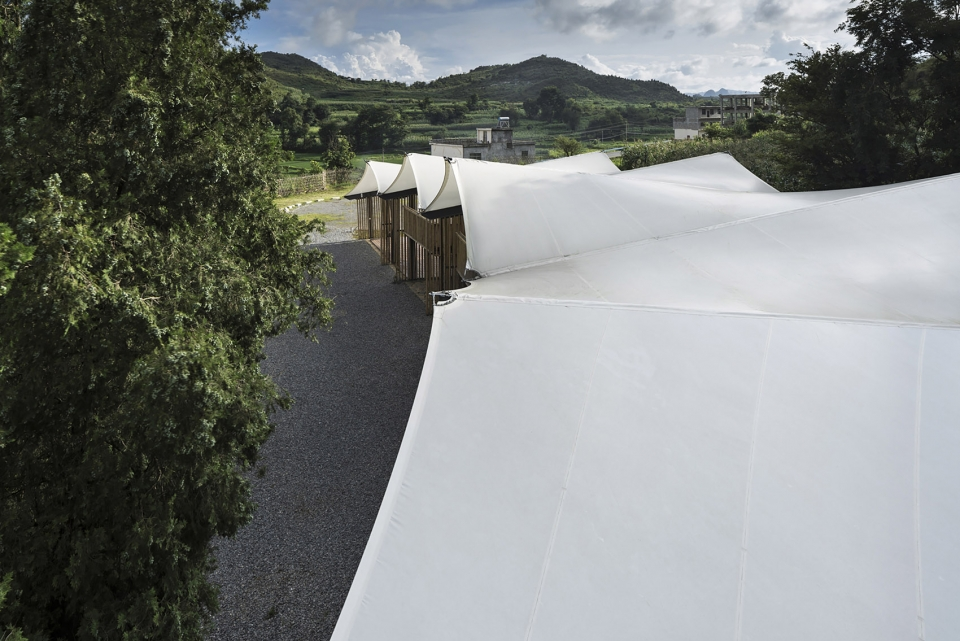

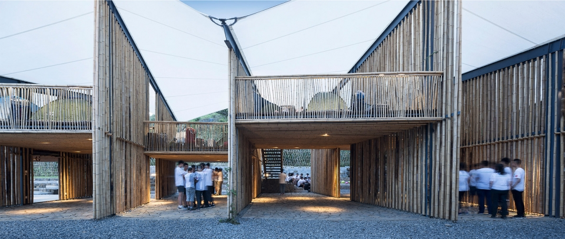

### 材料、构造与活动场地

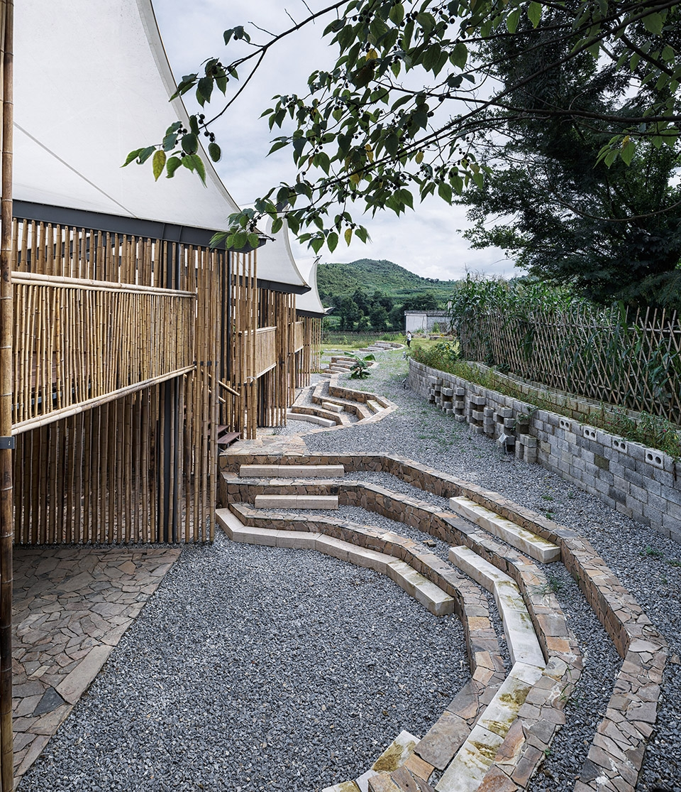

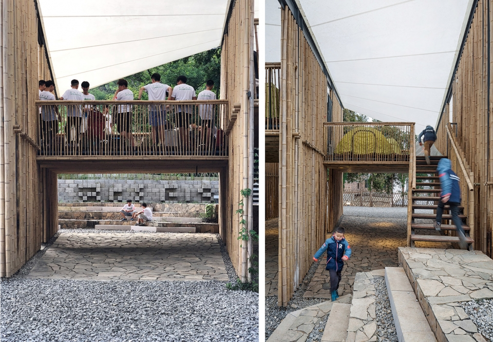

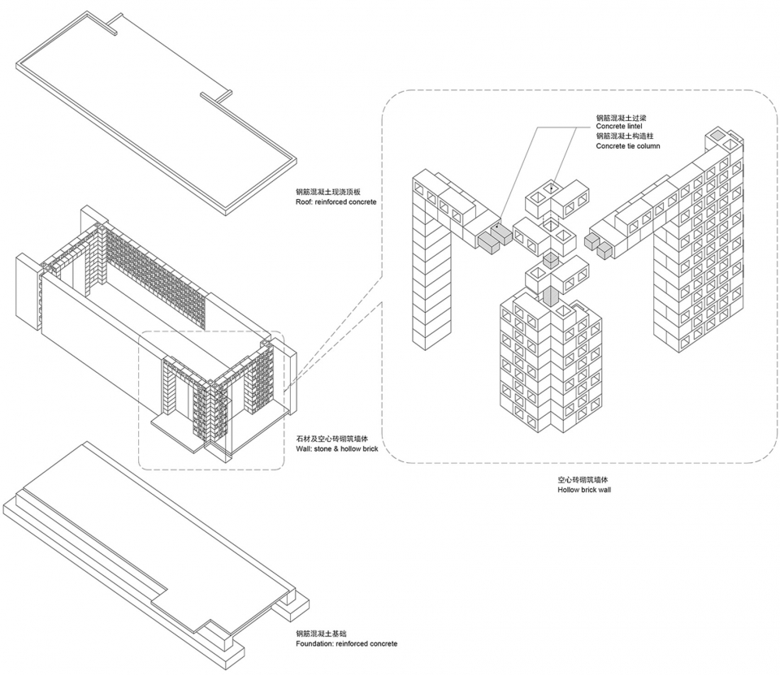

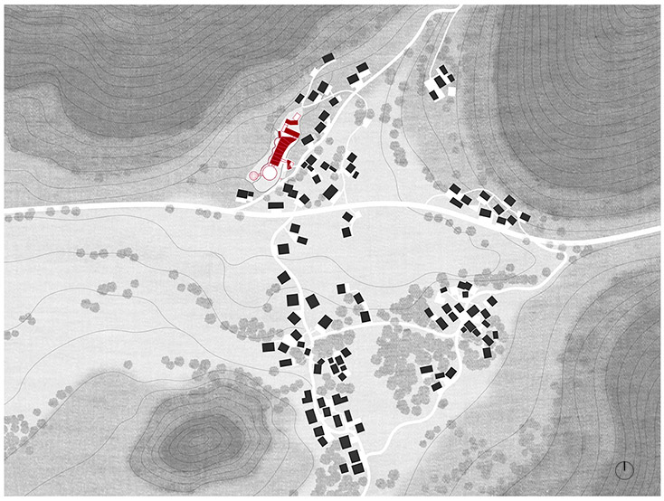

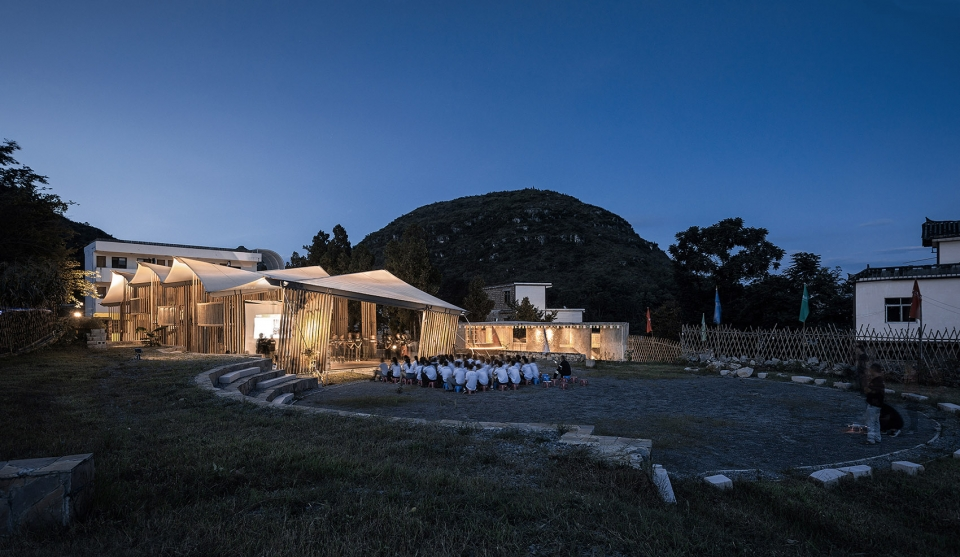

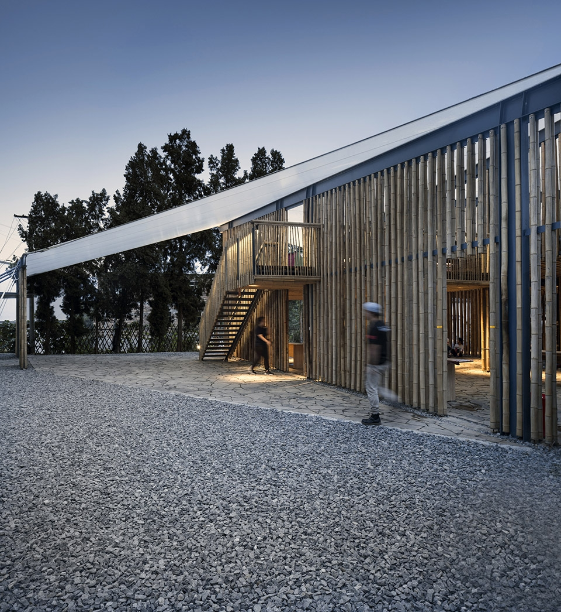

### 乡村图书馆与社区接口

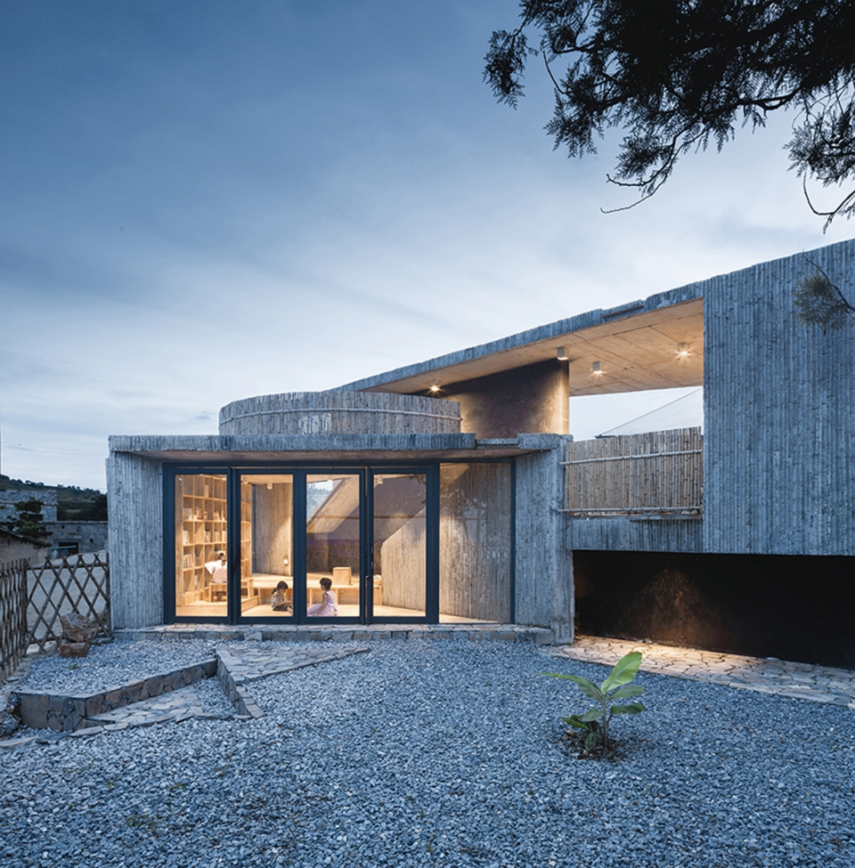

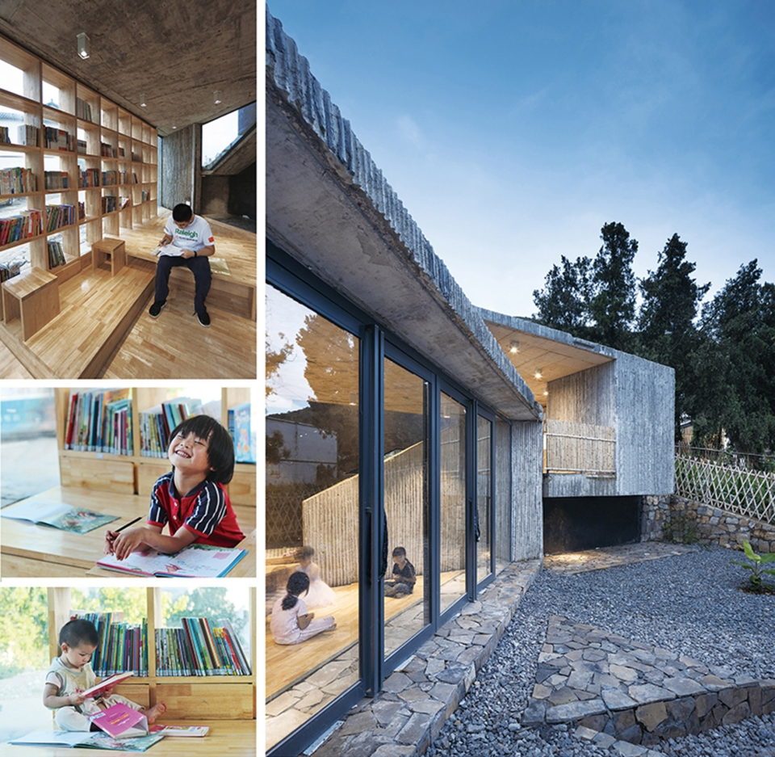

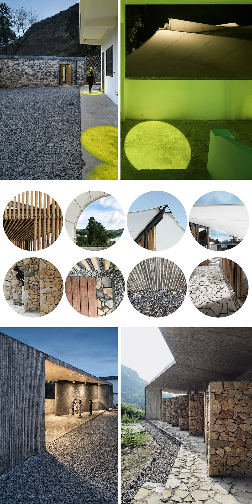

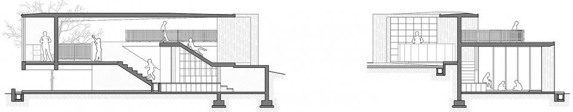

## 08 图纸与图片索引

| 图片类型 | 推荐用途 | 图片或页面链接 | 来源 | 版权 / 备注 |
| --- | --- | --- | --- | --- |
| 01_hero | 鸟瞰 / 场地整体识别 | images/01_hero_aerial.jpg | gooood | ©姚力，研究链接 |
| 09_analysis | 营区轴测 | images/02_camp_axis.jpg | gooood | 研究链接 |
| 04_section | 剖透视 / 建筑融入山村 | images/03_site_section.jpg | gooood | 研究链接 |
| 02_site | 建筑与场地关系 | images/04_multiuse_section.jpg | gooood | ©姚力，研究链接 |
| 04_section | 多功能空间剖透视 | images/05_multiuse_hall.jpg | gooood | 研究链接 |
| 01_hero | 多功能通用空间 | images/06_shared_platform.jpg | gooood | ©姚力，研究链接 |
| 06_detail | 竹界面 / 半透明界面 | images/07_bamboo_interface.jpg | gooood | ©姚力，研究链接 |
| 03_plan | 总平面图 | images/08_master_plan.jpg | gooood | 研究链接 |
| 03_plan | 一层平面图 | images/09_ground_plan.jpg | gooood | 研究链接 |
| 04_section | 营区剖面图 | images/10_rock_theater.jpg | gooood | 研究链接 |

## 09 对我的设计启发

- 可以学什么：旧校改造如何作为乡村营地锚点；轻量工业化体系如何与地方材料工艺并置；公益项目如何通过图书馆建立长期社区接口。
- 不适合直接照搬什么：不要只复制海帕膜屋面或竹界面，必须先判断气候、维护、工匠能力和运营模式是否匹配。
- 适合用于哪类设计任务：乡村营地、青年活动中心、公益建造、旧校更新、乡村图书馆、低成本公共空间。
- 可转化成哪些分析图：旧校锚固与加建关系图、营地功能聚落图、雨棚与通风剖面图、地方材料建构图、社区开放界面图、营地活动时间轴。

## 10 信息缺口与冲突

- 当前核心资料主要来自谷德项目报道，且该报道说明内容由华南理工大学建筑设计研究院提供；仍可继续补充设计院官网或 Raleigh China 原始项目资料。
- 未找到完整施工图和后期运营评估资料，因此关于长期维护、材料老化和使用反馈仍需进一步调查。
- 文章中英文结构团队名单略有差异：中文结构团队包含姚荣康，英文摘要片段未显示该姓名；本包以中文项目信息为主。

## 11 来源列表

### Level A：官方与一手来源

- [Raleigh Hong Kong 官方网站](https://www.raleigh.org.hk/)
- [Raleigh International 官方网站](https://raleighinternational.org/)

### Level B：高质量建筑媒体

- [Raleigh Campsite in Guizhou by Architectural Design and Research Institute of SCUT - gooood](https://www.gooood.cn/raleigh-campsite-in-guizhou-by-architectural-design-and-research-institute-of-scut.htm)

### Level C：中文补充源

- 暂未补充。

### Level D：参考源，只能辅助

- [Raleigh International - Wikipedia](https://en.wikipedia.org/wiki/Raleigh_International)
