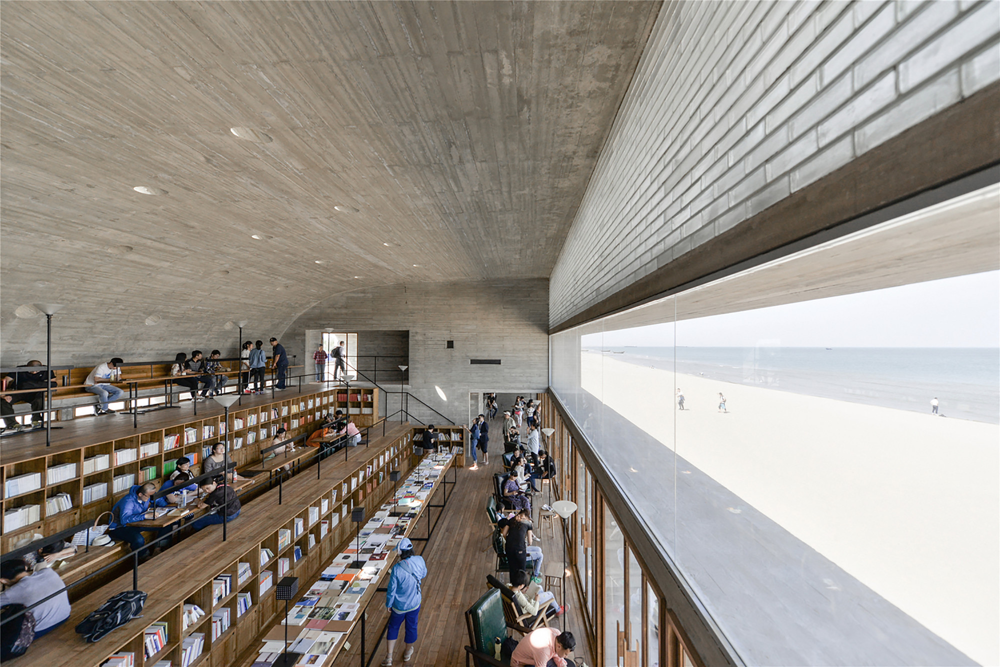
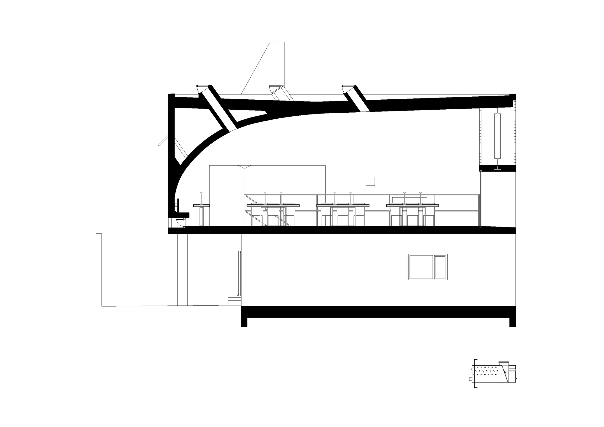
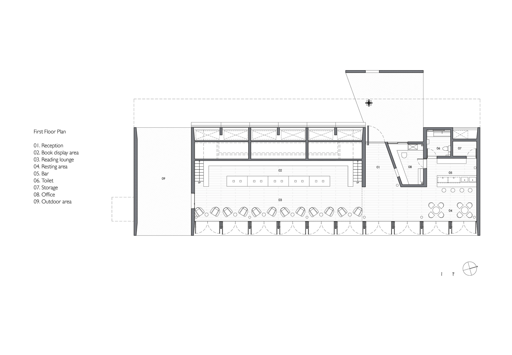
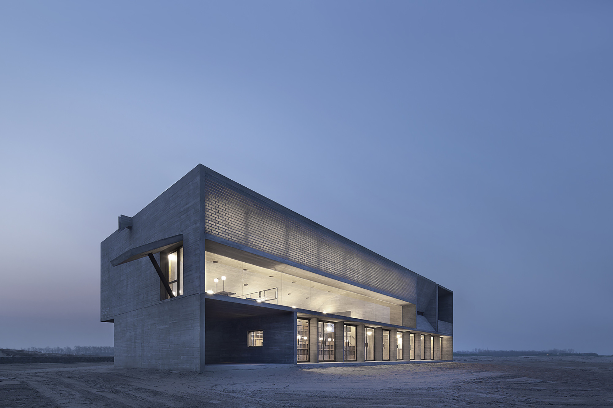
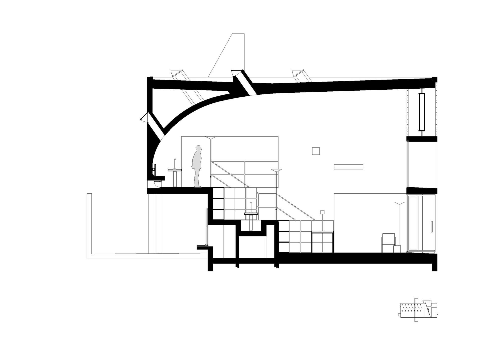
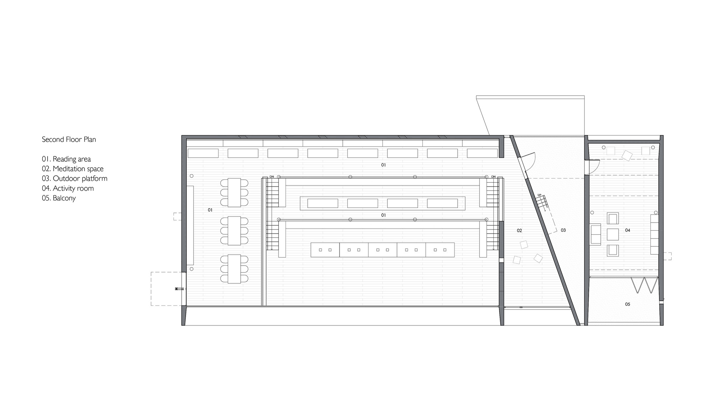
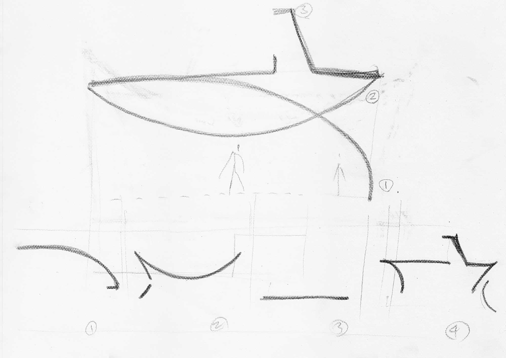
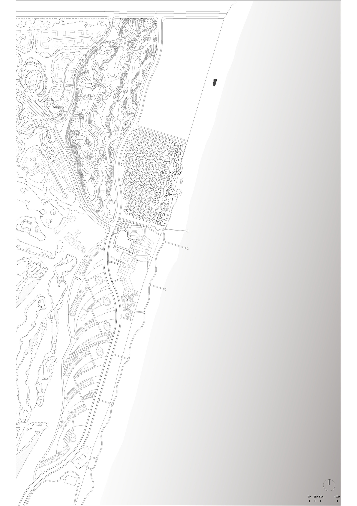

# 孤独图书馆 / Seashore Library

## 01 基本信息

- 建筑师 / 事务所：直向建筑 Vector Architects；主持建筑师董功；项目建筑师梁琛；驻场建筑师张艺凡、孙栋平
- 地点：中国河北秦皇岛，南戴河 / 北戴河新区阿那亚海岸社区一带
- 年份：2015
- 类型：文化建筑，图书馆 / 社区公共文化设施
- 面积：450 m2
- 状态：建成
- 关键词：海岸公共空间、剖面组织、看海阅读、光与风、木纹混凝土、玻璃砖、Freespace
- 案例类型：Cultural
- 信息可信度：high
- 主要依据来源：直向建筑官方项目页、ArchDaily 中英文项目页、gooood 访谈、Divisare、Arquitectura Viva、有方访谈

## 02 资料质量

- 资料状态：sufficient
- 是否有一级资料：是
- 一级资料是否用于身份确认：是
- 建筑专业媒体数量：5
- 微信有效结果数量：0
- 知乎有效结果数量：1
- 是否二手资料偏重：否
- 身份确认来源：s1, s2, s3
- 已覆盖分析项：concept / context / program / circulation / facade_material / structure_construction / user_experience / urban_relationship
- 需要人工复核：图片版权只可作为研究整理引用，不代表商业使用授权；知乎正文访问受限，仅保留搜索摘要作为学习线索。

## 03 一句话判断

这个案例最值得学习的不是“海边建筑如何取景”，而是如何把剖面、身体移动、光、风和材料共同组织成一种可被公众持续使用的精神性空间。

## 04 项目背景

图书馆位于渤海湾海岸线上的度假社区，官方说明将其放在“距离北京约三小时车程”的自然生活场景中，作为社区文化与休闲设施之一。建筑东侧面向大海，春、夏、秋三季不仅服务西侧社区居民，也向社会公众开放（s1, s3）。ArchDaily 记录项目面积为 450 m2，竣工年份为 2015，类别为文化建筑 / 图书馆（s2, s3）。

## 05 设计理念

### 来源明确的设计理念

直向建筑官方项目页明确提出，设计重点是探索空间边界、身体移动、光氛围、空气流通与海景之间的共存关系；设计从剖面开始，图书馆由主要阅读空间、冥想空间、活动室、水吧和休息区构成，不同空间分别建立与海、光、风的关系（s1）。ArchDaily 中文页也记录了这一叙述，并补充阅读空间被理解为面向海的“看台”，冥想空间则通过狭窄缝隙和低尺度形成内向体验（s3）。

### AI 综合判断

从图纸和叙述综合判断，图书馆的核心不是把海景作为单一正面景观，而是通过剖面差异把“看见海、听见海、感受风、感受光”拆分到不同房间中。它将海岸上的公共文化设施转化为一组身体经验：进入、上升、停留、面海、转入暗处、再回到开放平台。

## 06 核心建筑策略

### 策略 1：以剖面而不是平面作为空间生成逻辑

- 设计问题：海边场地过于开阔，单纯做一个面海房间容易把空间简化成观景盒子。
- 具体做法：设计从剖面展开，把阅读、冥想、活动、水吧和休息空间放入不同高度、亮度、开放度的空间段落中；剖面图显示屋面弧线、看台式阅读平台和相邻空间的高差关系。
- 建筑效果：不同功能不只是被分区，而是分别获得不同的海景、光线和身体尺度，形成连续但有差异的体验序列。
- 证据来源：s1, s3, s5
- 相关图片 / 图纸：
  
- 可借鉴点：面对强景观场地时，可以先定义“人与景观发生关系的剖面方式”，再组织平面功能。

### 策略 2：把阅读大厅做成面向大海的公共看台

- 设计问题：阅读空间需要安静，但海景又具有强烈公共性和吸引力。
- 具体做法：阅读区采用逐渐升起的阶梯平台，使不同位置的人都能越过前方视线看到海；朝海一侧设置可开启的玻璃旋转门，上方以横向海景窗框定主要视线。
- 建筑效果：阅读大厅同时具有图书馆、剧场和观景平台的性质，海成为空间的“舞台”，读者的停留被组织成朝向自然的集体凝视。
- 证据来源：s1, s3, s6
- 相关图片 / 图纸：
  
  
- 可借鉴点：公共阅读空间不一定只靠书架定义，也可以通过台阶、视线和开口把共同观看转化为空间秩序。

### 策略 3：用光和风细分空间性格

- 设计问题：同一栋小型公共建筑内需要同时容纳开放、明亮、公共和安静、内向、私密的体验。
- 具体做法：阅读空间使用横向海景窗、可开启玻璃墙、玻璃砖和屋面通风井；冥想空间通过 30 cm 宽的水平与垂直细缝引入晨昏光线；活动室则用朝东天窗和西墙高侧窗组织不同方向的光。
- 建筑效果：光线和通风不只是环境性能，而成为区分空间情绪的主要手段；阅读厅明亮开敞，冥想空间幽暗、封闭、可听海而不直接看海。
- 证据来源：s1, s3, s5
- 相关图片 / 图纸：
  
  
- 可借鉴点：小体量建筑可以通过开口尺度、方向和可开启构件获得多种空间性格，而不是依赖复杂造型。

### 策略 4：木纹混凝土与玻璃砖让厚重体量具有时间感

- 设计问题：海边建筑需要抵抗强烈自然环境，但过于坚硬的体量容易削弱人的亲近感。
- 具体做法：建筑主体采用木纹清水混凝土，纹理灵感来自场地踏勘中沙地上的风痕、脚印和车辙；阅读厅海景窗上方的钢桁架两侧填入手工玻璃砖，弱化结构的硬度并转化光线。
- 建筑效果：混凝土体量像海边风化的石块，但表面留下木模和施工过程的痕迹；玻璃砖让厚墙和结构在光线中变得半透明。
- 证据来源：s1, s3, s5
- 相关图片 / 图纸：
  
- 可借鉴点：材料表达可以来自场地经验，而不是事后贴附的地域符号；结构和围护也可以同时承担光环境塑造。

### 策略 5：从社区图书馆演变为多功能公共空间

- 设计问题：度假社区中的文化设施容易被消费化或打卡化，但图书馆需要持续承载公共活动。
- 具体做法：项目在春夏秋三季向公众开放；有方对董功的采访中提到，投入使用后多年间，空间功能不断变化，除读书外还被用于音乐厅、剧场、舞蹈室、会议、演出和拍摄等活动。
- 建筑效果：建筑从“图书馆”扩展成社区层面的 Freespace，连接社区居民、游客和更广泛的公共文化活动。
- 证据来源：s1, s7
- 相关图片 / 图纸：
  
- 可借鉴点：公共文化建筑的价值不只在功能命名，而在它是否能给不可预设的活动留下空间弹性。

## 07 空间与流线

流线可理解为一条从社区侧进入、穿过服务与阅读空间、逐步接近海景和屋顶平台的身体路径。首层平面显示主体被分为阅读大厅、冥想/辅助空间和服务空间；剖面显示阅读平台向后升起，使视线越过前排人与水平海面相接。活动室与阅读区之间通过户外平台区隔，既避免声音干扰，也让流线中出现短暂的室外转场（s1, s3）。

## 08 形体、立面与建构

建筑外部是简洁、厚重、近似风化石块的混凝土体量，内部则通过弧形屋面、阶梯平台、玻璃砖和细缝开口制造丰富体验。官方和 ArchDaily 均提到，屋顶荷载由海景窗上方的钢桁架承担，以避免结构构件打断横向观海视窗；屋面阵列 30 cm 直径通风井，在天气允许时可开启，带动室内空气流动（s1, s3）。

材料上，木纹混凝土来自现场风痕、脚印、车辙等时间痕迹的转译。ArchDaily 中文页记录，施工中与乡镇级施工队合作，木纹混凝土浇筑是最大挑战，主体建造前进行了三次样墙实验，以控制纹理、颜色和跑浆、气泡等质量问题（s3）。

## 09 图纸与图片索引

| 图片类型 | 推荐用途 | 本地图片 / 来源页面 | 来源 | 下载状态 | 版权 / 备注 |
| --- | --- | --- | --- | --- | --- |
| 01_hero | 封面 / 外观识别 | `images/01_hero_exterior.jpg` / [ArchDaily 图库](https://www.archdaily.cn/cn/768089/hai-bian-tu-shu-guan-zhi-xiang-jian-zhu-vector-architects) | ArchDaily | downloaded | 页面可见摄影署名包括何斌、苏圣亮、孙栋平；研究引用，商业使用需另行清权 |
| 02_site | 场地关系分析 | `images/02_site_plan.jpg` / [ArchDaily 图库](https://www.archdaily.cn/cn/768089/hai-bian-tu-shu-guan-zhi-xiang-jian-zhu-vector-architects) | ArchDaily | downloaded | 图纸来源页面：ArchDaily |
| 03_plan | 平面 / 功能组织分析 | `images/03_plan_first_floor.jpg` / [ArchDaily 图库](https://www.archdaily.cn/cn/768089/hai-bian-tu-shu-guan-zhi-xiang-jian-zhu-vector-architects) | ArchDaily | downloaded | 图纸来源页面：ArchDaily |
| 03_plan | 二层 / 屋顶平台分析 | `images/03_plan_second_floor.jpg` / [ArchDaily 图库](https://www.archdaily.cn/cn/768089/hai-bian-tu-shu-guan-zhi-xiang-jian-zhu-vector-architects) | ArchDaily | downloaded | 图纸来源页面：ArchDaily |
| 04_section | 剖面 / 空间关系分析 | `images/04_section_longitudinal.jpg` / [ArchDaily 图库](https://www.archdaily.cn/cn/768089/hai-bian-tu-shu-guan-zhi-xiang-jian-zhu-vector-architects) | ArchDaily | downloaded | 图纸来源页面：ArchDaily |
| 04_section | 楼梯 / 冥想空间剖面 | `images/04_section_stairs.jpg` / [ArchDaily 图库](https://www.archdaily.cn/cn/768089/hai-bian-tu-shu-guan-zhi-xiang-jian-zhu-vector-architects) | ArchDaily | downloaded | 图纸来源页面：ArchDaily |
| 07_concept | 概念 / 生成逻辑 | `images/07_concept_sketch.jpg` / [ArchDaily 图库](https://www.archdaily.cn/cn/768089/hai-bian-tu-shu-guan-zhi-xiang-jian-zhu-vector-architects) | ArchDaily | downloaded | 图纸来源页面：ArchDaily |
| 08_interior | 阅读大厅体验 | `images/08_interior_reading_hall.jpg` / [ArchDaily 图库](https://www.archdaily.cn/cn/768089/hai-bian-tu-shu-guan-zhi-xiang-jian-zhu-vector-architects) | ArchDaily | downloaded | 页面可见摄影署名包括何斌、苏圣亮、孙栋平；研究引用，商业使用需另行清权 |

## 10 对我的设计启发

- 可以学什么：从剖面定义人与环境的关系；用光、风、视线和材料共同组织空间经验；把小体量公共建筑做出多重性格。
- 不适合直接照搬什么：不要把“面向景观的阶梯看台”和“粗粝混凝土”当作形式套用；它们在这里成立，是因为场地、开放方式、结构和使用情绪彼此扣合。
- 适合用于哪类设计任务：滨水公共文化设施、小型社区图书馆、冥想/展览空间、度假社区公共节点、自然景观中的低层公共建筑。
- 可转化成哪些分析图：剖面体验序列图、视线与开口关系图、光 / 风进入方式图、公共性层级图、材料来源与建构逻辑图。

## 11 信息缺口与冲突

- 中文语境中常称“三联海边图书馆”或“孤独图书馆”，英文与专业媒体多用 Seashore Library；本包以官方中文“孤独图书馆”和 ArchDaily 标题“海边图书馆 / Seashore Library”并列记录。
- 图片版权仅适合研究整理和内部学习引用；如用于公开网站、商业发布或出版，需要向原摄影师、ArchDaily 或权利方确认授权。
- 知乎案例分析正文无法稳定访问，只保留搜索摘要作为学习线索，不用于确认项目硬事实。

## 12 来源列表

### Level A：官方与一手来源

- [2015 孤独图书馆 - 直向建筑](https://www.vectorarchitects.com/projects/31)
- [Project-Social & Cultural 2015 Seashore Library - Vector Architects](https://www.vectorarchitects.com/en/projects/31)

### Level B：高质量建筑媒体

- [海边图书馆 / 直向建筑 Vector Architects - ArchDaily 中国](https://www.archdaily.cn/cn/768089/hai-bian-tu-shu-guan-zhi-xiang-jian-zhu-vector-architects)
- [Seashore Library / Vector Architects - ArchDaily](https://www.archdaily.com/638390/seashore-library-vector-architects)
- [Seashore Library, Bei Daihe, China by Vector Architects - gooood](https://www.gooood.cn/seashore-library-by-vector.htm)
- [Vector Architects, Xia Zhi, Su Shengliang · Seashore Library - Divisare](https://divisare.com/projects/290488-vector-architects-xia-zhi-su-shengliang-seashore-library)
- [Seashore Library, Beidaihe - Arquitectura Viva](https://arquitecturaviva.com/works/biblioteca-en-la-costa-beidaihe-10)
- [董功：直向建筑在威双 | 有方专访](https://www.archiposition.com/items/20180723163531)

### Level C：中文补充源

- [【东大建筑考研.建筑案例分析01】三联海边图书馆——并置罗列的空间结构 - 知乎专栏](https://zhuanlan.zhihu.com/p/112988140)

### Level D：参考源，只能辅助

- 无
