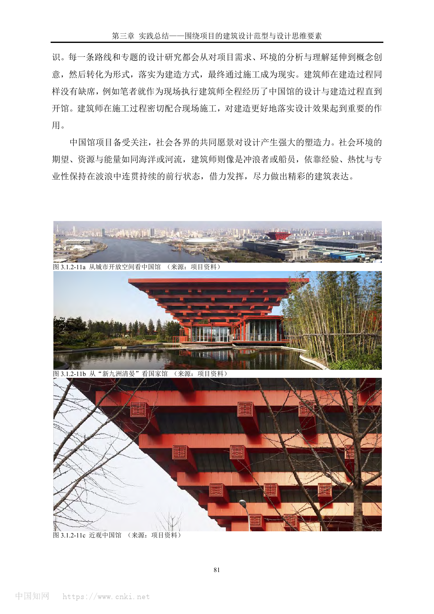
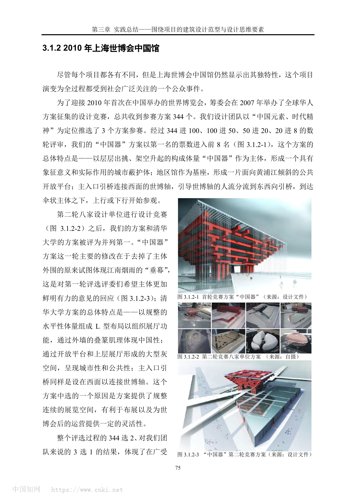
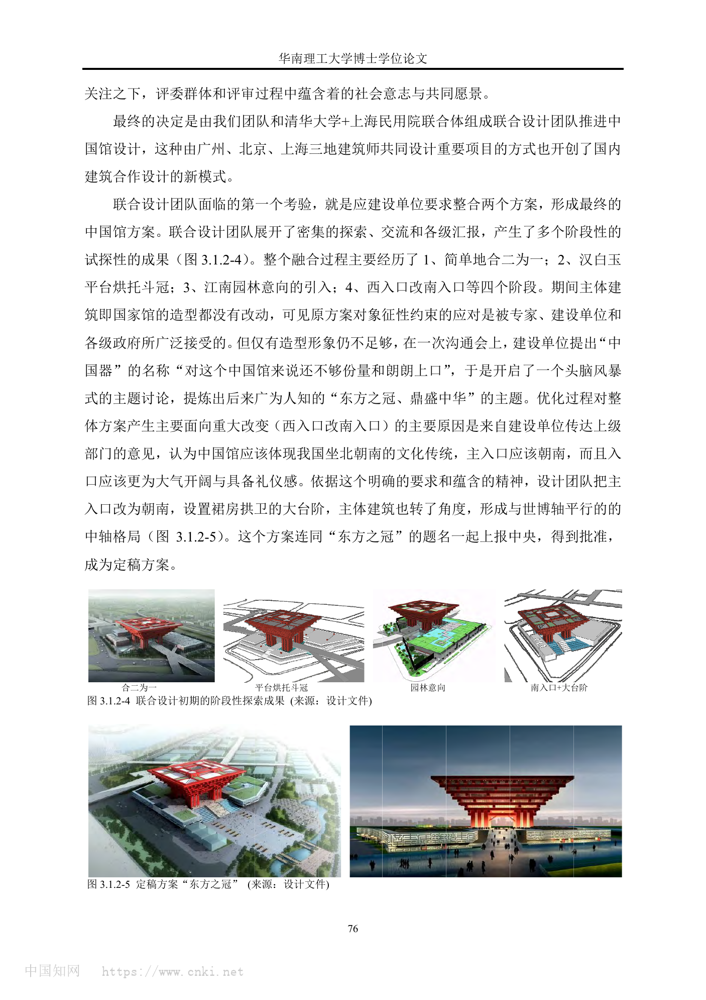
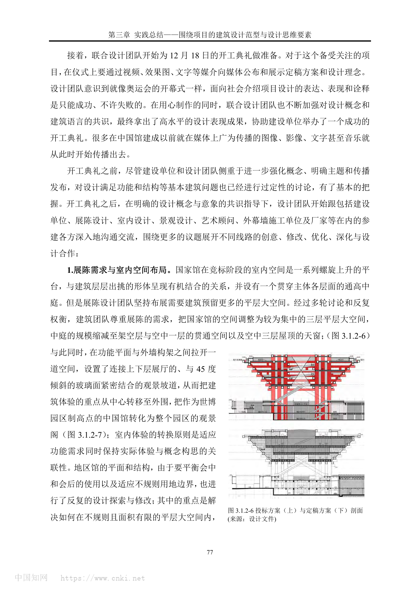
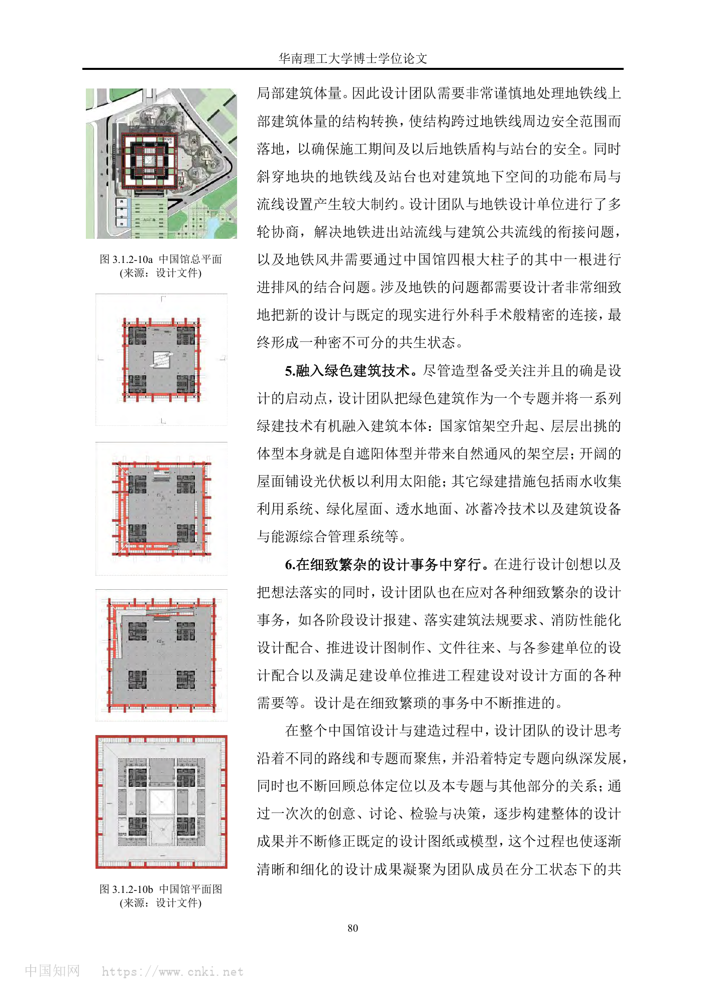
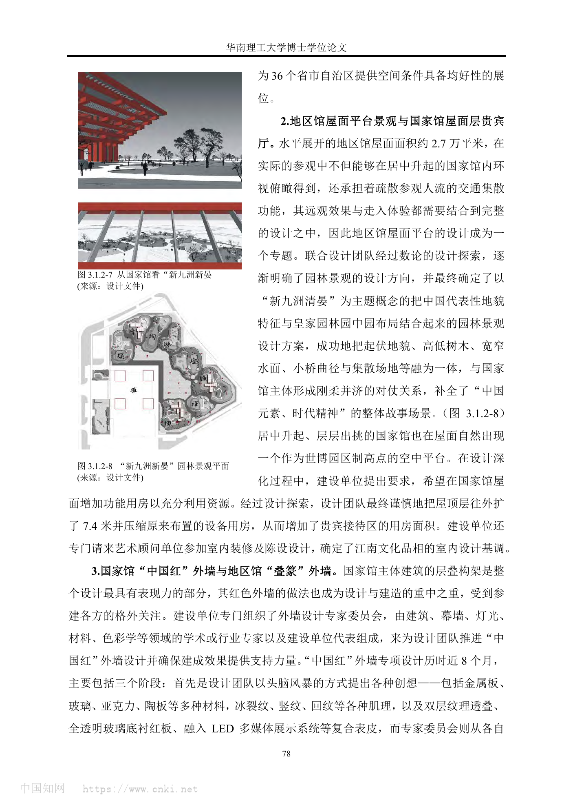
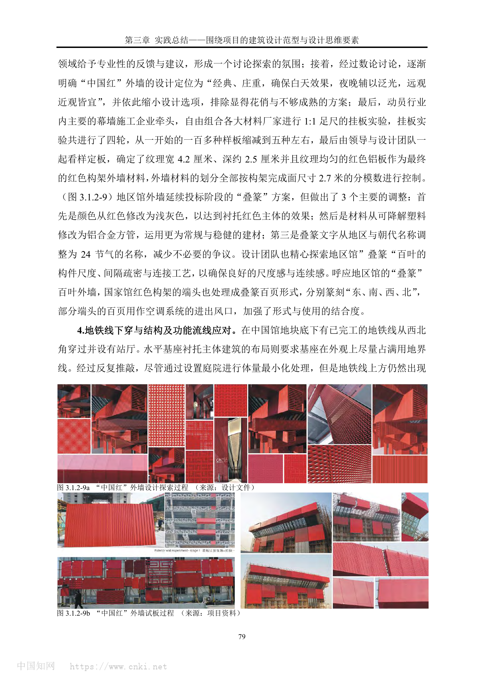

# 上海世博会中国馆 / China Pavilion for Expo 2010 Shanghai

> 资料说明：本案例以用户提供的 PDF 为主要设计过程资料，并以中华艺术宫官方网站、Area、ArchDaily、gooood 等公开来源进行身份和事实交叉校核。公开资料中项目名称也写作“中国2010年上海世博会中国国家馆”“东方之冠”“China Pavilion / China Pavillion for Shanghai World Expo 2010”。本包按“上海世博会中国馆”组织分析。

## 01 基本信息与技术指标

| 项目 | 内容 |
| --- | --- |
| 项目名称 | 上海世博会中国馆 / 中国2010年上海世博会中国国家馆 |
| 英文名称 | China Pavilion for Expo 2010 Shanghai / China Pavillion for Shanghai World Expo 2010 |
| 建筑师 / 事务所 | 联合设计团队：何镜堂团队、清华大学团队、上海民用建筑设计院等；PDF 强调广州、北京、上海三地建筑师合作 |
| 地点 | 上海世博园区，浦东上南路 205 号一带 |
| 建成 / 开放 | 2007 年竞赛与开工；2010 年上海世博会使用；2012 年 10 月 1 日改作中华艺术宫开放 |
| 建筑类型 | 国家展馆、文化展示建筑、世博后再利用美术馆 |
| 建筑面积 | 约 16 万平方米；Area 页面给出 160,126 平方米，中华艺术宫公开资料也以约 16 万平方米为常见口径 |
| 建筑高度 | 当前包未用一手资料稳定确认；公开资料常见 63 米口径，正式引用前需复核 |
| 结构体系 | PDF 提到地铁线下穿处需结构转换并跨越安全范围落地；完整结构体系未在 PDF 中系统披露 |
| 主要材料 | 红色铝板“中国红”外墙、浅灰铝合金方管“叠篆”百叶、玻璃、屋面光伏与绿化屋面等 |
| 后续状态 | 世博会后保留并改造为中华艺术宫（上海美术馆） |
| 摄影 / 图纸来源 | PDF 图注含设计文件、项目资料；Area 图片注明 Shen Zhong Hai 摄影 |
| 信息可信度 | 高。身份、设计过程、核心策略、主要材料和后续使用可多源确认；结构、节点和高度需补充专项资料 |

指标说明：高度、容积率、建筑密度、完整结构系统、施工节点详图等高精度信息未在当前资料中完整确认，不作推测。

## 02 资料质量与证据密度

- 资料状态：sufficient
- 是否有一手资料：是。PDF 包含设计竞赛、方案整合、剖面调整、外墙专项、地铁下穿、绿色技术和建造配合等过程性资料。
- 建筑专业媒体数量：3。Area、ArchDaily、gooood 可补充事实、摄影和传播背景。
- 图片处理状态：completed。已从 PDF 渲染并整理 7 张分析页。
- 已覆盖分析项：concept / context / program / circulation / facade_material / structure_construction / user_experience / urban_relationship
- 资料最充分方向：概念生成、方案整合、空间功能调整、中国红外墙、叠篆外墙、屋顶园林、地铁下穿与绿色技术。
- 资料不足方向：施工节点详图、结构计算体系、造价、长期运营评价、中华艺术宫改造阶段的内部空间变更细节。

## 03 一句话判断

中国馆最值得学习的是：在一个高度公共化、政治文化象征极强的项目中，设计团队没有停留在“东方之冠”的图像，而是通过入口轴线、展陈平层化、观景坡道、屋顶园林、外墙足尺试板和地铁下穿结构应对，把象征、功能、城市、人流和建造逐步桥接成可落地的建筑系统。

图文相关性：用于说明中国馆建成后的城市识别度、屋顶园林与国家馆主体之间的视觉关系。

## 04 场地信息表

| 场地维度 | 与设计回应相关的信息 | 证据 |
| --- | --- | --- |
| 场地区位 | 上海世博园区核心展馆，西侧与世博轴联系紧密 | PDF p75-p76 |
| 人文环境 | 首次在中国举办的世博会，项目成为全国性公共关注事件 | PDF p75 |
| 交通关系 | 竞赛阶段主入口曾连接西侧世博轴，定稿阶段改为南入口与大台阶，形成更强礼仪感 | PDF p75-p76 |
| 地下条件 | 已建成地铁线从地块西北角下穿并设站厅，对结构、地下空间和人流组织形成约束 | PDF p79-p80 |
| 服务人群 | 世博会期间大客流参观者、国家馆与地区馆观众；后续为中华艺术宫观众 | PDF p77-p80，中华艺术宫官网 |
| 场地核心矛盾 | 需要同时回应国家象征、超大客流、展陈灵活性、世博轴人流、地铁既有设施和世博后运营 | PDF p75-p80 |

## 05 概念创意探索 Conceptual Exploration

### 5.1 诊断 Diagnosis

来源明确：PDF 指出中国馆从设计竞赛开始就是“全过程都受到社会广泛关注的公众事件”。竞赛共收到 344 个方案，最终形成何镜堂团队方案与清华大学方案并列第一，再由广州、北京、上海三地团队联合推进。

基于资料的归纳判断：项目的设计问题不是单纯的展馆形象，而是如何在国家形象、世博主题、展陈运营、超大客流与永久保留之间建立可被社会共同接受的建筑解答。设计过程中的“社会意志”直接塑造了方案走向。

图文相关性：用于说明项目从全球华人方案征集到“中国器”进入前八、再与其他方案比较的竞赛背景。

### 5.2 定位 Positioning

来源明确：设计团队最初以“中国元素、时代精神”为定位参赛；建设单位认为“中国器”名称不够有分量，后续提炼出“东方之冠、鼎盛中华”的主题。南入口、大台阶和中轴格局则回应了“坐北朝南”的文化传统和国家馆礼仪性。

基于资料的归纳判断：定位经历了从“器物原型”到“国家礼仪建筑”的转译。形体仍保留层层出挑、架空升起的核心构成，但表达从较抽象的“中国器”转向更具传播力的“东方之冠”。

图文相关性：用于说明合二为一、平台烘托斗冠、园林意向、南入口与大台阶等阶段性整合过程。

### 5.3 策略 Strategy

策略：以国家馆主体的象征形体作为核心，地区馆作为基座和公共平台，再通过南入口大台阶、屋顶园林和展陈空间调整补足城市性、公共性和功能性。

回应的问题：仅有强图像不足以支撑完整展馆；展陈需要平层大空间，地区馆需兼顾会中和会后使用，超大客流需要交通集散和疏散平台，城市展示需要远观与近观均成立。

对空间 / 形式 / 建造的影响：国家馆从竞标阶段的螺旋平台调整为较集中的三层平层大空间；观景坡道转移体验重心；地区馆屋顶成为“新九洲清晏”园林平台；外墙专项从图像表达进入材料试板和分模数控制。

### 5.4 意象与表达 Imagery, Naming & Expression

来源明确：中国馆主题为“东方之冠、鼎盛中华”。国家馆层层出挑，形成类似斗冠/斗拱的强象征；地区馆“叠篆”百叶以二十四节气名称替代地区和朝代名称，减少争议并加强文化普适性。

基于资料的归纳判断：这个项目的符号系统不是单一图案，而是由冠、鼎、斗拱、红色、叠篆、九洲园林、南向礼仪入口共同构成的多层叙事。

## 06 建筑语言生成 Architectural Language Generation

### 6.1 功能梳理 Function

来源明确：PDF 说明，国家馆竞标阶段原为空间连续的螺旋上升平台和通高中庭；展陈团队提出需要更多平层大空间后，建筑团队将其调整为较集中的三层平层大空间，并缩减中庭规模。地区馆则需为 36 个省市自治区提供均好展位，并兼顾世博会后使用。

基于资料的归纳判断：功能不是被动填充，而是反过来校正形体。中国馆最重要的空间调整正是由展陈需求触发，设计团队用外围观景坡道保留建筑体验和城市眺望，使功能调整不削弱概念。

图文相关性：用于说明国家馆从螺旋平台到三层平层大空间的剖面调整，以及体验重心从中心转向外围。

### 6.2 布局逻辑 Layout

来源明确：早期方案主入口引桥连接西侧世博轴，定稿阶段根据坐北朝南和礼仪性要求改为南入口、大台阶和与世博轴平行的中轴格局。地区馆作为水平基座支撑国家馆，既承担展陈空间，也承担交通集散与会后运营。

基于资料的归纳判断：中国馆的布局是“礼仪轴线 + 水平平台 + 居中升起主体”的组合。南入口强化国家馆的正面性，水平基座处理大客流和地区展馆，国家馆主体则负责远距离识别和垂直体验。

图文相关性：用于说明总平面、地铁下穿影响、功能流线与绿色建筑技术嵌入。

### 6.3 形式构成 Composition

来源明确：国家馆以层层出挑、架空升起的构成体量作为主体，形成城市蔽护体；地区馆作为基座和公共平台，面向黄浦江倾斜展开。后续整合中主体造型基本未改，说明其对象征性约束的回应已被多方接受。

基于资料的归纳判断：形式构成采用“上重下轻”的反常规表达：巨大主体被架空，借由出挑和大柱形成纪念性，同时释放底层公共空间；地区馆以水平基座稳定主体，并以园林与灰调叠篆外墙柔化国家馆的强烈象征。

### 6.4 场所与氛围 Place & Atmosphere

来源明确：地区馆屋面约 2.7 万平方米，承担疏散和交通集散，同时被国家馆俯瞰，因此成为专题设计。团队最终用“新九洲清晏”把代表性地貌、皇家园林园中园布局、起伏地貌、高低树木、宽窄水面、小桥曲径和集散场地融合。

基于资料的归纳判断：“新九洲清晏”不是装饰性景观，而是把水平基座从交通屋面转化为可被观看、可被行走、可承载人流的文化场景，与国家馆的刚性红色主体形成刚柔对仗。

图文相关性：用于说明屋顶平台如何从疏散/集散需求转化为中国地貌与园林叙事。

## 07 建造品质控制 Construction Quality Control

### 7.1 建造语言 Construction Language

来源明确：PDF 明确记录了地铁线下穿对结构转换、地下空间、公共流线和地铁风井的影响。地铁线从地块西北角穿过，设计需使结构跨过地铁线周边安全范围落地，并把地铁风井与中国馆四根大柱中的一根结合。

基于资料的归纳判断：地铁约束迫使项目从象征性形体进入精密的工程连接。中国馆不是一件孤立雕塑，而是与既有城市基础设施形成共生状态。

### 7.2 材料与工艺 Materials & Craft

来源明确：“中国红”外墙专项历时近 8 个月，建设单位组织建筑、幕墙、灯光、材料、色彩学等专家参与。团队从金属板、玻璃、亚克力、陶板，多种肌理和复合表皮中筛选，最终确定纹理宽 4.2 厘米、深约 2.5 厘米、纹理均匀的红色铝板；外墙划分按构架完成面尺寸 2.7 米的分模数控制。

基于资料的归纳判断：红色不是简单涂装，而是通过材料、肌理、观看距离、白天夜晚效果、灯光和施工样板共同确定的建造结果。

图文相关性：用于说明中国红外墙从多材料、多肌理探索到 1:1 足尺挂板定板的过程。

### 7.3 构造逻辑 Tectonic Logic

来源明确：地区馆“叠篆”外墙由红色改为浅灰色，以衬托国家馆主体；材料由可降解塑料改为铝合金方管；叠篆文字由地区与朝代名称改为二十四节气。国家馆红色构架端头也处理成叠篆百叶，分别篆刻“东、南、西、北”，部分端头百叶用作空调进出风口。

基于资料的归纳判断：叠篆百叶把文字、遮蔽、通风、尺度和文化表达合为一体。它不是表面贴字，而是通过构件尺度、间隔疏密和连接工艺进入外墙系统。

### 7.4 性能与施工控制 Performance & Construction Control

来源明确：绿色技术被作为专题融入建筑本体：国家馆架空升起和层层出挑形成自遮阳体型，并带来自然通风架空层；屋面铺设光伏板；其他措施包括雨水收集利用、绿化屋面、透水地面、冰蓄冷技术、建筑设备与能源综合管理系统。

基于资料的归纳判断：中国馆的绿色策略与形体高度相关。层层出挑本身同时服务象征、遮阳和公共架空空间，说明绿色技术不是附加设备，而是与体量语言绑定。

## 08 核心方法提炼

### 方法 1：在公众事件中把“社会意志”转译成设计结构

- 面对的问题：国家级世博展馆承载超高社会期待，单一设计团队或单一概念难以完成共识建构。
- 具体做法：通过竞赛、并列第一、联合设计和多轮汇报，把不同方案资源整合为“东方之冠”的最终主题。
- 建筑效果：方案获得更强公共传播力和政治文化识别度，同时保留国家馆主体的强象征。
- 证据来源：PDF p75-p76。
- 可迁移方法：重大公共项目要识别决策网络，把社会期待转译为空间、入口、主题和建造专题，而不是只防守方案完整性。

### 方法 2：用礼仪轴线增强象征建筑的公共进入

- 面对的问题：早期西入口连接世博轴有效，但礼仪性和国家馆正面性不足。
- 具体做法：主入口改为南向，设置裙房拱卫的大台阶，并形成与世博轴平行的中轴格局。
- 建筑效果：国家馆从展馆入口转化为更具仪式感的城市公共建筑入口。
- 证据来源：PDF p76。
- 可迁移方法：象征建筑的入口策略应同时处理人流效率、文化方位和公共仪式感。

### 方法 3：让展陈需求倒逼剖面重组

- 面对的问题：螺旋平台和通高中庭概念强，但展陈团队需要平层大空间。
- 具体做法：将国家馆调整为三层集中平层大空间，缩减中庭，并在功能平面与外墙构架之间设置观景坡道。
- 建筑效果：保留展馆运营效率，同时把体验重心转向外围观景，使中国馆成为世博园区观景阁。
- 证据来源：PDF p77。
- 可迁移方法：功能调整不必削弱概念，可通过剖面和边界空间重组，把被放弃的体验转移到新的空间载体。

### 方法 4：把屋顶平台从交通空间转化为文化场景

- 面对的问题：地区馆屋面既被国家馆俯瞰，又承担大客流疏散和集散。
- 具体做法：以“新九洲清晏”为主题组织地貌、水面、树木、桥径和集散场地。
- 建筑效果：屋顶平台成为可观看、可行走、可疏散的文化景观，与国家馆主体形成刚柔对仗。
- 证据来源：PDF p78。
- 可迁移方法：大体量公共建筑的屋面可作为第二地面处理，兼容疏散、景观、叙事和视觉背景。

### 方法 5：用足尺试板把颜色变成构造决策

- 面对的问题：“中国红”必须经典、庄重，并在远观近观、白天夜晚都成立。
- 具体做法：组织专家委员会和幕墙企业进行四轮 1:1 挂板实验，从一百多种样板筛选到最终红色铝板，并用 2.7 米分模数控制外墙划分。
- 建筑效果：红色外墙从符号诉求转化为可施工、可维护、可被观看距离验证的幕墙系统。
- 证据来源：PDF p78-p79。
- 可迁移方法：对建筑识别度有决定作用的颜色和表皮，应通过样板、模数、灯光和观看距离共同定板。

## 09 图纸与图片索引

| 图片类型 | 推荐用途 | 本地图片 | 来源 | 下载状态 | 图文相关性 |
| --- | --- | --- | --- | --- | --- |
| 01_hero | 建成识别 / 城市视角 | `images/01_hero_built_views_pdf_p81.png` | 用户 PDF | downloaded | 城市开放空间、新九洲清晏和近观中国馆 |
| 07_concept | 竞赛概念 | `images/07_competition_china_qi_pdf_p75.png` | 用户 PDF | downloaded | “中国器”与竞赛阶段 |
| 07_concept | 方案整合 | `images/07_concept_eastern_crown_pdf_p76.png` | 用户 PDF | downloaded | 从合二为一到“东方之冠” |
| 04_section | 剖面 / 展陈调整 | `images/04_section_exhibition_adjustment_pdf_p77.png` | 用户 PDF | downloaded | 投标与定稿剖面对比 |
| 02_site | 屋顶平台 / 景观 | `images/02_roof_garden_new_jiuzhou_pdf_p78.png` | 用户 PDF | downloaded | 新九洲清晏与屋顶平台 |
| 06_detail | 外墙材料 / 试板 | `images/06_china_red_facade_mockup_pdf_p79.png` | 用户 PDF | downloaded | 中国红外墙探索和试板 |
| 03_plan | 总平面 / 绿色技术 | `images/03_site_plan_green_tech_pdf_p80.png` | 用户 PDF | downloaded | 总平面、平面、地铁和绿色技术 |

## 10 对我的设计启发

- 可迁移方法 1：重大公共建筑的设计不是孤立作者表达，而是对社会共同愿景的专业组织。
- 可迁移方法 2：强象征形体必须继续接受功能、交通、运营和建造专题的检验。
- 可迁移方法 3：展陈建筑要把“可布展的平层大空间”和“可记忆的空间体验”同时纳入剖面设计。
- 可迁移方法 4：屋顶平台可以承担人流疏散、文化叙事、城市观看和绿色策略，不应只当作第五立面。
- 可迁移方法 5：颜色、肌理和文字表皮要转化为构件、模数、连接和风口等真实系统。
- 不适合直接照搬的部分：“东方之冠”“中国红”“斗冠/斗拱”高度绑定世博国家馆语境，不能作为一般文化建筑的通用符号。
- 可转化成的分析图：竞赛整合流程图、南入口礼仪轴线图、国家馆剖面调整图、屋顶平台复合功能图、中国红外墙试板决策图、地铁下穿与结构跨越关系图。

## 11 信息缺口与冲突

- 项目英文名拼写存在差异：ArchDaily 页面题名写作 “China Pavillion”，更常见英文为 “China Pavilion”。
- 面积口径：Area 与中华艺术宫公开资料均指向约 16 万平方米量级，但不同资料对中国馆、地区馆、中华艺术宫改造后的展陈面积可能有不同统计口径。
- 高度口径：公开资料常见 63 米，但当前包未找到可直接对应设计图纸或官方技术表的稳定一手来源，故未在基本表中确认为高可信指标。
- 结构体系：PDF 提到地铁下穿结构转换和大柱结合风井，但完整结构体系、节点构造和施工过程仍需专项工程资料补充。
- 后续改造：中华艺术宫作为后续使用可确认，但改造阶段的内部空间调整、展厅数量口径和运营评价未在本包中展开。

## 12 来源列表

### Level A：官方与一手来源

- S1. 用户提供 PDF：《上海世博会中国馆.pdf》，节选自博士论文相关章节，包含竞赛、方案整合、剖面调整、外墙试板、地铁下穿、绿色技术与建成照片。本地路径：`C:/Users/dell/Desktop/上海世博会中国馆.pdf`
- S2. 中华艺术宫官方网站：https://www.artmuseumonline.org/

### Level B：高质量建筑媒体

- S3. Area：《China Pavilion》，https://www.area-arch.it/en/china-pavilion/
- S4. ArchDaily：《China Pavillion for Shanghai World Expo 2010》，https://www.archdaily.com/34037/china-pavillion-for-shanghai-world-expo-2010
- S5. gooood：《gooood Interview NO.17 – He Jingtang》，https://www.gooood.cn/gooood-interview-hejingtang.htm

### Level C：中文补充源

- S6. 中国青年报：《上海世博会中国馆变身中华艺术宫》，https://zqb.cyol.com/html/2012-09/25/nw.D110000zgqnb_20120925_7-01.htm

### Level D：参考源

- 未采用 Level D 作为关键事实依据。
