# 泰州民俗文化展示中心 / Taizhou Folk Culture Exhibition Center

> 资料说明：本案例以用户提供的博士论文 PDF 章节为主要项目资料，并用泰州市住建局、2016 WA 中国建筑奖、同济大学何镜堂建筑创作展页面和 gooood 何镜堂访谈页交叉校核。项目在公开资料中也常以“泰州科学发展观展示馆 / 泰州科学发展观展示中心 / Exhibition Center of Scientific Outlook”出现；本包按用户给定题名“泰州民俗文化展示中心”组织分析。

## 01 基本信息与技术指标

| 项目 | 内容 |
| --- | --- |
| 项目名称 | 泰州民俗文化展示中心；公开资料别名：泰州科学发展观展示馆、泰州科学发展观展示中心 |
| 英文名称 | Taizhou Folk Culture Exhibition Center；Exhibition Center of Scientific Outlook |
| 建筑师 / 事务所 | 何镜堂、郭卫宏、张振辉、黄瑜、何炽立 / 华南理工大学建筑设计研究院 |
| 地点 | 江苏省泰州市，坡子街、稻河头、五巷传统街区相关城市节点 |
| 设计 / 建成 | 2009 年启动设计；2014 年建成 |
| 建筑类型 | 文化展示建筑、城市更新触媒、历史街区整合项目 |
| 建筑面积 | 约 12000 平方米，另有住建局页面提及 10306 平方米；需人工复核口径 |
| 层数 | 地上 3 层、地下 1 层 |
| 结构体系 | 公开资料未完整披露；PDF 提到结构骨架与围合体系需匹配、钢结构参与屋脊等关键部位 |
| 主要材料 | 浅灰石材、石材百叶幕墙、金属构架花格窗、玻璃长廊、金属遮阳百叶、超白玻璃双银 LOW-E 玻璃 |
| 绿色目标 | 国家绿色三星建筑；住建局称采用光伏、地源热泵、光导照明、自然通风、能耗监测等技术 |
| 摄影 / 图纸来源 | PDF 中注明项目资料、设计文件、姚力摄影、马明华摄影等 |
| 信息可信度 | 中高。项目身份和核心事实可交叉确认；面积、项目名称口径、部分技术指标仍需人工复核 |

指标说明：高度、容积率、建筑密度、完整结构体系等高精度指标未在当前可用资料中稳定确认，不作推测。

## 02 资料质量与证据密度

- 资料状态：partial
- 是否有一手资料：是。PDF 来自项目实践复盘，包含设计过程、图纸、照片、节点与建造控制说明；住建局页面为地方主管部门来源。
- 建筑专业媒体数量：2。WA 奖项页面可确认奖项、团队与城市贡献分类；gooood 访谈页含何镜堂及项目图片线索，但不是完整项目报道。
- 图片处理状态：completed。本包使用 PDF 渲染出的关键页作为本地研究图像。
- 已覆盖分析项：concept / context / program / circulation / facade_material / structure_construction / user_experience / urban_relationship
- 资料最充分方向：场地诊断、东西向轴带、街区缝合、传统建筑当代表达、石材百叶幕墙、绿色技术消隐、建造品质控制。
- 资料不足方向：完整结构图、节点详图原始大样、运维后评估、展陈系统、成本与施工组织。

## 03 一句话判断

这个案例最值得学习的不是单个形式，而是设计团队如何把旧城节点、名人旧居、五巷街区、百米高层和新展馆纳入同一条东西向叙事轴，再把“和谐与发展”的概念落实到平面肌理、立面材料、绿色技术和建造控制中。

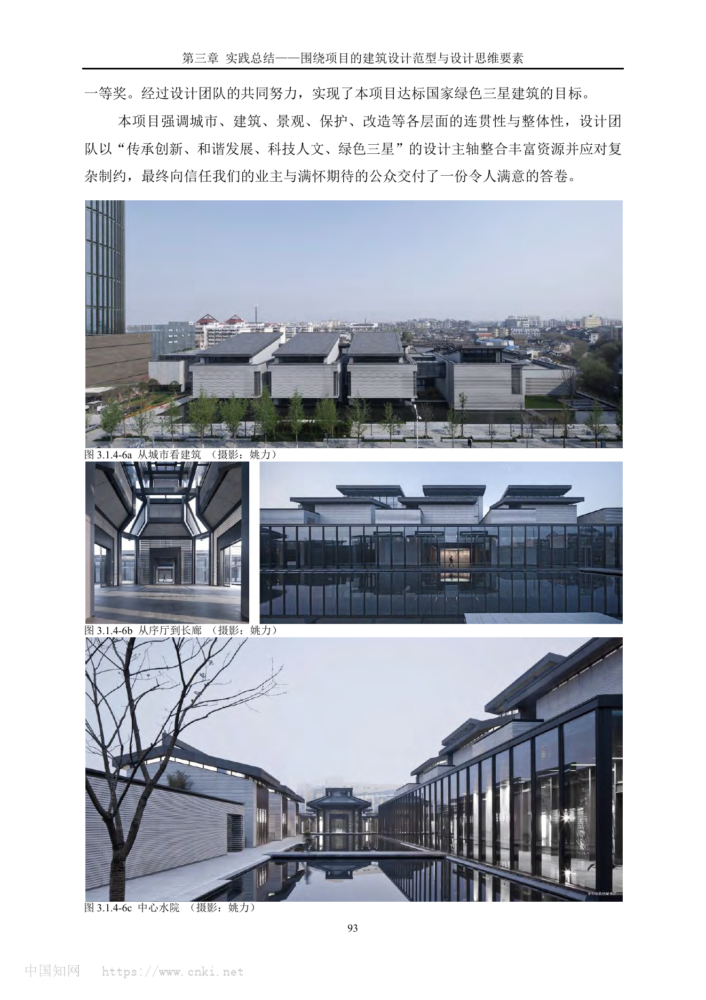

图文相关性：用于说明项目的建成整体氛围、中心水院、长廊和城市视角下的体量关系。

## 04 场地信息表

| 场地维度 | 与设计回应相关的信息 | 证据 |
| --- | --- | --- |
| 场地区位 | 基地位于长江流域与淮河流域衔接地带，稻河头是历史水运“翻坝”节点 | PDF p88 |
| 人文环境 | 北邻五巷传统街区，西侧有名人旧居，南向现代商业中心坡子街 | PDF p88-p90 |
| 核心矛盾 | 单层名人旧居与约 100 米高层距离约 5 米，尺度冲突极强 | PDF p88 |
| 城市关系 | 原有历史线索被商业建筑遮蔽，项目通过广场和轴线重新显露稻河头、五巷街区和展示馆 | PDF p89 |
| 服务人群 | 市民、游客、展馆参观者、历史街区体验者 | PDF p89-p90, p243 |
| 场地策略 | 从东侧进入，沿东西向轴带到达名人旧居，把高层转化为背景或屏风 | PDF p89, p241 |

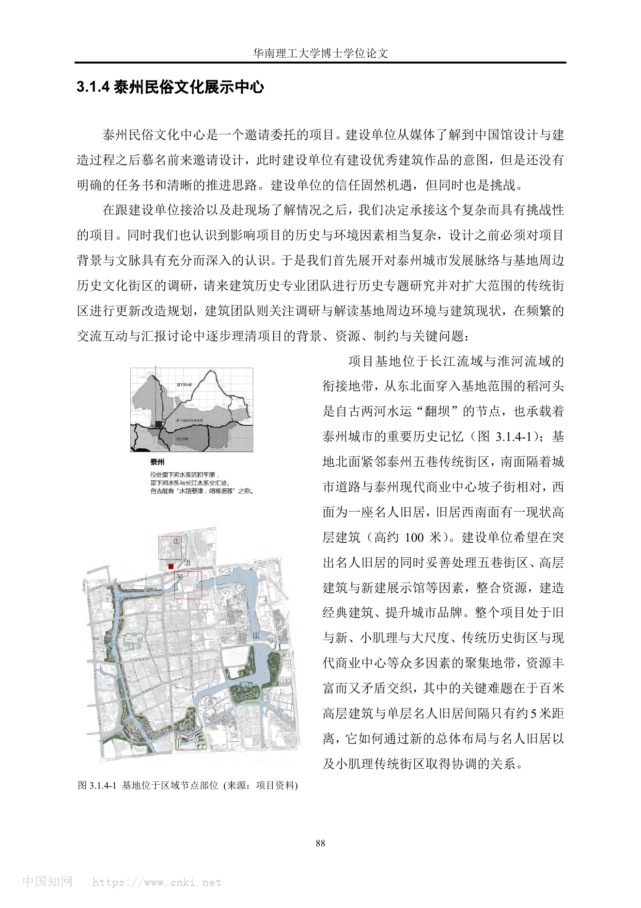

图文相关性：用于验证基地区位、稻河头历史线索、名人旧居与高层建筑的关键矛盾。

## 05 概念创意探索 Conceptual Exploration

### 5.1 诊断 Diagnosis

来源明确：建设单位最初缺少明确任务书，但希望通过项目形成优秀建筑作品并提升城市品牌；基地处在旧与新、小肌理与大尺度、传统街区与现代商业中心交织的位置。PDF 反复指出，设计前必须深入研究泰州城市发展脉络和基地周边历史文化街区。

基于资料的归纳判断：项目的真实问题不是“做一个展示馆”，而是重组一个被近现代道路、商业建筑、高层开发割裂的城市节点。展馆只是介入机制之一，城市广场、名人旧居、复建民居、高层立面改造、传统街区更新共同构成设计对象。

### 5.2 定位 Positioning

来源明确：设计团队提出“和谐与发展”的总体定位，并以“传承创新、和谐发展、科技人文、绿色三星”为主轴整合资源。PDF 后半段把该项目放入“概念创意探索、建筑语言生成、建造品质控制”的连贯框架中复盘。

基于资料的归纳判断：项目定位具有双重性：一方面作为展示馆承载文化与展陈功能，另一方面作为旧城更新触媒，重新连接五巷、稻河头、名人旧居和坡子街商业中心。

### 5.3 策略 Strategy

策略：建立东西向轴带，而不是从南侧硬性进入名人旧居。

回应的问题：名人旧居、百米高层、五巷街区、现代商业中心之间原本互相冲突，尤其高层对单层旧居造成压迫。

对空间 / 形式 / 建造的影响：轴带从东向西组织稻河头广场、展示馆主体、名人旧居展示区，使高层从“干扰物”转化为背景；中部建筑通过中央水院和南北体量分化衔接大尺度城市与小肌理街区。

证据来源：PDF p88-p90、p241。

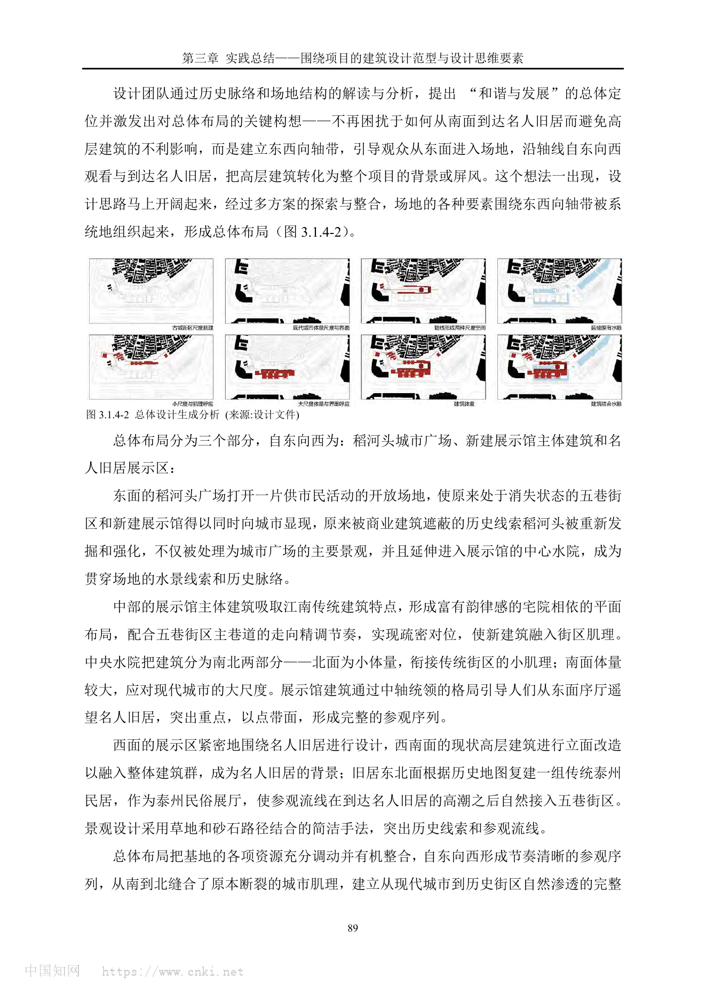

图文相关性：用于说明东西向轴带、三段式总体布局和稻河头水线索进入中心水院的生成关系。

### 5.4 意象与表达 Imagery, Naming & Expression

来源明确：PDF 将“新泰州建筑”的品相概括为灰调、平正、低调、质朴、内敛、敦厚，并把它与泰州传统建筑中的灰砖、屋脊、花窗、转角等形态特征联系起来。

基于资料的归纳判断：项目没有直接复制传统民居，而是通过灰色调、细密模数、石材百叶、花格窗、亮脊和玻璃长廊等现代建造语言，把地方建筑的“气质”转译为可建造的公共建筑界面。

## 06 建筑语言生成 Architectural Language Generation

### 6.1 功能梳理 Function

来源明确：PDF p243 将功能需求分为三层：新建展馆本身的展览、藏品、办公研究、贵宾、多功能报告厅、设备用房；坡子街-稻河头-五巷片区作为城市更新体验区；改善社区环境并创造公共活动空间。

基于资料的归纳判断：展馆被处理成“半开放的小系统嵌入一个大系统”。它既要满足展陈的封闭性与后勤需求，又要让街区、广场、水院和旧居形成连续体验。

### 6.2 布局逻辑 Layout

来源明确：总体布局自东向西分为稻河头城市广场、新建展示馆主体建筑、名人旧居展示区。东侧广场重新打开五巷街区和新馆的城市可见性；中心水院延续稻河头水线索；西侧围绕名人旧居展开，并使参观流线接入五巷街区。

基于资料的归纳判断：水线索、轴线、街巷肌理和参观流线相互叠合，使项目从单体建筑转化为城市空间叙事。

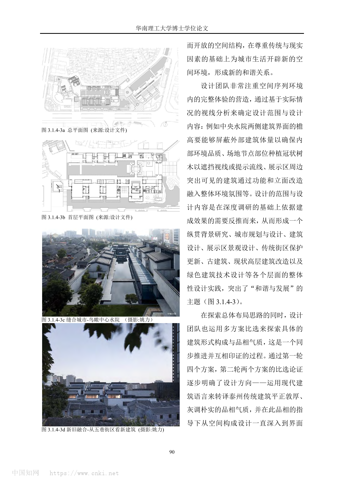

图文相关性：用于验证总平面、首层平面、中心水院和从五巷街区看新建筑的衔接关系。

### 6.3 形式构成 Composition

来源明确：展示馆主体吸取江南传统建筑特点，形成宅院相依的平面布局；中央水院将建筑分成南北两部分，北侧小体量衔接传统街区，南侧较大体量回应现代城市尺度。后续方案通过“片墙立体勾连”的方式呼应宅院相依的传统布局。

基于资料的归纳判断：形式并非先有造型再套功能，而是从轴带、院落、墙体、屋面、节点“重器”逐步生成。它既保持主轴统领，又通过疏密对位减弱新建筑对历史街区的压迫。

### 6.4 场所与氛围 Place & Atmosphere

来源明确：设计团队通过视线分析确定檐高、树木遮挡、节点提示、周边建筑立面改造等内容，以确保内部环境品质和参观序列体验。

基于资料的归纳判断：项目的场所感来自“控制观看”。从东侧进入、通过序厅望向名人旧居、在水院与长廊中行进、再进入历史街区，人的视线、遮挡、显露和停留共同塑造体验。

## 07 建造品质控制 Construction Quality Control

### 7.1 建造语言 Construction Language

来源明确：PDF p248 将建造体系拆解为骨架、围合与地台。设计团队对结构体系单独建模，并反馈到建筑模型上，检验结构构件与围合体系的匹配度；公共空间室内外高差处理为 1.5 厘米，以追求平顺衔接。

基于资料的归纳判断：这个项目的建造控制不是后期补救，而是用“骨架-围合-地台”的体系把形式语言变成可施工、可校核的构造系统。

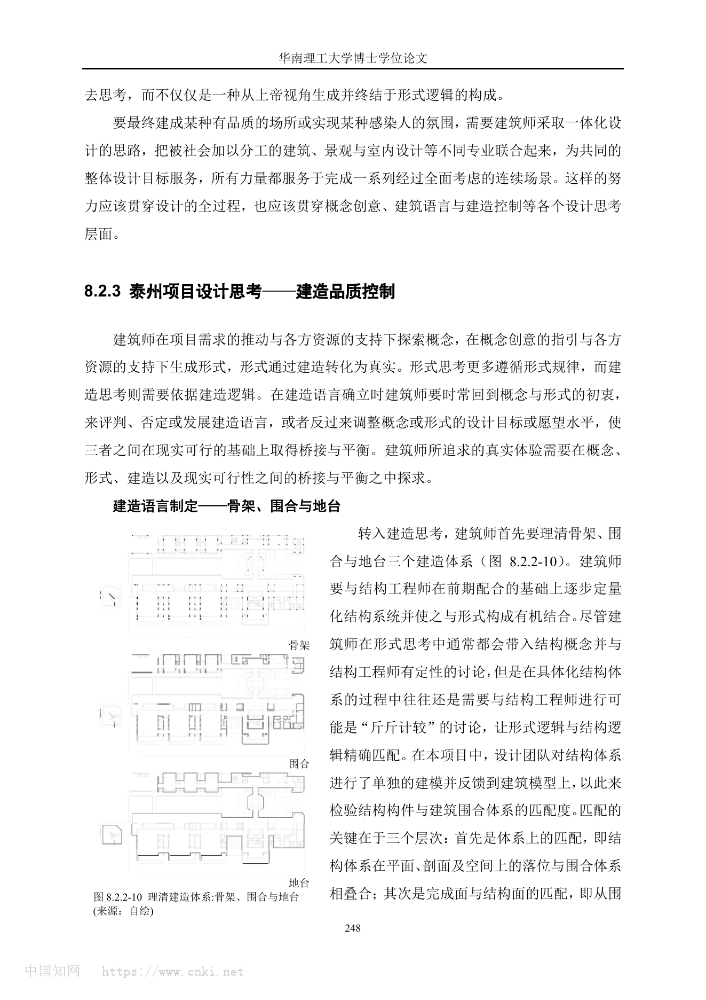

图文相关性：用于说明结构骨架、外墙围合与地台系统如何对应形式控制。

### 7.2 材料与工艺 Materials & Craft

来源明确：团队曾尝试改良传统青砖砌法并做足尺试版，但因新建筑体量和外墙品质要求转向石材百叶幕墙。基面石材采用锯齿状表面，按 75mm 模数形成细密肌理；浅灰色石材呼应传统青砖色调；长廊使用超白玻璃双银 LOW-E 玻璃。

基于资料的归纳判断：材料策略的关键不是“像青砖”，而是把青砖的尺度感、灰调和光影肌理转译到更适合大型公共建筑的幕墙系统中。

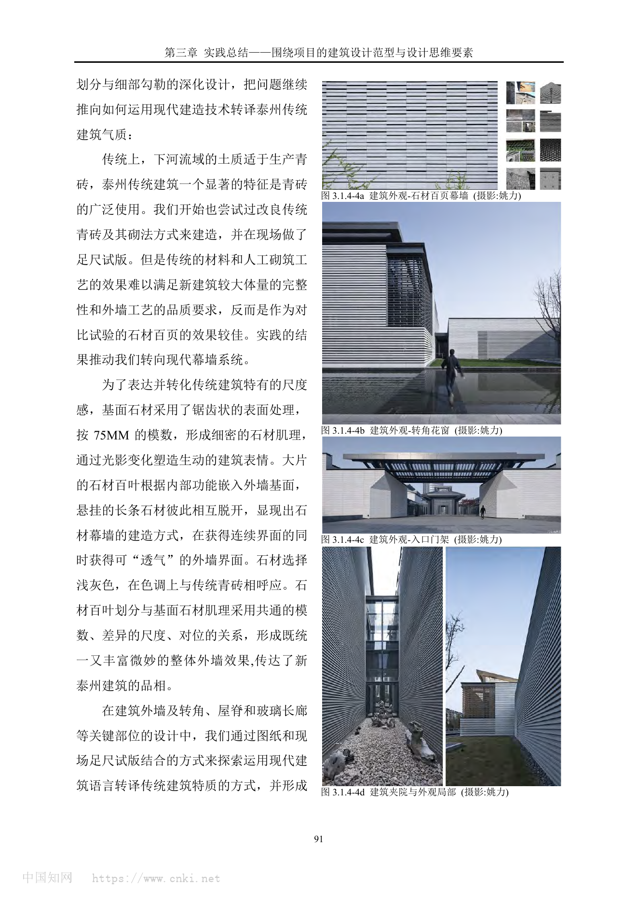

图文相关性：用于验证石材百叶幕墙、转角花窗、入口门架和灰调外墙的建成效果。

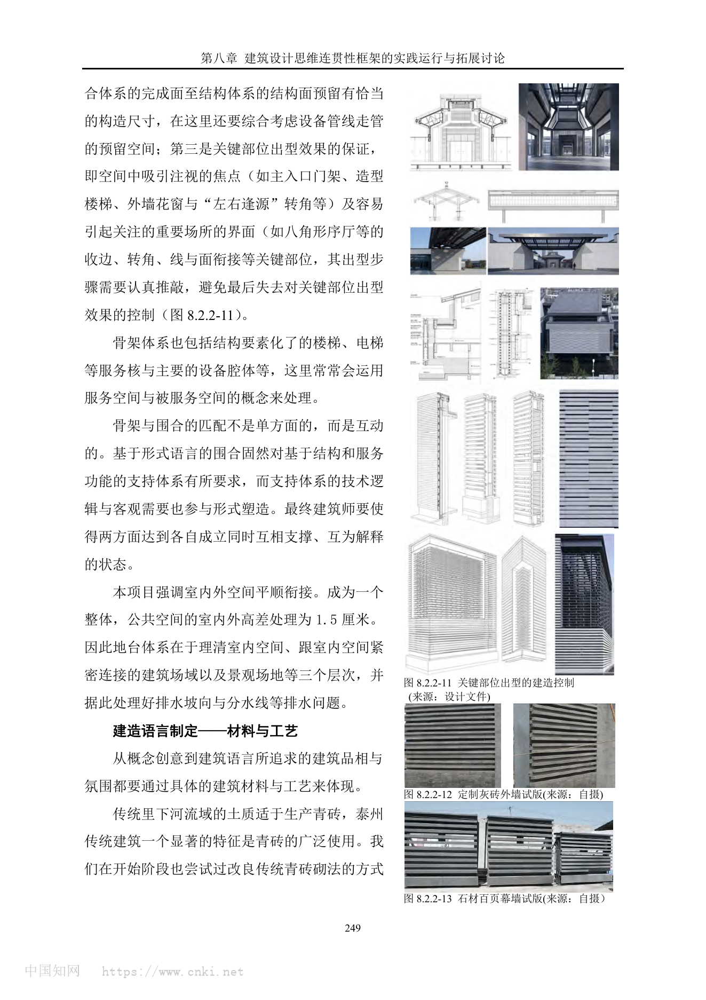

图文相关性：用于说明材料选择经过足尺试版比较，传统青砖方案被现代石材百叶系统替代。

### 7.3 构造逻辑 Tectonic Logic

来源明确：石材百叶划分与基面石材肌理采用共通模数、差异尺度和对位关系；转角处结合幕墙龙骨系统设置金属构架“左右逢源”花格窗；屋面顶端结合钢结构构筑“亮脊”；公共走道设置玻璃长廊与金属遮阳百叶。

基于资料的归纳判断：构造逻辑围绕“同一模数下的差异尺度”展开。墙面、百叶、收边、花窗、亮脊不是孤立装饰，而是共同服务于“新泰州建筑”的整体品相。

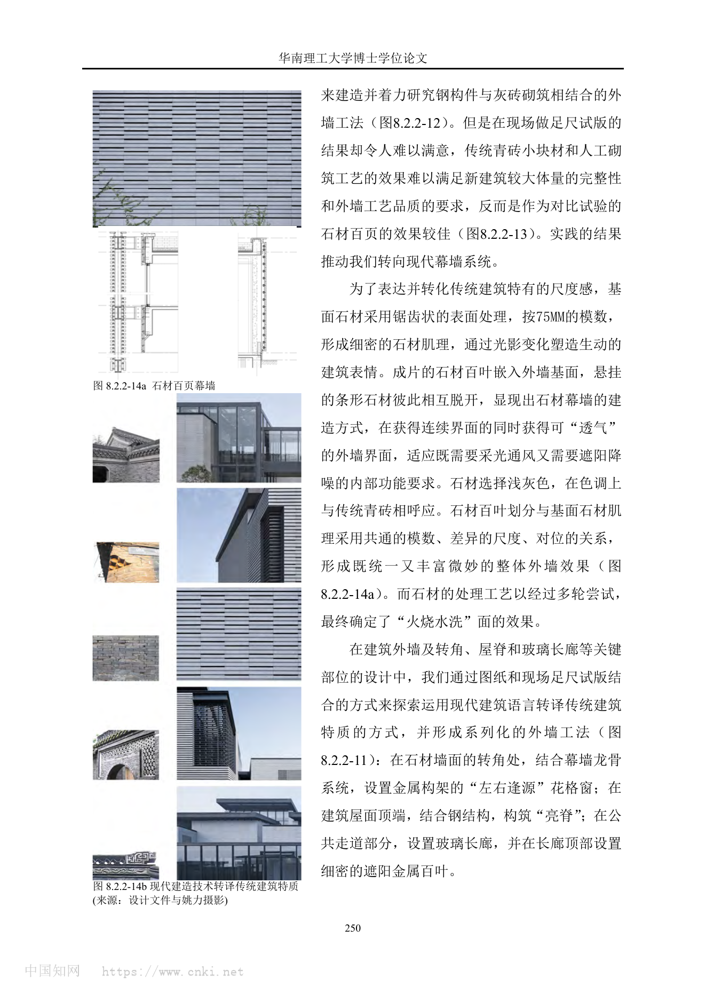

图文相关性：用于说明石材百叶、花格窗、亮脊与玻璃长廊等系列化外墙工法。

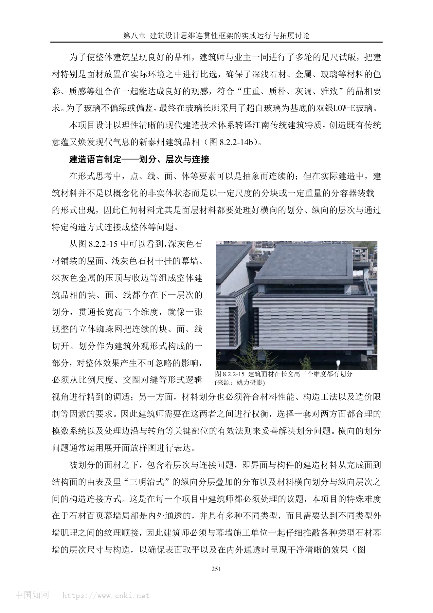

图文相关性：用于说明面材划分、模数、交圈对缝和转角处理对整体品相的影响。

### 7.4 性能与施工控制 Performance & Construction Control

来源明确：PDF 提到“顶面做排水、边沿沟滴水、交接设防水、地台阻潮气”的防水策略；玻璃长廊顶部设置自动喷水系统；绿色技术通过坡顶、外墙、开窗等本体元素消隐化整合。住建局页面补充了光伏、地源热泵、光导照明、自然通风、能耗监测等绿色技术。

基于资料的归纳判断：本项目的绿色技术不是独立展示的“技术符号”，而是被压入建筑本体和景观水系统，服务于文化氛围与现场体验。

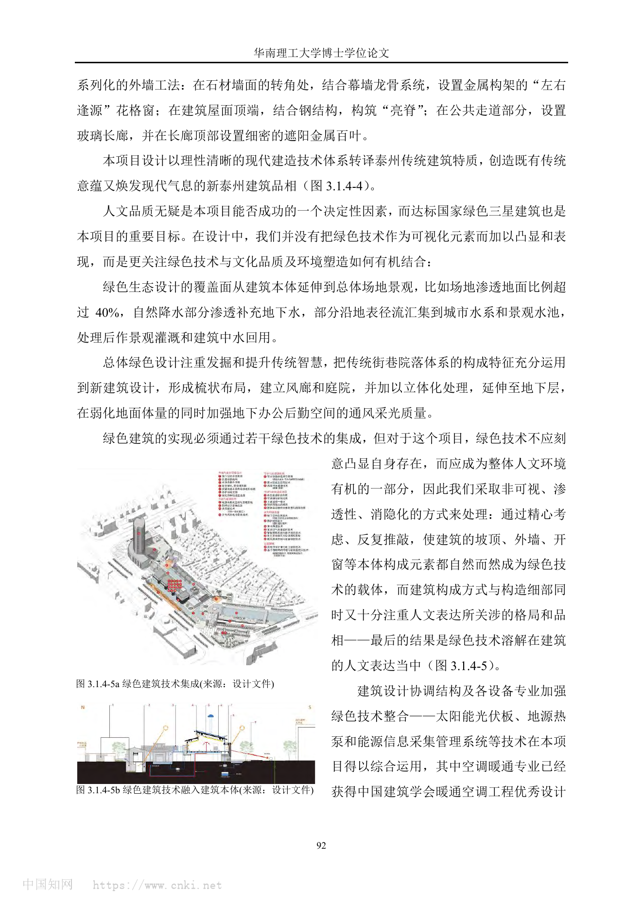

图文相关性：用于说明绿色技术如何嵌入场地水系统、屋面、外墙、开窗和设备系统。

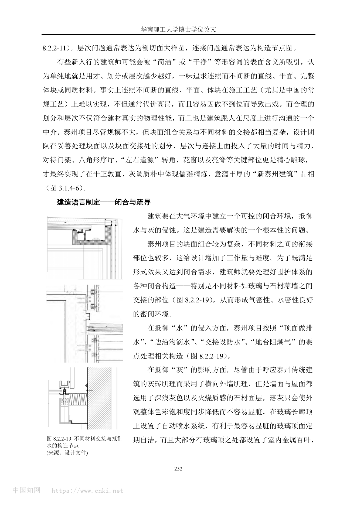

图文相关性：用于说明防水、防尘、玻璃长廊维护和复杂材料交接的建造控制。

## 08 核心方法提炼

### 方法 1：用一条叙事轴重组复杂旧城节点

- 面对的问题：名人旧居、五巷街区、稻河头、商业中心和百米高层尺度冲突。
- 具体做法：建立自东向西的参观轴带，把稻河头广场、展示馆、名人旧居和高层背景纳入连续序列。
- 建筑效果：高层从不利因素转为背景，历史水线索被重新显露，参观路径获得清晰方向。
- 证据来源：PDF p88-p90、p241；WA 城市贡献奖入围。
- 可迁移方法：面对复杂城市更新场地时，先寻找能够重新解释各矛盾要素的组织线索，而不是逐个处理问题。

### 方法 2：用南北体量差异缝合大小肌理

- 面对的问题：北侧传统街区小尺度与南侧现代商业大尺度并置。
- 具体做法：中央水院分割南北体量，北侧小体量衔接五巷街区，南侧大体量回应城市道路和商业中心。
- 建筑效果：新建筑既有公共建筑体量，又不完全压迫历史街区。
- 证据来源：PDF p89-p90、p245。
- 可迁移方法：在新旧交界处，不必追求单一体量秩序，可用院落、水体、廊道和体量梯度完成尺度翻译。

### 方法 3：从传统“气质”而非传统“样式”生成立面

- 面对的问题：项目需要传承泰州传统建筑，但仿古路线难以承载公共建筑的时代性和建造品质。
- 具体做法：把灰砖、花窗、屋脊、转角等传统特征转译为石材百叶、金属花格窗、亮脊、玻璃长廊和 75mm 模数肌理。
- 建筑效果：形成灰调、平正、低调、质朴、内敛、敦厚的“新泰州建筑”品相。
- 证据来源：PDF p91、p242、p249-p251。
- 可迁移方法：地域表达可先提炼比例、色调、尺度、光影、构造逻辑，再选择当代材料系统实现。

### 方法 4：用足尺试版把材料判断落到现场

- 面对的问题：传统青砖砌筑效果难以满足较大体量新建筑的完整性和外墙品质。
- 具体做法：现场做定制灰砖外墙试版和石材百叶幕墙试版，并通过多轮看样定版控制深浅石材、金属、玻璃组合。
- 建筑效果：设计从材料想象转入可验证的建造判断，最终形成统一且细腻的外墙效果。
- 证据来源：PDF p91、p249-p250。
- 可迁移方法：涉及地方材料转译时，应尽早用足尺样板检验尺度、色差、阴影、耐污和施工可行性。

### 方法 5：把绿色技术消隐进建筑本体

- 面对的问题：绿色三星目标容易变成技术堆叠或可视化符号，与文化建筑氛围冲突。
- 具体做法：把场地雨水、风廊庭院、地下采光通风、坡顶、外墙、开窗、光伏、地源热泵等整合为非炫示的系统。
- 建筑效果：绿色技术服务于空间品质和人文表达，而不是抢夺形式主题。
- 证据来源：PDF p92、住建局页面。
- 可迁移方法：文化建筑中的绿色策略可优先转化为水、风、光、围护、运维的空间机制，而非独立设备展示。

## 09 图纸与图片索引

| 图片类型 | 推荐用途 | 本地图片 | 来源 | 下载状态 | 图文相关性 |
| --- | --- | --- | --- | --- | --- |
| 01_hero | 建成整体氛围 | `images/01_hero_views_pdf_p93.png` | 用户 PDF | downloaded | 城市视角、序厅长廊、中心水院 |
| 02_site | 场地关系 | `images/02_site_context_pdf_p88.png` | 用户 PDF | downloaded | 区域节点、稻河头、名人旧居与高层冲突 |
| 07_concept | 总体生成 | `images/07_concept_layout_generation_pdf_p89.png` | 用户 PDF | downloaded | 东西向轴带和三段式总体布局 |
| 03_plan | 平面与序列 | `images/03_plan_sequence_pdf_p90.png` | 用户 PDF | downloaded | 总平面、首层平面、中心水院、新旧融合 |
| 06_detail | 外墙材料 | `images/06_facade_stone_louver_pdf_p91.png` | 用户 PDF | downloaded | 石材百叶、转角花窗、入口门架 |
| 09_analysis | 绿色技术 | `images/09_green_technology_pdf_p92.png` | 用户 PDF | downloaded | 绿色技术集成与建筑本体融合 |
| 06_detail | 建造体系 | `images/06_construction_system_pdf_p248.png` | 用户 PDF | downloaded | 骨架、围合、地台 |
| 06_detail | 材料试版 | `images/06_mockup_material_pdf_p249.png` | 用户 PDF | downloaded | 灰砖与石材百叶试版比较 |
| 06_detail | 幕墙细部 | `images/06_stone_louver_detail_pdf_p250.png` | 用户 PDF | downloaded | 石材百叶与传统特质转译 |
| 06_detail | 模数划分 | `images/06_material_module_pdf_p251.png` | 用户 PDF | downloaded | 面材三维划分与交圈对缝 |
| 06_detail | 防水节点 | `images/06_waterproof_detail_pdf_p252.png` | 用户 PDF | downloaded | 不同材料交接与抵御水的构造节点 |

## 10 对我的设计启发

- 可迁移方法 1：旧城更新中的“新建筑”不一定是主角，它可以是重新组织历史线索、公共空间和参观叙事的工具。
- 可迁移方法 2：面对强冲突场地，先寻找能够改变问题性质的布局策略，例如把不可拆高层转化为背景，而不是只做遮挡。
- 可迁移方法 3：地域性表达应避免直接拼贴符号，优先研究地方建筑的材料尺度、色调、构造节奏和空间秩序。
- 可迁移方法 4：材料和细部要通过足尺试版进入真实光线、距离和施工条件，不宜停留在效果图判断。
- 可迁移方法 5：绿色技术可以成为空间和构造的一部分，特别适合文化建筑中的低调表达。
- 不适合直接照搬的部分：石材百叶、灰调立面和花窗意象依赖泰州地方文脉与项目预算条件，不能作为通用风格套用。
- 可转化成的分析图：东西向叙事轴图、南北尺度梯度图、水线索延展图、传统特征到现代构造转译图、骨架-围合-地台体系图、绿色技术消隐图。

## 11 信息缺口与冲突

- 项目名称口径：用户 PDF 使用“泰州民俗文化展示中心”，住建局与部分公开资料使用“泰州科学发展观展示馆 / 展示中心”，英文资料使用 Exhibition Center of Scientific Outlook；需在正式发表前确认业主最终命名。
- 面积口径：WA 页面和展览页面显示约 12000 平方米，住建局页面显示 10306 平方米；可能因建筑面积、展馆面积或统计口径不同导致。
- 技术指标：高度、容积率、建筑密度、完整结构系统、造价明细、施工周期未在当前资料中完整确认。
- 使用后评估：当前资料多来自设计方与奖项/政府信息，缺少长期运营、公众评价和展陈适应性的独立评价。

## 12 来源列表

### Level A：官方与一手来源

- S1. 用户提供 PDF：《泰州民俗文化展示中心.pdf》，节选自博士论文相关章节，包含项目设计复盘、图纸、照片、建造控制与绿色技术说明。本地路径：`C:/Users/dell/Desktop/泰州民俗文化展示中心.pdf`
- S2. 泰州市住房和城乡建设局：《【2012】新技术应用示范工程：泰州市科学发展观展示馆》，https://jsj.taizhou.gov.cn/cjtz/art/2012/art_d8281181ea554a22bd48b51c12730e3f.html
- S3. 同济大学何镜堂建筑创作展页面：《中国院士馆巡展第二站：何镜堂院士建筑创作展》，https://tuanwei.nju.edu.cn/4c/b6/c24473a412854/page.htm

### Level B：高质量建筑媒体 / 奖项来源

- S4. WA 中国建筑奖：《2016 WA 中国建筑奖揭晓》，https://www.wamp.com.cn/award/year/2016
- S5. gooood：《gooood Interview NO.17 – He Jingtang》，https://www.gooood.cn/gooood-interview-hejingtang.htm

### Level C：中文补充源

- 当前未保留独立有效的微信 / 知乎文章。普通网页搜索未发现比 PDF、住建局、WA 更能补充核心事实的有效结果。

### Level D：参考源

- 未采用 Level D 作为关键事实依据。
